# III. Levantamiento de Requerimientos

## 3.1 Determinación de los instrumentos a utilizar

Con el propósito de documentar con precisión las necesidades del mercado, los clientes (propietarios y arrendatarios) y los requisitos legales para el desarrollo de la solución informática **EspaciGo**, se determinó la aplicación de métodos mixtos. Los instrumentos de levantamiento de información utilizados fueron:

1. **Encuestas Digitales (Cuantitativo):** Para recopilar datos sobre patrones de uso de bodegaje temporario y disposición a pago flexible por horas/días.
2. **Entrevistas En Profundidad (Cualitativo):** Para comprender las barreras legales (Ley 21.461) y de seguridad que preocupan a los dueños de espacios, administradores y corredores de propiedades.
3. **Estudio de Mercado y Benchmark Competitivo:** Para identificar brechas de diseño funcional frente a competidores tradicionales (Mercado Libre, Mudango).
4. **Grupos de Discusión Técnicos:** Para definir la arquitectura Cloud-Native, el flujo de retención (Escrow) y la trazabilidad de datos (Ley 21.719) junto al equipo de desarrollo.

## 3.2 Documentar los Requerimientos

Para reflejar la envergadura de una plataforma SaaS Cloud-Native y cumplir con los más altos estándares de Ingeniería de Software, el levantamiento de requerimientos se documenta integrando tanto el estándar **predictivo (IEEE 830 y Casos de Uso)** como el enfoque **adaptativo (Historias de Usuario)**.

### 3.2.1 Requerimientos Funcionales (RF)

Los Requerimientos Funcionales (RF) definen el comportamiento interno del sistema y cubren todo el ecosistema B2B/B2C, financiero y legal.

**Módulo 1: Identidad y Privacidad (Privacy by Design)**
- **RF-1.1:** El sistema debe permitir registrar una cuenta de usuario unificada.
- **RF-1.2:** El sistema debe permitir la recuperación de contraseña de forma segura.
- **RF-1.3:** El sistema debe integrar validación de Cédula de Identidad chilena (KYC) vía API.
- **RF-1.4:** El sistema debe validar el giro comercial de empresas (KYB) cruzando datos con el SII.
- **RF-1.5:** El sistema debe permitir al usuario solicitar el "Derecho al Olvido" (Ley 21.719), eliminando sus datos PII.

**Módulo 2: Catálogo y Reservas**
- **RF-2.1:** El sistema debe permitir al arrendador crear un anuncio de espacio comercial (dimensiones, reglas).
- **RF-2.2:** El sistema debe permitir subir y gestionar una galería fotográfica del inmueble.
- **RF-2.3:** El sistema debe permitir bloquear fechas y fijar tarifas dinámicas en un calendario.
- **RF-2.4:** El sistema debe buscar espacios disponibles mediante un mapa geolocalizado.
- **RF-2.5:** El sistema debe permitir filtrar la búsqueda por precio, tipo y fechas.
- **RF-2.6:** El sistema debe permitir al arrendatario enviar una solicitud de reserva.
- **RF-2.7:** El sistema debe notificar y permitir al arrendador aprobar o rechazar solicitudes.

**Módulo 3: Financiero y Escrow**
- **RF-3.1:** El sistema debe procesar pagos mediante pasarela externa (Mercado Pago).
- **RF-3.2:** El sistema debe retener los pagos de reservas en una bóveda virtual (Escrow).
- **RF-3.3:** El sistema debe bloquear un cupo de garantía en la tarjeta de crédito del usuario.
- **RF-3.4:** El sistema debe ejecutar el *Payout* liberando los fondos al arrendador, descontando comisión.

**Módulo 4: Legal y Operativa**
- **RF-4.1:** El sistema debe generar contratos dinámicos inyectando variables en plantillas PDF.
- **RF-4.2:** El sistema debe enviar contratos vía API para Firma Electrónica Avanzada o Notarial (ANF).
- **RF-4.3:** El sistema debe permitir subir fotografías de check-in y check-out.
- **RF-4.4:** El sistema debe permitir la apertura de disputas por daños al inmueble.
- **RF-4.5:** El sistema debe inyectar logs inmutables en BigQuery de cada acción transaccional.

### 3.2.2 Requerimientos No Funcionales (RNF)

| ID REQ | Categoría | Descripción y Criterio de Aceptación |
| :--- | :--- | :--- |
| **RNF-01** | Seguridad (ISO 25010) | Contratos resguardados en *Buckets* cifrados. Transmisión TLS 1.3. |
| **RNF-02** | Fiabilidad (ISO 25010) | La base de datos (PostgreSQL) debe garantizar transacciones **ACID**. |
| **RNF-03** | Rendimiento (ISO 25010) | El backend (Go) procesará alta concurrencia mediante *Goroutines*. Mapa en < 2.5s. |
| **RNF-04** | Usabilidad (ISO 25010) | Interfaz Responsive (Next.js). Flujo de reserva en máximo 4 clics. |
| **RNF-05** | Escalabilidad (ISO 25010) | Despliegue en Cloud Run (autoescalable). |
| **RNF-06** | Legislativo (Sommerville) | **Ley 21.719:** Privacy by Design. Datos PII nunca guardados en logs públicos. |
| **RNF-07** | Legislativo (Sommerville) | **Ley 21.461:** El sistema exige firma notarial online para garantizar desalojo. |
| **RNF-08** | Implementación (Sommerville) | Contenerizado (Docker) y desplegado vía GitHub Actions (CI/CD). |

### 3.2.3 Historias de Usuario (Metodología Adaptativa)

Para la planificación iterativa (Sprints), se desglosó el proyecto en **25 Historias de Usuario (HU)** agrupadas en Épicas:

**Épica 1: Gestión de Identidad y Privacidad**
- **HU-01:** Como visitante, quiero registrarme con mi correo y contraseña.
- **HU-02:** Como usuario, quiero poder recuperar mi contraseña.
- **HU-03:** Como usuario, quiero validar mi Cédula de Identidad chilena (KYC).
- **HU-04:** Como propietario B2B, quiero validar mi giro en el SII (KYB).
- **HU-05:** Como usuario, quiero solicitar la eliminación de mi cuenta (Ley 21.719).

**Épica 2: Publicación y Gestión (Arrendador)**
- **HU-06:** Como propietario, quiero crear un anuncio especificando M2 y reglas.
- **HU-07:** Como propietario, quiero subir fotos de mi espacio.
- **HU-08:** Como propietario, quiero bloquear fechas en un calendario interactivo.
- **HU-09:** Como propietario, quiero definir distintos precios (hora/día).
- **HU-10:** Como propietario, quiero aprobar o rechazar reservas.

**Épica 3: Búsqueda y Reserva (Arrendatario)**
- **HU-11:** Como usuario, quiero ver los espacios en un mapa interactivo.
- **HU-12:** Como usuario, quiero filtrar por fechas, precio y tipo.
- **HU-13:** Como usuario, quiero enviar una solicitud de reserva.
- **HU-14:** Como usuario, quiero tener un panel con mi historial de reservas.

**Épica 4: Transaccionalidad y Escrow**
- **HU-15:** Como usuario, quiero pagar mi reserva mediante pasarela segura.
- **HU-16:** Como usuario, quiero que la garantía sea un "cupo bloqueado" en mi tarjeta.
- **HU-17:** Como usuario, quiero ver que mi dinero está en Escrow.
- **HU-18:** Como propietario, quiero recibir el Payout automático.

**Épica 5: Operativa y Legalización**
- **HU-19:** Como usuario, quiero subir fotos del espacio al hacer check-in.
- **HU-20:** Como usuario, quiero subir fotos al hacer check-out.
- **HU-21:** Como propietario, quiero abrir una disputa por daños.
- **HU-22:** Como sistema, quiero generar un PDF inmutable con los datos de arriendo.
- **HU-23:** Como usuario, quiero recibir un link para firmar remotamente con notario.

**Épica 6: Backoffice**
- **HU-24:** Como administrador, quiero un dashboard para resolver disputas.
- **HU-25:** Como administrador, quiero exportar logs de BigQuery para auditorías.

### 3.2.4 Especificación de Casos de Uso y Referencias Cruzadas (Predictivo)

A continuación, se modelan de forma granular los **18 Casos de Uso** principales del sistema, demostrando la complejidad real del proyecto. Para cada uno se presenta su diagrama UML y su tabla con **referencias cruzadas** a los Requerimientos Funcionales (RF).

*(Nota: Insertar aquí el Diagrama de Casos de Uso UML General).*

---

#### **CU-01: Registrar Cuenta**
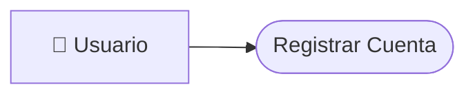
*(Nota: Adjuntar imagen de diagrama de caso de uso 1 aquí)*

| | ID | CU-01 |
| :--- | :--- | :--- |
| **Elaborado por:** | Equipo EspaciGo |
| **Fecha de Creación:** | Septiembre 2026 |
| **Caso de Uso** | Registrar Cuenta |
| **Actor** | Usuario (Visitante) |
| **Descripción** | El visitante se registra en la plataforma creando sus credenciales de acceso. |
| **Referencias cruzadas** | **RF-1.1** |
| **Pre-Condiciones** | No poseer cuenta activa. |
| **Eventos Actor** | **Eventos Sistema** |
| 1. Completa formulario de registro. | 1. Valida unicidad de email. 2. Hashea contraseña con Bcrypt. 3. Crea el registro en BD. |

---

#### **CU-02: Validar Identidad (KYC/KYB)**
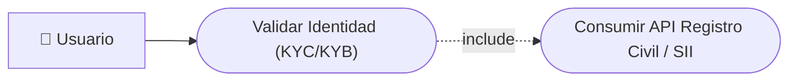
*(Nota: Adjuntar imagen de diagrama de caso de uso 2 aquí)*

| | ID | CU-02 |
| :--- | :--- | :--- |
| **Elaborado por:** | Equipo EspaciGo |
| **Fecha de Creación:** | Septiembre 2026 |
| **Caso de Uso** | Validar Identidad (KYC/KYB) |
| **Actor** | Usuario Autenticado |
| **Descripción** | El usuario valida su cédula o e-RUT para habilitar transacciones financieras. |
| **Referencias cruzadas** | **RF-1.3, RF-1.4** |
| **Pre-Condiciones** | Usuario registrado y logueado. |
| **Eventos Actor** | **Eventos Sistema** |
| 1. Sube foto de documento. | 1. Envía documento a API externa. 2. Cambia estado a "Usuario Verificado". |

---

#### **CU-03: Solicitar Derecho al Olvido**
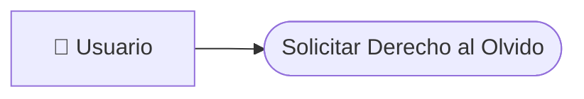
*(Nota: Adjuntar imagen de diagrama de caso de uso 3 aquí)*

| | ID | CU-03 |
| :--- | :--- | :--- |
| **Elaborado por:** | Equipo EspaciGo |
| **Fecha de Creación:** | Septiembre 2026 |
| **Caso de Uso** | Solicitar Derecho al Olvido |
| **Actor** | Usuario Autenticado |
| **Descripción** | El usuario pide borrar sus datos, cumpliendo la Ley 21.719. |
| **Referencias cruzadas** | **RF-1.5, RF-4.5** |
| **Pre-Condiciones** | No tener arriendos activos ni deudas. |
| **Eventos Actor** | **Eventos Sistema** |
| 1. Selecciona "Eliminar Cuenta". | 1. Anonimiza datos PII en PostgreSQL. 2. Registra log de eliminación en BigQuery. |

---

#### **CU-04: Crear Anuncio de Inmueble**
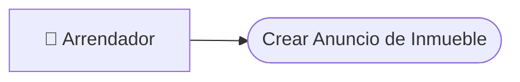
*(Nota: Adjuntar imagen de diagrama de caso de uso 4 aquí)*

| | ID | CU-04 |
| :--- | :--- | :--- |
| **Elaborado por:** | Equipo EspaciGo |
| **Fecha de Creación:** | Septiembre 2026 |
| **Caso de Uso** | Crear Anuncio de Inmueble |
| **Actor** | Arrendador (Verificado) |
| **Descripción** | El propietario detalla las características de su espacio. |
| **Referencias cruzadas** | **RF-2.1** |
| **Pre-Condiciones** | Identidad KYC/KYB validada. |
| **Eventos Actor** | **Eventos Sistema** |
| 1. Ingresa M2, tipo, reglas y descripción. | 1. Crea el borrador del anuncio en la BD. |

---

#### **CU-05: Subir Galería Fotográfica**
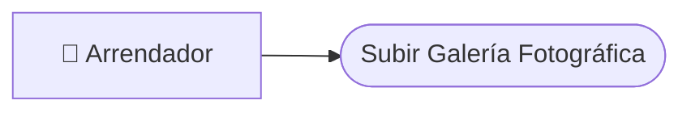
*(Nota: Adjuntar imagen de diagrama de caso de uso 5 aquí)*

| | ID | CU-05 |
| :--- | :--- | :--- |
| **Elaborado por:** | Equipo EspaciGo |
| **Fecha de Creación:** | Septiembre 2026 |
| **Caso de Uso** | Subir Galería Fotográfica |
| **Actor** | Arrendador (Verificado) |
| **Descripción** | El propietario sube fotos de su espacio a la plataforma. |
| **Referencias cruzadas** | **RF-2.2** |
| **Pre-Condiciones** | Anuncio creado (CU-04). |
| **Eventos Actor** | **Eventos Sistema** |
| 1. Selecciona imágenes y las sube. | 1. Comprime y almacena imágenes en Cloud Storage. 2. Vincula las URLs al anuncio. |

---

#### **CU-06: Configurar Calendario y Tarifas**
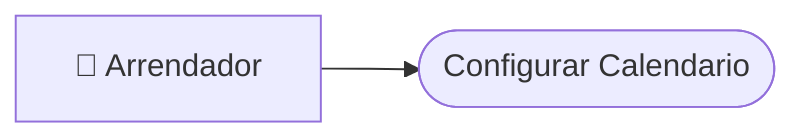
*(Nota: Adjuntar imagen de diagrama de caso de uso 6 aquí)*

| | ID | CU-06 |
| :--- | :--- | :--- |
| **Elaborado por:** | Equipo EspaciGo |
| **Fecha de Creación:** | Septiembre 2026 |
| **Caso de Uso** | Configurar Calendario y Tarifas |
| **Actor** | Arrendador |
| **Descripción** | El propietario bloquea fechas y fija precios dinámicos. |
| **Referencias cruzadas** | **RF-2.3** |
| **Pre-Condiciones** | Anuncio creado (CU-04). |
| **Eventos Actor** | **Eventos Sistema** |
| 1. Selecciona bloques de fechas/horas y asigna precios. | 1. Actualiza el índice de disponibilidad del inmueble. |

---

#### **CU-07: Buscar en Mapa Geolocalizado**
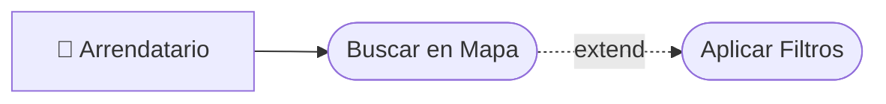
*(Nota: Adjuntar imagen de diagrama de caso de uso 7 aquí)*

| | ID | CU-07 |
| :--- | :--- | :--- |
| **Elaborado por:** | Equipo EspaciGo |
| **Fecha de Creación:** | Septiembre 2026 |
| **Caso de Uso** | Buscar en Mapa Geolocalizado |
| **Actor** | Arrendatario (Usuario) |
| **Descripción** | El usuario busca espacios moviendo el mapa interactivo y aplicando filtros. |
| **Referencias cruzadas** | **RF-2.4, RF-2.5** |
| **Pre-Condiciones** | Ninguna. |
| **Eventos Actor** | **Eventos Sistema** |
| 1. Navega por el mapa e ingresa fechas/uso. | 1. Consulta PostgreSQL geoespacial. 2. Renderiza pines en el mapa. |

---

#### **CU-08: Solicitar Reserva**
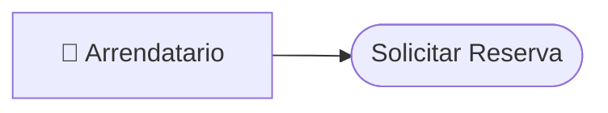
*(Nota: Adjuntar imagen de diagrama de caso de uso 8 aquí)*

| | ID | CU-08 |
| :--- | :--- | :--- |
| **Elaborado por:** | Equipo EspaciGo |
| **Fecha de Creación:** | Septiembre 2026 |
| **Caso de Uso** | Solicitar Reserva |
| **Actor** | Arrendatario |
| **Descripción** | El usuario selecciona un espacio disponible y envía la solicitud. |
| **Referencias cruzadas** | **RF-2.6** |
| **Pre-Condiciones** | Usuario logueado. Inmueble con disponibilidad en la fecha. |
| **Eventos Actor** | **Eventos Sistema** |
| 1. Selecciona fechas y presiona "Solicitar". | 1. Cambia estado a "Pendiente de Aprobación". 2. Notifica al arrendador. |

---

#### **CU-09: Aprobar o Rechazar Reserva**
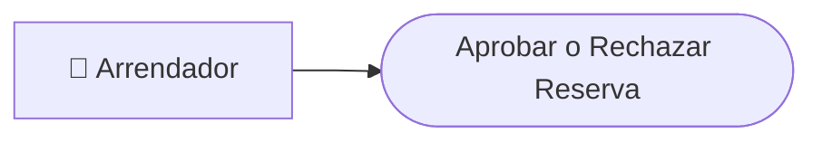
*(Nota: Adjuntar imagen de diagrama de caso de uso 9 aquí)*

| | ID | CU-09 |
| :--- | :--- | :--- |
| **Elaborado por:** | Equipo EspaciGo |
| **Fecha de Creación:** | Septiembre 2026 |
| **Caso de Uso** | Aprobar o Rechazar Reserva |
| **Actor** | Arrendador |
| **Descripción** | El propietario revisa el perfil del solicitante y aprueba la reserva. |
| **Referencias cruzadas** | **RF-2.7** |
| **Pre-Condiciones** | Existencia de solicitud pendiente. |
| **Eventos Actor** | **Eventos Sistema** |
| 1. Selecciona "Aprobar" en la solicitud. | 1. Cambia estado a "Aprobada - Pendiente de Pago". 2. Notifica al arrendatario. |

---

#### **CU-10: Pagar Reserva y Retener Fondos (Escrow)**
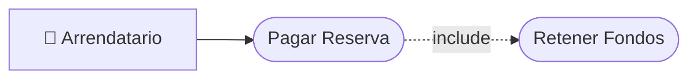
*(Nota: Adjuntar imagen de diagrama de caso de uso 10 aquí)*

| | ID | CU-10 |
| :--- | :--- | :--- |
| **Elaborado por:** | Equipo EspaciGo |
| **Fecha de Creación:** | Septiembre 2026 |
| **Caso de Uso** | Pagar Reserva y Retener Fondos (Escrow) |
| **Actor** | Arrendatario |
| **Descripción** | El usuario paga a través de Mercado Pago y el dinero queda en custodia. |
| **Referencias cruzadas** | **RF-3.1, RF-3.2** |
| **Pre-Condiciones** | Reserva aprobada (CU-09). |
| **Eventos Actor** | **Eventos Sistema** |
| 1. Ingresa datos de tarjeta y paga. | 1. Procesa transacción vía API. 2. Cambia estado de reserva a "Pagada/Retenida". |

---

#### **CU-11: Bloquear Garantía en Tarjeta**
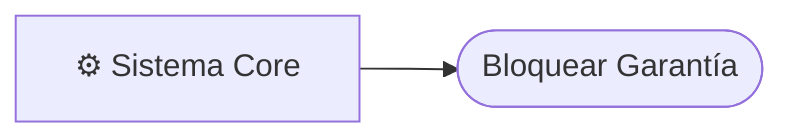
*(Nota: Adjuntar imagen de diagrama de caso de uso 11 aquí)*

| | ID | CU-11 |
| :--- | :--- | :--- |
| **Elaborado por:** | Equipo EspaciGo |
| **Fecha de Creación:** | Septiembre 2026 |
| **Caso de Uso** | Bloquear Garantía en Tarjeta |
| **Actor** | Sistema Core |
| **Descripción** | Pre-autorización automática del monto de garantía en la tarjeta del usuario. |
| **Referencias cruzadas** | **RF-3.3** |
| **Pre-Condiciones** | Realizando pago de reserva (CU-10). |
| **Eventos Actor** | **Eventos Sistema** |
| 1. (Asíncrono) | 1. Solicita pre-autorización a pasarela. 2. Registra bloqueo exitoso. |

---

#### **CU-12: Generar Contrato PDF**
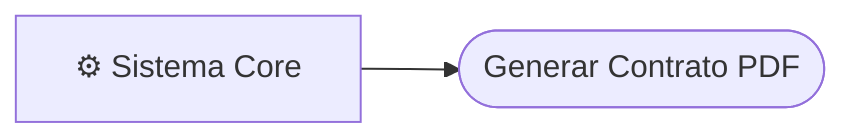
*(Nota: Adjuntar imagen de diagrama de caso de uso 12 aquí)*

| | ID | CU-12 |
| :--- | :--- | :--- |
| **Elaborado por:** | Equipo EspaciGo |
| **Fecha de Creación:** | Septiembre 2026 |
| **Caso de Uso** | Generar Contrato PDF |
| **Actor** | Sistema Core |
| **Descripción** | Tras el pago, el sistema inyecta las variables en una plantilla legal. |
| **Referencias cruzadas** | **RF-4.1** |
| **Pre-Condiciones** | Reserva pagada (CU-10). |
| **Eventos Actor** | **Eventos Sistema** |
| 1. (Asíncrono) | 1. Genera PDF inmutable. 2. Lo almacena en Cloud Storage. |

---

#### **CU-13: Enviar a Firma Notarial Remota**
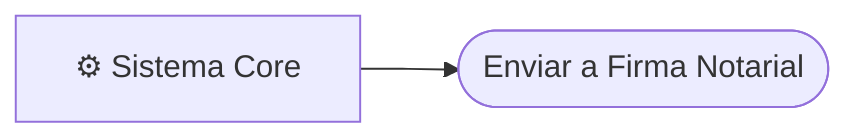
*(Nota: Adjuntar imagen de diagrama de caso de uso 13 aquí)*

| | ID | CU-13 |
| :--- | :--- | :--- |
| **Elaborado por:** | Equipo EspaciGo |
| **Fecha de Creación:** | Septiembre 2026 |
| **Caso de Uso** | Enviar a Firma Notarial Remota |
| **Actor** | Sistema Core |
| **Descripción** | Envío del PDF a la API de FirmaVirtual para solicitar rúbrica de ambas partes. |
| **Referencias cruzadas** | **RF-4.2** |
| **Pre-Condiciones** | PDF generado (CU-12). |
| **Eventos Actor** | **Eventos Sistema** |
| 1. (Asíncrono) | 1. Consume API FirmaVirtual. 2. Envía links de firma a usuarios. |

---

#### **CU-14: Subir Evidencia Check-in / Check-out**
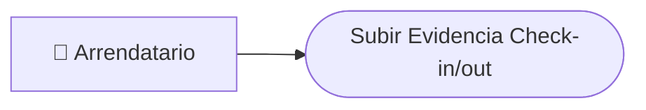
*(Nota: Adjuntar imagen de diagrama de caso de uso 14 aquí)*

| | ID | CU-14 |
| :--- | :--- | :--- |
| **Elaborado por:** | Equipo EspaciGo |
| **Fecha de Creación:** | Septiembre 2026 |
| **Caso de Uso** | Subir Evidencia Check-in / Check-out |
| **Actor** | Arrendatario |
| **Descripción** | El usuario carga fotos del estado del inmueble al llegar y al irse. |
| **Referencias cruzadas** | **RF-4.3** |
| **Pre-Condiciones** | Fecha y hora actual dentro del periodo de reserva. |
| **Eventos Actor** | **Eventos Sistema** |
| 1. Sube fotografías desde el móvil. | 1. Registra timestamp de las fotos. 2. Las almacena como evidencia. |

---

#### **CU-15: Apertura de Disputa por Daños**
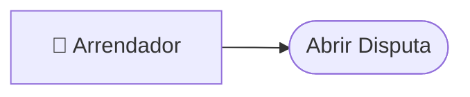
*(Nota: Adjuntar imagen de diagrama de caso de uso 15 aquí)*

| | ID | CU-15 |
| :--- | :--- | :--- |
| **Elaborado por:** | Equipo EspaciGo |
| **Fecha de Creación:** | Septiembre 2026 |
| **Caso de Uso** | Apertura de Disputa por Daños |
| **Actor** | Arrendador |
| **Descripción** | El dueño reporta daños tras el check-out, pausando el reembolso de garantía. |
| **Referencias cruzadas** | **RF-4.4** |
| **Pre-Condiciones** | Check-out realizado, dentro de ventana de 24 horas. |
| **Eventos Actor** | **Eventos Sistema** |
| 1. Selecciona reserva y reporta daño con fotos. | 1. Cambia estado a "En Disputa". 2. Notifica a soporte administrativo. |

---

#### **CU-16: Liberar Fondos (Payout Automático)**
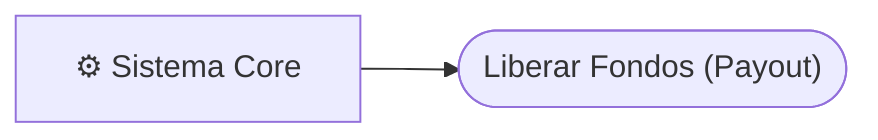
*(Nota: Adjuntar imagen de diagrama de caso de uso 16 aquí)*

| | ID | CU-16 |
| :--- | :--- | :--- |
| **Elaborado por:** | Equipo EspaciGo |
| **Fecha de Creación:** | Septiembre 2026 |
| **Caso de Uso** | Liberar Fondos (Payout Automático) |
| **Actor** | Sistema Core |
| **Descripción** | Si no hay disputas tras el check-out, transfiere el dinero al arrendador. |
| **Referencias cruzadas** | **RF-3.4** |
| **Pre-Condiciones** | Check-out completado sin disputas (CU-14). |
| **Eventos Actor** | **Eventos Sistema** |
| 1. (Asíncrono) | 1. Calcula Take Rate. 2. Instruye a pasarela transferir fondos. |

---

#### **CU-17: Auditar Transacciones en BigQuery**
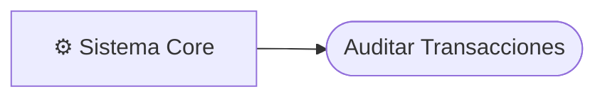
*(Nota: Adjuntar imagen de diagrama de caso de uso 17 aquí)*

| | ID | CU-17 |
| :--- | :--- | :--- |
| **Elaborado por:** | Equipo EspaciGo |
| **Fecha de Creación:** | Septiembre 2026 |
| **Caso de Uso** | Auditar Transacciones en BigQuery |
| **Actor** | Sistema Core |
| **Descripción** | Cada acción crítica (pago, contrato, borrado) se inyecta como log inmutable. |
| **Referencias cruzadas** | **RF-4.5** |
| **Pre-Condiciones** | Acción transaccional ocurrida. |
| **Eventos Actor** | **Eventos Sistema** |
| 1. (Asíncrono) | 1. Toma datos del evento. 2. Envía insert asíncrono a BigQuery. |

---

#### **CU-18: Resolución de Disputas en Backoffice**
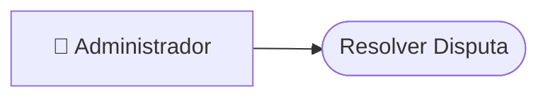
*(Nota: Adjuntar imagen de diagrama de caso de uso 18 aquí)*

| | ID | CU-18 |
| :--- | :--- | :--- |
| **Elaborado por:** | Equipo EspaciGo |
| **Fecha de Creación:** | Septiembre 2026 |
| **Caso de Uso** | Resolución de Disputas en Backoffice |
| **Actor** | Administrador |
| **Descripción** | Revisa evidencia gráfica para cobrar garantía o devolverla. |
| **Referencias cruzadas** | **RF-4.4** |
| **Pre-Condiciones** | Disputa abierta (CU-15). |
| **Eventos Actor** | **Eventos Sistema** |
| 1. Evalúa evidencia y emite veredicto. | 1. Ejecuta cargo a tarjeta o libera cupo. 2. Cierra reserva. |
