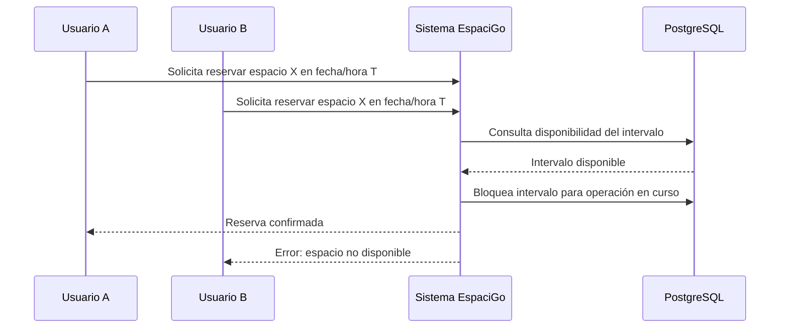
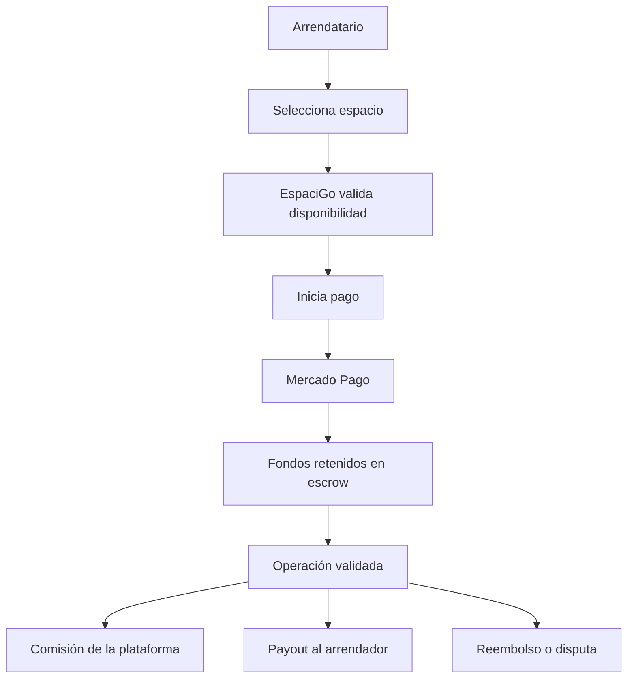
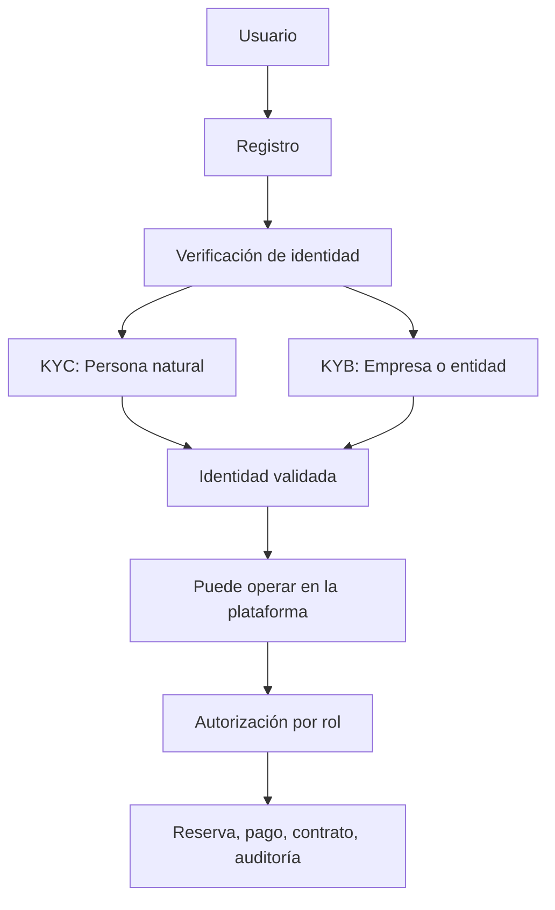
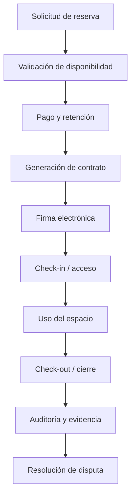

# IV. Marco Teórico

El presente capítulo presenta el marco teórico que sustenta la solución tecnológica EspaciGo. A diferencia de una revisión conceptual genérica, este apartado se orienta a justificar cada decisión de diseño, arquitectura y operación del sistema, mostrando cómo los principios teóricos se traducen en requisitos, mecanismos funcionales y decisiones técnicas concretas del producto.

La fundamentación teórica se estructura alrededor de conceptos centrales del desarrollo de software, los mercados digitales, la gestión de disponibilidad y recursos, la seguridad de la información, la protección de datos personales y la regulación aplicable en el contexto chileno. Cada sección responde a una pregunta específica: ¿qué problemática del negocio o de la operación exige esta dimensión teórica y cómo se materializa en la plataforma EspaciGo?

En consecuencia, la lógica del capítulo no consiste en definir términos aislados, sino en demostrar la coherencia entre el problema de negocio, la arquitectura propuesta y las decisiones de implementación. Esta relación resulta esencial en un sistema de intermediación digital que combina reservas, pagos, identidad, trazabilidad y formalización contractual.

En este sentido, el marco teórico cumple una función epistemológica dentro del proyecto: no solo describe conceptos, sino que valida la viabilidad técnica y operativa de la solución propuesta. El análisis se centra en la relación entre la lógica del negocio, sus implicancias regulatorias y la arquitectura tecnológica requerida para sostenerla de manera segura y escalable.

---

## 4.1 Plataforma digital y modelo SaaS

El modelo de distribución de software ha evolucionado desde soluciones On-Premise hacia plataformas SaaS. El software On-Premise requiere que la organización instale y mantenga la infraestructura tecnológica local, mientras que el modelo SaaS entrega la aplicación como servicio en la nube, accediendo a ella mediante navegador o dispositivo conectado a internet. Esto reduce costos iniciales, permite actualizaciones centralizadas y facilita la disponibilidad global del sistema.

### 4.1.1 Comparación SaaS vs On-Premise

| Aspecto | SaaS | On-Premise | Relevancia para EspaciGo |
|---|---|---|---|
| Infraestructura | Almacenamiento y servidores en la nube | Hardware propio | Se evita depender de cada cliente o instalación local |
| Mantenimiento | Centralizado por proveedor | De la organización | Reduce carga operativa y acelera evolución del producto |
| Costos iniciales | Menores y escalables | Altos | Facilita validación del modelo de negocio |
| Escalabilidad | Alta y elástica | Limitada por infraestructura fija | Necesaria para picos temporales de demanda |
| Actualizaciones | Centralizadas y continuas | Manuales y dependientes del equipo interno | Importante para pagos, seguridad y contratos |
| Disponibilidad | Gestionada a nivel de servicio | Dependiente de infraestructura local | Es clave para reservas y pagos en tiempo real |
| Acceso | Web y multiusuario | Más restringido | El marketplace requiere acceso constante y simultáneo |

### 4.1.2 Alternativas y criterio de decisión

Las alternativas relevantes para una plataforma como EspaciGo son principalmente: SaaS cloud-native, software On-Premise y software tradicional licenciado. La solución cloud-native ofrece elasticidad, mantenimiento centralizado y despliegue rápido; la opción On-Premise ofrece mayor control pero exige infraestructura, soporte técnico y complejidad operativa; el software tradicional se adapta peor a un entorno con transacciones dinámicas, usuarios múltiples y procesos legales.

### 4.1.3 Aplicación a EspaciGo

En el caso de EspaciGo, una plataforma de intermediación entre arrendadores y arrendatarios requiere disponibilidad permanente, acceso desde distintos dispositivos, actualización continua de inventario, pagos y contratos. Además, la operación del marketplace depende de la coordinación entre varios procesos críticos: publicación, reserva, validación de identidad, pago, cierre y disputa. Por ello, la solución se plantea como una plataforma SaaS cloud-native, no como software instalado localmente en un equipo o empresa.

### 4.1.4 Decisión de implementación

> Decisión de implementación: EspaciGo se diseña como una solución web basada en la nube, con acceso centralizado para usuarios, administración remota y operación como servicio digital.

### 4.1.5 Implicación técnica

Esto exige:

- despliegue en cloud y escalado automático
- servicios centralizados para reservas, pago, usuarios y auditoría
- acceso web multusuario para arrendadores, arrendatarios y administradores
- mantenimiento de la plataforma sin intervención local del usuario final

---

## 4.2 Marketplace y modelo B2B2C

Un marketplace es una plataforma digital que conecta dos o más grupos de actores para facilitar la interacción, la negociación y la transacción comercial. Su valor no radica en ser el propietario del bien o servicio que se ofrece, sino en reducir la fricción entre oferta y demanda y en generar confianza entre los participantes.

### 4.2.1 Tipologías de marketplace

Los marketplaces más comunes se clasifican según su estructura de relación comercial:

- B2B: empresa a empresa
- B2C: empresa a consumidor
- B2B2C: plataforma + proveedor + consumidor

| Modelo | Estructura | Ejemplo típico | Valor principal |
|---|---|---|---|
| B2B | Empresa a empresa | Proveedores industriales | Negociación entre actores corporativos |
| B2C | Empresa a consumidor | Comercio electrónico | Venta directa al cliente final |
| B2B2C | Plataforma con participantes de dos lados | Airbnb, Uber, marketplace inmobiliario | Intermediación y coordinación de confianza |

### 4.2.2 Alternativas y criterio de decisión

El problema de EspaciGo no es solo conectar oferta y demanda; es gestionar una operación con riesgo financiero, datos personales, documentación legal y conflicto potencial. Por eso, un modelo B2C simple o un modelo B2B tradicional no bastan para describir la naturaleza del sistema. El valor de la plataforma no está únicamente en la venta del espacio, sino en la reducción de fricción para la operación completa: disponibilidad, pago, validación, contrato, evidencia y cierre.

### 4.2.3 Aplicación a EspaciGo

EspaciGo se ubica en un modelo B2B2C porque conecta a arrendadores que ofrecen espacios con arrendatarios que requieren utilizarlos, además de la propia plataforma, que facilita la transacción, la validación y la trazabilidad de la operación. La plataforma no posee los espacios, sino que actúa como intermedio tecnológico y comercial, administrando la publicación, disponibilidad, pago, contrato y resolución de conflictos.

### 4.2.4 Decisión de implementación

> Decisión de implementación: la arquitectura debe incluir roles diferenciados por actor, control de acceso, separación de permisos y flujos específicos para cada tipo de usuario.

### 4.2.5 Implicación técnica

Esto exige:

- separación por perfil y permisos
- validación de identidad y documentos
- registro de eventos y logs de operación
- gestión de contratos, pagos y disputas desde la misma capa del negocio
- arquitectura orientada a la confianza entre actores

---

## 4.3 Modelos de negocio y monetización digital

Los modelos de monetización digital definen cómo una plataforma transforma valor generado para sus usuarios en ingresos sostenibles para la empresa. En un ambiente digital, esto no se limita a cobrar por acceso o licencias; también incluye comisiones, servicios premium, cobranzas por transacción, retención de fondos y modelos híbridos.

### 4.3.1 Modelos de monetización frecuentes

| Modelo | Descripción | Ventaja principal | Riesgo principal |
|---|---|---|---|
| Suscripción | Cobro periódico por acceso al servicio | Ingreso estable y predecible | Puede desalentar adopción inicial |
| Freemium | Servicio base gratis y funciones premium pagadas | Incrementa volumen de usuarios | Conversión incierta |
| Pago por uso | Cobro por cada operación o unidad consumida | Flexibilidad para distintos perfiles | Costos difíciles de proyectar |
| Comisión transaccional | Cobro por porcentaje de la operación | Alinea ingreso con actividad real | Depende del volumen operativo |
| Tarifa fija | Cobro por publicación o gestión | Simple de explicar | Puede desalentar operaciones pequeñas |

### 4.3.2 Alternativas y criterio de decisión

Para una plataforma como EspaciGo, las alternativas más relevantes son suscripción, freemium, tarifa por uso, comisión por operación y modelo híbrido. La suscripción funciona mejor cuando el principal valor es acceso regular a una herramienta; el freemium puede atraer usuarios, pero no encaja bien con operaciones puntuales de arriendo; la tarifa por uso presenta flexibilidad, pero no refleja el valor central de la intermediación; la comisión por transacción alinea mejor el beneficio de la empresa con la actividad real del marketplace.

### 4.3.3 Aplicación a EspaciGo

EspaciGo no es una aplicación de software tradicional que se vende a una empresa interna; es una plataforma de intermediación digital. Su valor se genera cuando ocurre una operación real: un arrendatario busca un espacio, confirma la reserva, paga de forma segura, recibe o usa el espacio y finaliza la operación sin conflictos.

### 4.3.4 Decisión de implementación

> Decisión de implementación: EspaciGo adopta un modelo basado en comisión transaccional, con servicios complementarios pagados adicionales (validación reforzada, gestión documental, soporte premium), en lugar de un modelo de suscripción o freemium como eje principal.

### 4.3.5 Implicación técnica

Esto exige:

- cálculo de comisión real en tiempo real
- separación entre valor bruto, comisión y payout neto
- retención o escrow de fondos
- trazabilidad del flujo financiero
- registro de estados de pago, disputa y cierre

---

## 4.4 Cloud Computing, arquitectura web y APIs

El Cloud Computing permite ofrecer infraestructura y servicios bajo demanda, con escalabilidad y disponibilidad mejoradas para aplicaciones web. Las arquitecturas modernas se apoyan en capas funcionales: frontend, backend, lógica de negocio, persistencia y servicios externos. Las APIs REST permiten que los distintos componentes del sistema se comuniquen de manera estandarizada y segura.

### 4.4.1 Arquitectura monolítica vs distribuida

| Enfoque | Ventaja principal | Limitación principal | ¿Es adecuado para EspaciGo? |
|---|---|---|---|
| Monolítica | Simplicidad inicial | Acoplamiento fuerte y menor evolución | No |
| Arquitectura modular | Separación de dominios y mejor mantenibilidad | Mayor complejidad de integración | Sí |
| Microservicios | Escalado independiente y especialización | Mayor coordinación y operación | Sí, bajo criterio razonable |

### 4.4.2 Alternativas y criterio de decisión

La arquitectura de un marketplace no puede ser monolítica si combina pagos, disponibilidad temporal, contratos, identidad y trazabilidad. Una solución monolítica puede funcionar en etapas iniciales, pero termina mezclando dominios diferentes y arriesgando la consistencia del negocio. La modularidad permite aislar procesos críticos sin perder flexibilidad y escalabilidad.

### 4.4.3 Aplicación a EspaciGo

EspaciGo requiere integrar varios flujos simultáneamente: gestión de usuarios, publicación de espacios, pagos, generación de documentos, validación de identidad y registro de auditoría. Esta complejidad justifica una arquitectura modular basada en servicios y APIs.

### 4.4.4 Decisión de implementación

> Decisión de implementación: EspaciGo se diseña con una arquitectura modular cloud-native, con servicios encapsulados para frontend, negocio, persistencia, pago, identidad, documento y auditoría.

### 4.4.5 Implicación técnica

Esto implica:

- separación entre frontend, backend y base de datos
- APIs REST bien definidas para comunicación entre módulos
- integración con servicios externos mediante webhooks y eventos
- desacople de la lógica operativa y la analítica
- aplicación de Cloud Run o infraestructura equivalente para despliegue

---

## 4.5 Gestión de espacios, disponibilidad y riesgo de doble reserva

Un espacio comercial o de alquiler no funciona como un producto estático. Tiene atributos de ubicación, capacidad, horario disponible y disponibilidad temporal. El recurso principal es la ventana de tiempo en la que puede ser utilizado. Por ello, la gestión de inventario de EspaciGo requiere controlar no solo el espacio, sino también la disponibilidad por fecha y horario.

El problema central es el double booking o doble reserva. Si dos usuarios intentan reservar el mismo espacio para el mismo intervalo, el sistema debe prevenir la sobreposición; de lo contrario, se producirán conflictos de disponibilidad, pagos duplicados y una mala experiencia de uso.

### 4.5.1 Conceptos asociados

Los conceptos clave del problema son:

- inventario temporal
- disponibilidad por intervalos
- bloqueo o reserva preventiva
- solapamiento de fechas y horarios
- estados transaccionales de la reserva
- validación de disponibilidad antes del pago

### 4.5.2 Aplicación a EspaciGo

EspaciGo debe permitir que un usuario busque espacios por ubicación, tipo, rango de fechas, horario y restricciones de capacidad. La plataforma debe mostrar disponibilidad real y no solo un inventario estático. Cuando un usuario elige una opción, el sistema debe validar que ese intervalo no esté ya ocupado o bloqueado. La reserva no puede confirmarse si existe solapamiento con otra operación activa.

### 4.5.3 Decisión de implementación

> Decisión de implementación: el sistema debe implementar validaciones transaccionales, control de concurrencia y estados de reserva para evitar conflictos temporales entre usuarios.

### 4.5.4 Implicación técnica

El manejo de disponibilidad exige:

- validación de solapamiento temporal
- bloqueo lógico o transaccional del intervalo
- consistencia entre disponibilidad y pago
- trazabilidad de cambios de estado de la reserva
- actualización rápida del calendario de disponibilidad

### 4.5.5 Diagrama de reserva y conflicto temporal

---

## 4.6 Sistemas de pago electrónico, retención de fondos y escrow

Una pasarela de pago es un servicio que permite recibir, validar y procesar pagos electrónicos entre el comprador, la entidad financiera y el comercio. Los conceptos clave de este flujo incluyen autorización, captura, reembolso, tokenización, idempotencia y webhook.

El escrow es un mecanismo de custodia de fondos en el que un tercero retiene el dinero hasta que se cumplen condiciones definidas, como la entrega del servicio, la firma del contrato o la resolución de una disputa. Esto reduce el riesgo de fraude y aumenta la confianza entre las partes.

### 4.6.1 Comparación de mecanismos de pago

| Proveedor o mecanismo | Fortalezas | Limitaciones | Aplicación en EspaciGo |
|---|---|---|---|
| Webpay | Confianza institucional y uso generalizado | Menor flexibilidad para flujos complejos | Adecuado, pero menos flexible para marketplace dinámico |
| Flow | Integración simple para comercio digital | Menor soporte para retenciones y split | No es la mejor opción para EspaciGo |
| Mercado Pago | APIs modernas, webhooks, split, retención y comercio digital | Requiere mayor integración técnica | Es la opción más alineada con el negocio |
| Escrow | Reducción del riesgo de fraude | Debe estar bien modelado | Es clave para la operación |

### 4.6.2 Alternativas y criterio de decisión

La alternativa de cobro directo sin retención es insuficiente para una plataforma donde existe intercambio de dinero real entre usuarios que no siempre se conocen previamente. Un flujo de justicia, validación y protección de fondos requiere retención y control del dinero hasta que se cumpla la operación o se resuelva la disputa.

### 4.6.3 Aplicación a EspaciGo

En EspaciGo, el dinero no puede transferirse directamente al arrendador sin control, porque existen factores como disponibilidad, uso real del espacio y disputas potenciales. Por eso se requiere un flujo de retención y liberación condicionada de fondos.

### 4.6.4 Decisión de implementación

> Decisión de implementación: el sistema utiliza una pasarela con soporte a retención de fondos, webhooks e idempotencia para gestionar pagos, reembolsos y payout.

### 4.6.5 Implicación técnica

Esto exige:

- no almacenar datos sensibles de tarjetas en la base principal
- usar tokens y referencias seguras de la pasarela
- manejar estados de pago y reserva sincronizados
- mantener trazabilidad financiera para auditoría
- diseñar reglas de reembolso y payout bajo condiciones específicas

### 4.6.6 Diagrama del flujo financiero

---

## 4.7 KYC, KYB, identidad digital y autenticación

KYC (Know Your Customer) y KYB (Know Your Business) son procesos de verificación de identidad utilizados para mitigar fraude, lavado de dinero, suplantación de identidad y uso indebido de plataformas. El objetivo principal es conocer a quién se está dando acceso a la operación y cuáles son los elementos que respaldan su identidad.

### 4.7.1 Diferencia entre KYC y KYB

| Criterio | KYC | KYB |
|---|---|---|
| Usuario | Persona natural | Empresa o entidad |
| Objetivo | Verificar identidad personal | Verificar identidad legal y operativa |
| Riesgo principal | Suplantación, fraude, identidad falsa | Lavado de dinero, operación con entidad no real |
| Relevancia en EspaciGo | Usuarios individuales | Propietarios o operadores empresariales |

### 4.7.2 Autenticación vs autorización

- Autenticación: verificar quién es el usuario
- Autorización: definir qué puede hacer ese usuario dentro del sistema

### 4.7.3 Alternativas y criterio de decisión

La alternativa más común es una identidad abierta sin validación formal, o una identidad con verificación documental y control de roles. En un marketplace con dinero y contratos, la segunda opción es necesaria porque la confianza operativa depende de la capacidad de identificar a los participantes y definir límites claros de acción.

### 4.7.4 Aplicación a EspaciGo

EspaciGo debe validar que:

- la persona que publica un espacio es el titular o cuenta con autorización
- la persona que reserva un espacio es una entidad real y verificable
- las empresas o arrendadores con actividad comercial cumplen con validación correspondiente
- los permisos de cada perfil estén bien diferenciados
- los eventos relevantes de identificación y operación queden registrados para auditoría

### 4.7.5 Decisión de implementación

> Decisión de implementación: EspaciGo adopta una política de identidad verificada con KYC/KYB, autenticación segura y autorización por roles para reducir fraude y proteger la operación de pago, reserva y contrato.

### 4.7.6 Implicación técnica

Esto requiere:

- almacenamiento seguro de datos identificatorios
- validación documental y de negocio antes de habilitar la operación
- login seguro con autenticación adecuada
- control de permisos por rol y por caso de uso
- trazabilidad en auditoría para cada evento relevante

### 4.7.7 Diagrama del flujo de identidad y confianza

---

## 4.8 Seguridad, privacidad y protección de datos personales

La seguridad de la información y la protección de datos personales son dimensiones relacionadas, pero no equivalentes. La seguridad busca proteger la información frente a amenazas, robo, manipulación o accesos indebidos; la privacidad busca garantizar que los datos se usen de manera justa, limitada y conforme a la normativa.

### 4.8.1 Seguridad informática y principios en EspaciGo

En EspaciGo, es necesario proteger:

- credenciales de acceso
- documentos de identificación
- información financiera y de pago
- datos asociados a contratos y reservas
- fotografías, documentos y archivos de usuarios
- registros de actividad y auditoría

Algunos conceptos clave son:

- autenticación
- autorización
- cifrado
- hash y sal para contraseñas
- TLS para comunicaciones
- control de acceso por roles
- prevención de vulnerabilidades OWASP Top 10

### 4.8.2 Alternativas y criterio de decisión

La alternativa es operar sin medidas de protección o diseñar controles de seguridad desde la arquitectura. En un sistema con pagos y datos personales, la segunda opción no es opcional. Seguridad y privacidad deben incorporarse desde la concepción del sistema, no como capas posteriores.

### 4.8.3 Privacidad y protección de datos personales en Chile

La normativa chilena sobre protección de datos establece principios fundamentales, entre ellos:

- finalidad
- minimización
- transparencia
- seguridad
- acceso y rectificación
- eliminación
- limitación del tratamiento

### 4.8.4 Aplicación a EspaciGo

EspaciGo trata información altamente sensible: identidad de usuarios, documentos, montos financieros, registros de actividad, contratos y, en algunos casos, información legal o tributaria. Esto exige que la plataforma no solo proteja la información frente a ataques, sino además que limite su tratamiento y lo vuelva trazable bajo condiciones debidas.

### 4.8.5 Decisión de implementación

> Decisión de implementación: EspaciGo adopta un enfoque de privacidad por diseño y seguridad aplicada por capas, diferenciando datos operativos, financieros, documentales y de auditoría para cumplir con la normativa y evitar exposición innecesaria.

### 4.8.6 Implicación técnica

Esto exige:

- cifrado de datos sensibles
- políticas de acceso por perfil y permisos
- registro de eventos críticos para auditoría
- separación entre base transaccional y data warehouse
- políticas de retención de datos y eliminación segura
- validación de seguridad en cada flujo de API y servicio externo

### 4.8.7 Matriz de seguridad y privacidad

| Área | Seguridad | Privacidad |
|---|---|---|
| Objetivo | Proteger la información frente a amenazas | Garantizar tratamiento adecuado y justo de los datos |
| Ejemplo | Cifrado, MFA, TLS, control de acceso | Minimización, transparencia, eliminación y acceso |
| Riesgo principal | Robo, manipulación, explotación de vulnerabilidades | Uso indebido, tratamiento excesivo, falta de consentimiento |
| Relevancia en EspaciGo | Datos financieros, autenticación e identidad | Datos personales, documentos y auditoría |

---

## 4.9 Contratos digitales, firma electrónica y gestión documental

Un contrato digital es un acuerdo formalizado mediante medios electrónicos, con valor jurídico cuando cumple requisitos de identidad, intención de obligarse, trazabilidad y protección del documento. En mercados digitales y plataformas de servicios, el contrato deja de ser solo un documento administrativo y pasa a ser evidencia de la relación operativa entre proveedor, usuario y plataforma.

### 4.9.1 Contratos en plataformas de intermediación

En un marketplace de alquiler o uso de espacios, el contrato debe responder a varias necesidades:

- identificar claramente a las partes
- describir el servicio o espacio alquilado
- fijar condiciones de uso, precio y duración
- registrar la aceptación y consentimiento
- dejar evidencia del proceso completo
- permitir la resolución de disputas o la auditoría posterior

### 4.9.2 Firma electrónica

La firma electrónica permite asociar la voluntad de una persona a un documento digital. Su nivel de seguridad varía según la tecnología utilizada y el grado de verificación de identidad.

| Tipo de firma | Nivel de seguridad | Uso típico | Relevancia para EspaciGo |
|---|---|---|---|
| Firma simple | Baja | Aceptación de términos y condiciones | Útil para consentimientos básicos |
| Firma avanzada | Media-alta | Documentos comerciales y firma de acuerdos | Adecuada para la mayoría de contratos de uso |
| Firma cualificada | Máxima | Casos con alta exigencia legal y financiera | Recomendable para contratos críticos y disputas legales |

### 4.9.3 Aplicación a EspaciGo

En EspaciGo, los contratos digitales son necesarios en varios momentos del ciclo de operación:

- antes de la reserva confirmada
- durante la validación del espacio y responsabilidades del arrendatario
- en el proceso de pago y depósito
- al momento de uso del espacio
- ante eventuales disputas o auditorías

### 4.9.4 Decisión de implementación

> Decisión de implementación: EspaciGo adopta un flujo de contratos digitales con generación automática de plantillas, validación de datos, integración con firma electrónica y archivado seguro de la evidencia final.

### 4.9.5 Implicación técnica

Esto exige:

- frontend para presentar el documento y solicitar la aceptación
- backend para preparar los datos del contrato y orquestar el flujo
- almacenamiento seguro del archivo final
- metadata y registro para auditoría legal
- separación de datos operativos y evidencia documental

### 4.9.6 Diagrama del flujo contractual

---

## 4.10 Auditoría, trazabilidad y resolución de disputas

La auditoría es el registro de acciones relevantes con el propósito de verificar qué ocurrió, quién lo realizó y en qué momento. La trazabilidad, por su parte, permite reconstruir la secuencia de eventos de un proceso y analizar la relación entre decisiones, operaciones y resultados.

### 4.10.1 Importancia en marketplaces

La trazabilidad es esencial para procesos como:

- reservas y disponibilidad
- confirmación de pagos
- firma de contratos
- uso y check-in de espacios
- incidentes o daños reportados
- revisiones regulatorias o administrativas

### 4.10.2 Aplicación a EspaciGo

EspaciGo debe permitir demostrar qué sucedió antes, durante y después del uso de un espacio. Esto incluye la evidencia de:

- disponibilidad y bloqueos
- mensajes de confirmación y rechazo
- pago, retención o reembolso
- firma de contrato
- confirmación de ingreso y salida del espacio
- revisión o reporte de daños o incumplimientos

### 4.10.3 Decisión de implementación

> Decisión de implementación: el sistema adopta un modelo de auditoría basado en eventos, donde cada acción clave del negocio genera un registro estructurado que conserva información sobre actor, momento, entidad afectada y estado previo/posterior.

### 4.10.4 Implicación técnica

Esto requiere:

- registro de eventos por acción crítica
- almacenamiento en repositorio de auditoría
- separación entre base transaccional y repositorio analítico
- consulta histórica para soporte legal o de disputa
- conexión con documentos, pagos y estados de reserva

### 4.10.5 Tabla de evidencia digital

| Evento | Evidencia relevante | Valor para EspaciGo |
|---|---|---|
| Reserva | Usuario, horario, disponibilidad, estado | Permite validar la operación comercial |
| Pago | Monto, token, estado, timestamp | Confirma la transacción financiera |
| Contrato | Documento firmado y metadata | Soporta la relación legal entre partes |
| Check-in/out | Registro fotográfico, ubicación, estado | Ayuda a resolver conflictos de acceso o daños |
| Reclamo | Documentación, mensajes, historial | Facilita la investigación y respuesta ante un caso |

### 4.10.6 Diagrama de trazabilidad

---

## 4.11 Arquitectura de software, requisitos y metodologías de desarrollo

La arquitectura de software define la estructura lógica y técnica de un sistema para cumplir objetivos de funcionalidad, seguridad, mantenibilidad, escalabilidad y evolución. La ingeniería de requisitos, a su vez, permite transformar las necesidades del negocio en especificaciones claras, verificables y rastreables.

### 4.11.1 Requisitos funcionales y no funcionales

Los requisitos funcionales describen lo que el sistema debe hacer; los no funcionales describen cómo debe comportarse bajo condiciones reales de operación.

| Tipo | Ejemplo en EspaciGo |
|---|---|
| Funcional | Registrar espacios y disponibilidades |
| Funcional | Reservar un espacio por fecha y horario |
| Funcional | Generar un contrato digital |
| No funcional | Mantener integridad en reservas concurrentes |
| No funcional | Proteger información sensible |
| No funcional | Mantener trazabilidad completa para auditoría |

### 4.11.2 Arquitectura de software en EspaciGo

La arquitectura del proyecto se articula en torno a una lógica modular y orientada a servicios con roles claramente diferenciados:

- Frontend en Next.js: experiencia de usuario y visualización de la aplicación
- Backend en Go: lógica de negocio, reglas y coordinación
- PostgreSQL: base de datos transaccional para reservas, usuarios, pagos y estado operativo
- Cloud Run: despliegue de servicios en contenedores
- BigQuery: almacenamiento analítico y evidencia para auditoría y reporting

### 4.11.3 Metodología híbrida

Un proyecto con alta regulación, más de una categoría de usuario y varios procesos críticos no puede depender solo de una metodología pura. Para EspaciGo, se recomienda una metodología híbrida que combine:

- iterativo e incremental para desarrollo funcional
- PMBOK para alcance, costos, riesgos y planificación
- trazabilidad documental y de requisitos
- validación continua de reglas y entregables

### 4.11.4 Decisión de implementación

> Decisión de implementación: se adopta una metodología híbrida para EspaciGo, combinando rigor de gestión con entregas incrementales dirigidas a módulos críticos como reservas, pagos, contratos, identidad y reportes.

### 4.11.5 Implicación técnica

Esto exige:

- matriz de trazabilidad de requisitos
- casos de uso y reglas de negocio documentados
- validación funcional por módulo
- pruebas para condiciones críticas de reserva, pago y contrato
- separación de responsabilidades entre frontend, backend, base de datos y analítica

### 4.11.6 Matriz de trazabilidad requisito → implementación

| Requisito del negocio | Caso de uso | Componente técnico | Validación esperada |
|---|---|---|---|
| El espacio no puede reservarse dos veces en el mismo horario | Reserva de espacio | Backend + PostgreSQL | Validación de solapamiento y transacción ACID |
| El pago debe confirmarse antes de liberar el espacio | Confirmación de reserva | Backend + pasarela | Estado de pago y retención coherentes |
| El contrato debe estar firmado antes del uso | Aceptación de condiciones | Contrato + firma digital | Documento firmado y asociado a la operación |
| La plataforma debe auditar acciones críticas | Disputa o revisión | BigQuery + logs de eventos | Evidencia histórica y consulta posterior |

---

## 4.12 Síntesis de decisiones teóricas y de implementación para EspaciGo

El marco teórico de EspaciGo no pretende ser un conjunto de definiciones aisladas, sino una justificación de la arquitectura y las decisiones técnicas del proyecto. Cada concepto teórico permite entender una necesidad real del sistema y la razón por la cual la solución adopta una decisión concreta.

### 4.12.1 Síntesis de decisiones por concepto

| Concepto teórico | Problema que resuelve | Alternativas relevantes | Decisión tomada en EspaciGo | Impacto técnico |
|---|---|---|---|---|
| SaaS | Necesidad de acceso global y centralizado | SaaS, On-Premise, licenciado | SaaS cloud-native | Despliegue en la nube y acceso web centralizado |
| Marketplace B2B2C | Conectar oferta y demanda con confianza | B2B, B2C, B2B2C | B2B2C con roles diferenciados | Módulos de arrendador, arrendatario y administración |
| Modelos de monetización | Generar ingresos sostenibles | Suscripción, freemium, por uso, comisión | Comisión por operación | Cálculo de take rate y payout |
| Cloud computing y APIs | Escalabilidad y conexión de servicios | Monolito, modular, microservicios | Modular y cloud-native | APIs REST, servicios desacoplados y Cloud Run |
| Disponibilidad y reservas | Evitar doble reserva | Calendario manual, validación simple, estado transaccional | Control transaccional por intervalo | PostgreSQL y validación antes de confirmar |
| Pagos digitales y escrow | Riesgo de fraude y falta de confianza | Pago directo, cobro sin retención, escrow | Pago con retención y webhook | Integración con pasarela y estados financieros |
| KYC/KYB y autenticación | Verificar identidad y reducir fraude | Sin validación, validación mínima, verificación formal | KYC/KYB + autorización por roles | Seguridad y control de acceso |
| Privacidad y protección de datos | Proteger información personal | Seguridad aislada, privacidad por diseño | Privacidad por diseño | Cifrado, minimización y separación de datos |
| Contratos digitales | Formalizar la relación y reducir riesgo | Contrato manual, contrato digital sin firma, firma digital | Contrato digital con firma electrónica | Documentos, metadata y evidencia |
| Auditoría y trazabilidad | Resolver disputas y sostener evidencia | Logs básicos, auditoría aislada, audit trail estructurado | Audit trail con eventos y BigQuery | Evidencia histórica y análisis |
| Arquitectura de software | Mantener coherencia y escalabilidad | Monolito, modular, microservicios | Arquitectura modular con stack real | Next.js, Go, PostgreSQL, Cloud Run, BigQuery |

### 4.12.2 Diagrama conceptual final

### 4.12.3 Conclusión

EspaciGo se sustenta en una combinación de decisiones de negocio, tecnología y regulación. El marco teórico permite no solo comprender el problema de estudio, sino también justificar por qué la solución adopta un conjunto específico de principios de diseño, requisitos funcionales y restricciones operativas. En este sentido, la innovación del proyecto no depende únicamente de la idea de negocio, sino de la integración coherente de diversas disciplinas: ingeniería de software, seguridad, comercio digital, privacidad, pagos electrónicos, identidad digital, contratos y gestión documental.

La relevancia del marco teórico radica en su capacidad para explicar la relación entre el problema, la lógica del sistema y la arquitectura tecnológica propuesta. EspaciGo no puede entenderse como una plataforma aislada o genérica; debe concebirse como una solución digital orientada a la confianza, la trazabilidad y la operación segura de una transacción compleja. Por ello, este capítulo cumple una función esencial dentro del informe: fundamenta, valida y orienta el diseño del sistema como una propuesta tecnológica viable, segura y alineada con el contexto real de operación.

---

## Referencias bibliográficas

- Bass, L., Clements, P., & Kazman, R. (2021). *Software Architecture in Practice*.
- Benlian, A., Hess, T., & Buxmann, P. (2011). Drivers of SaaS adoption.
- Comisión Europea. (2024). *eIDAS Regulation and electronic identification services*.
- Date, C. J. (2003). *An Introduction to Database Systems*.
- FATF. (2023). *International Standards on Combating Money Laundering and the Financing of Terrorism*.
- Hagiu, A., & Wright, J. (2015). *Multi-sided platforms*.
- IBM. (s.f.). *What is SaaS? Software as a Service*.
- Ley N° 21.461. (2022). Modifica normas relacionadas con la restitución de propiedades arrendadas.
- Ley N° 21.719. (2024). *Protección de la vida privada y datos personales*.
- Mercado Pago Developers. (2024). *Documentación oficial de pagos y webhooks*.
- NIST. (2023). *Digital Identity Guidelines*.
- OWASP. (2024). *Top 10 Web Application Security Risks*.
- PMI. (2021). *PMBOK Guide*.
- Sommerville, I. (2011). *Software Engineering*.
- W3C. (2024). *Digital signatures and verifiable credentials*.

