# Anexo: Especificación de Casos de Uso — Sistema EspaciGo

Este anexo especifica los **52 casos de uso** del sistema, agrupados en los **11 módulos** descritos en el Anexo A. Los casos complementarios (CU-47 a CU-52) se presentan al final del módulo al que pertenecen, para no renumerar los casos definidos previamente. Cada caso de uso declara sus actores, precondiciones, flujo principal, flujos alternativos, postcondiciones y sus referencias cruzadas con los requerimientos funcionales (Anexo B) y las historias de usuario (Anexo E). Los diagramas se expresan en notaciуn UML 2.5.

## 1. Convenciones de modelado aplicadas

| Convención | Regla aplicada |
|---|---|
| **Actores** | Solo entidades externas: roles humanos y sistemas/servicios de terceros. No se representan componentes internos (frontend Next.js, API Go, contenedores, controladores, repositorios). |
| **Casos de uso** | Representan objetivos observables desde un actor. No se modelan detalles de implementación ni tablas/endpoints/clases. |
| **Límite del sistema** | Cada diagrama tiene un rectángulo con el nombre del sistema y, dentro, un paquete con el nombre del módulo. Los actores quedan fuera del límite. |
| **Asociaciones** | Se trazan solo entre actores y casos de uso en los que el actor participa directamente. Sin flechas ni direcciones inventadas. |
| **`<<include>>`** | Solo cuando el caso base **requiere obligatoriamente** el caso incluido. |
| **`<<extend>>`** | Solo cuando el caso de extensión agrega comportamiento **opcional, condicional o excepcional** al caso base. |
| **Generalización** | Solo con especialización real (ver justificaciones). |
| **Nomenclatura** | `RQF-###` (requerimiento funcional), `RNF-###` (no funcional), `CU-##` (caso de uso), `HU##` (historia de usuario). |
| **IDs** | Cada caso de uso tiene ID único y correlativo; el ID se usa igual en el informe, los anexos y las fichas. |

### Exclusiones justificadas (no se convierten en casos de uso)

| Elemento | Tipo real | Motivo |
|---|---|---|
| Cifrado/hash de contraseñas | `RNF-013` | Condición de calidad (confidencialidad), no funcionalidad observable. |
| Inmutabilidad de logs en el repositorio analítico | `RNF-017` | Condición de integridad de infraestructura. |
| Tokenización de tarjetas (PCI-DSS) | `RNF-025` | Restricción externa de cumplimiento. |
| Envío asíncrono de eventos a BigQuery | Detalle de implementación | No existe RF que lo observe un actor; se cubre con RNF-017. |
| Google BigQuery / Data Warehouse | Repositorio interno | No es actor: no hay interacción iniciada por él con un objetivo observable. |

## 2. Modelo de Actores

### 2.1 Actores primarios

| Actor | Nombre en UML | Descripción | Módulos |
|---|---|---|---|
| Visitante | `Visitante` | Usuario anónimo que explora el catálogo público. | M01, M05, M09 |
| Usuario Registrado | `UsuarioRegistrado` | Cuenta con correo verificado, sin validación de identidad. | M01, M02, M03 |
| Arrendador | `Arrendador` | Identidad verificada; publica y administra espacios, aprueba reservas, reclama daños. | M04, M07, M08, M09, M10 |
| Arrendatario | `Arrendatario` | Identidad verificada; busca, cotiza, reserva, paga, firma, hace check-in/out y reseña. | M05, M06, M07, M08, M09, M10 |
| Administrador | `Administrador` | Operador interno: validaciones manuales, arbitraje, moderación, reportes y auditoría. | M03, M10, M11 |

### 2.2 Actores secundarios (sistemas y servicios externos)

| Actor | Tipo | Participa en |
|---|---|---|
| Registro Civil | Servicio externo (API) | CU-11 |
| SII | Servicio externo (API) | CU-12 |
| Mercado Pago | Servicio externo (pasarela de pagos) | CU-24, CU-41, CU-42 |
| FirmaVirtual | Servicio externo (firma electrónica) | CU-29, CU-30 |

### 2.3 Generalización de actores

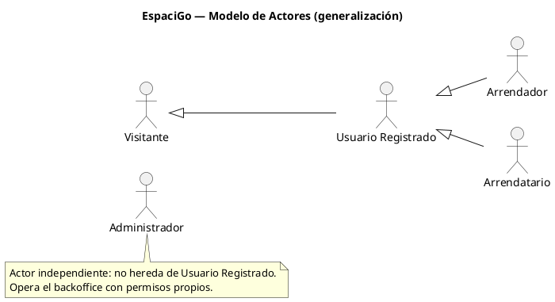

| Generalización | Justificación funcional |
|---|---|
| `UsuarioRegistrado --\|> Visitante` | Un usuario registrado puede ejecutar todo lo que ejecuta un visitante (buscar, filtrar, ver detalle, ver reseñas) y además autenticarse y operar con cuenta. |
| `Arrendador --\|> UsuarioRegistrado` | Además de las capacidades del usuario registrado, gestiona publicaciones, calendario, solicitudes de reserva y reclamos. |
| `Arrendatario --\|> UsuarioRegistrado` | Además de las capacidades del usuario registrado, reserva, paga, firma, hace check-in/out y reseña. |
| `Administrador` | Sin generalización: no es usuario del marketplace ni ejecuta los flujos comerciales de arrendador/arrendatario. |

## 3. Casos de Uso por Módulo

## Módulo M01 — Autenticación y Gestión de Cuenta

**RF cubiertos:** RQF-001 a RQF-023 + RQF-186 a RQF-188 + RQF-213 a RQF-218 (32 RF)
**Actores participantes:** Visitante, Usuario Registrado
**Casos de uso:** CU-01, CU-02, CU-03, CU-04, CU-05, CU-06, CU-50

### Diagrama de Casos de Uso

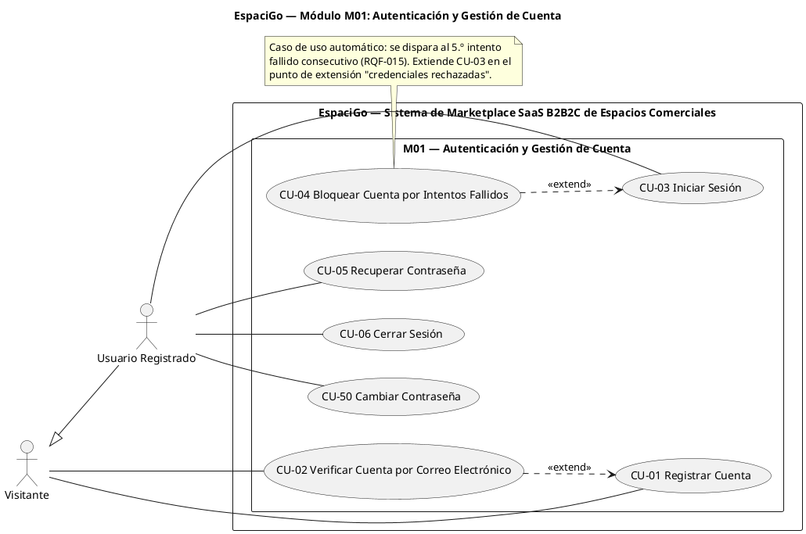

**Justificación de las relaciones**

| Relación | Tipo | Justificación |
|---|---|---|
| CU-02 → CU-01 | `<<extend>>` | La verificación por correo es **condicional**: la cuenta ya queda creada en CU-01 y la extensión se ejecuta cuando el visitante consume el token (RQF-009). CU-01 puede completarse sin la extensión. |
| CU-04 → CU-03 | `<<extend>>` | El bloqueo solo ocurre si se alcanzan 5 intentos fallidos consecutivos (RQF-015): comportamiento excepcional que extiende el caso base "Iniciar Sesión", que puede finalizar exitosamente sin la extensión. |
| CU-05, CU-06, CU-50 | Sin relación | Son objetivos independientes del usuario; no agregan comportamiento a otro caso de uso ni son obligatorios para otro. La recuperación (CU-05) y el cambio con sesión iniciada (CU-50) comparten la política de contraseña, pero no existe obligatoriedad entre ellos. |

### CU-01: Registrar Cuenta

| Atributo | Detalle |
| :--- | :--- |
| **ID** | CU-01 |
| **Caso de Uso** | Registrar Cuenta |
| **Actor** | Visitante |
| **Descripción** | El visitante crea una cuenta de acceso en la plataforma proporcionando un correo válido y una contraseña que cumpla las políticas de seguridad. |
| **Pre-condiciones** | No poseer una cuenta registrada con el mismo correo electrónico. |
| **Flujo Principal** | 1. El visitante accede al formulario de registro. 2. Ingresa correo electrónico y contraseña. 3. El sistema valida el formato del correo electrónico. 4. El sistema valida que la contraseña tenga mínimo 8 caracteres, una mayúscula, un número y un carácter especial. 5. El visitante selecciona su preferencia de uso (ofrecer espacios o arrendar espacios). 6. El sistema exige la aceptación de los términos y condiciones, y el visitante los acepta. 7. El sistema verifica que el correo no exista previamente en la plataforma. 8. El sistema registra la cuenta junto con la fecha y la versión de los términos y condiciones aceptados. 9. El sistema muestra un mensaje de éxito. |
| **Flujos Alternativos** | **A1. Correo ya registrado (Paso 7):** 1. El sistema detecta que el correo existe. 2. El sistema rechaza el registro e informa que debe iniciar sesión o recuperar su contraseña.  **A2. Formato inválido (Pasos 3 y 4):** 1. El sistema detecta que el correo o la contraseña no cumplen el formato exigido. 2. El sistema indica los campos que deben corregirse y no registra la cuenta.  **A3. Términos y condiciones no aceptados (Paso 6):** 1. El sistema no habilita el registro e indica que la aceptación es obligatoria para crear la cuenta. |
| **Post-condiciones** | Cuenta creada en estado "No Verificado", con preferencia de uso registrada y evidencia de la aceptación de los términos y condiciones. |
| **Referencias Cruzadas** | RQF-001 al RQF-007 · RQF-186, RQF-187 · RQF-213 · CU-02 (extensión) · HU01 |

### CU-02: Verificar Cuenta por Correo Electrónico

| Atributo | Detalle |
| :--- | :--- |
| **ID** | CU-02 |
| **Caso de Uso** | Verificar Cuenta por Correo Electrónico |
| **Actor** | Visitante |
| **Descripción** | Extensión de CU-01 que envía el token de verificación, confirma la cuenta y restringe el acceso mientras no esté verificada. |
| **Pre-condiciones** | Haber completado el registro de la cuenta (CU-01). |
| **Flujo Principal** | 1. El sistema envía al correo electrónico un token de verificación. 2. El visitante abre el enlace y consume el token. 3. El sistema cambia el estado de la cuenta a "Verificado". 4. El sistema informa la verificación exitosa y habilita el inicio de sesión. |
| **Flujos Alternativos** | **A1. Token inválido o expirado:** 1. El sistema rechaza la verificación. 2. El sistema permite reenviar el correo de verificación, generando un nuevo token.  **A2. Intento de inicio de sesión sin verificar (RQF-010):** 1. El sistema bloquea el inicio de sesión de cuentas en estado "No Verificado". 2. El sistema indica que debe confirmar su correo electrónico. |
| **Post-condiciones** | Cuenta habilitada para autenticarse en el sistema. |
| **Referencias Cruzadas** | RQF-008 al RQF-010 · RQF-188 · extiende CU-01 · HU01 |

### CU-03: Iniciar Sesión

| Atributo | Detalle |
| :--- | :--- |
| **ID** | CU-03 |
| **Caso de Uso** | Iniciar Sesión |
| **Actor** | Usuario Registrado |
| **Descripción** | El usuario autentica su identidad con correo y contraseña y obtiene una sesión temporal. |
| **Pre-condiciones** | Poseer una cuenta registrada y verificada por correo electrónico. |
| **Flujo Principal** | 1. El usuario ingresa correo y contraseña en la interfaz de acceso. 2. El sistema valida que las credenciales correspondan a una cuenta registrada. 3. El sistema genera una sesión temporal. 4. El sistema redirige al usuario a su panel según su rol. |
| **Flujos Alternativos** | **A1. Credenciales incorrectas (Paso 2):** 1. El sistema rechaza el acceso y despliega un mensaje genérico de seguridad. 2. El sistema incrementa el contador de intentos fallidos (deriva en CU-04 al llegar a 5).  **A2. Cuenta no verificada:** 1. El sistema bloquea el acceso y deriva a CU-02. |
| **Post-condiciones** | Sesión temporal activa en el sistema. |
| **Referencias Cruzadas** | RQF-011 al RQF-013 · RQF-018 · CU-04 (extensión) · HU02 |

### CU-04: Bloquear Cuenta por Intentos Fallidos

| Atributo | Detalle |
| :--- | :--- |
| **ID** | CU-04 |
| **Caso de Uso** | Bloquear Cuenta por Intentos Fallidos |
| **Actor** | Usuario Registrado (caso automático desencadenado por el sistema) |
| **Descripción** | Extensión de CU-03 que bloquea temporalmente la cuenta tras 5 intentos fallidos consecutivos, alerta al usuario y libera el acceso automáticamente. |
| **Pre-condiciones** | Haber alcanzado 5 intentos fallidos consecutivos (punto de extensión de CU-03). |
| **Flujo Principal** | 1. El sistema detecta el 5.º intento fallido consecutivo. 2. El sistema bloquea la cuenta de usuario. 3. El sistema envía un correo de alerta de seguridad. 4. El sistema mantiene el bloqueo durante 30 minutos. 5. El sistema libera automáticamente la cuenta al cumplirse el plazo. |
| **Flujos Alternativos** | **A1. Intento de acceso durante el bloqueo:** 1. El sistema rechaza el inicio de sesión e informa el tiempo restante de bloqueo. |
| **Post-condiciones** | Cuenta liberada automáticamente y contador de intentos reiniciado. |
| **Referencias Cruzadas** | RQF-014 al RQF-017 · extiende CU-03 · HU02 |

### CU-05: Recuperar Contraseña

| Atributo | Detalle |
| :--- | :--- |
| **ID** | CU-05 |
| **Caso de Uso** | Recuperar Contraseña |
| **Actor** | Usuario Registrado |
| **Descripción** | Permite restablecer la contraseña mediante un enlace temporal de un solo uso enviado al correo electrónico. |
| **Pre-condiciones** | Poseer una cuenta registrada. |
| **Flujo Principal** | 1. El usuario solicita la recuperación de contraseña. 2. El sistema envía un enlace único al correo electrónico. 3. El usuario abre el enlace dentro del plazo de vigencia de 15 minutos. 4. El usuario define la nueva contraseña y el sistema la actualiza. |
| **Flujos Alternativos** | **A1. Enlace expirado (Paso 3):** 1. El sistema rechaza el cambio al superar los 15 minutos y solicita generar un nuevo enlace.  **A2. Correo no registrado (Paso 2):** 1. El sistema informa que no es posible continuar con el correo ingresado. |
| **Post-condiciones** | Credencial de acceso actualizada. |
| **Referencias Cruzadas** | RQF-019 al RQF-022 · HU03 |

### CU-06: Cerrar Sesión

| Atributo | Detalle |
| :--- | :--- |
| **ID** | CU-06 |
| **Caso de Uso** | Cerrar Sesión |
| **Actor** | Usuario Registrado |
| **Descripción** | El usuario finaliza su sesión activa e invalida la credencial temporal. |
| **Pre-condiciones** | Sesión activa en el sistema. |
| **Flujo Principal** | 1. El usuario selecciona la opción de cerrar sesión. 2. El sistema invalida la sesión temporal activa. 3. El sistema redirige al usuario al catálogo público. |
| **Flujos Alternativos** | **A1. Sesión ya expirada:** 1. El sistema detecta que la sesión no es válida y redirige al catálogo público sin error. |
| **Post-condiciones** | Sesión finalizada y token invalidado. |
| **Referencias Cruzadas** | RQF-023 |

> **Caso de uso complementario (2.ª revisión, derivada de las Historias de Usuario):** CU-50 se incorpora al módulo M01 sin alterar la numeración de los casos existentes.

### CU-50: Cambiar Contraseña

| Atributo | Detalle |
| :--- | :--- |
| **ID** | CU-50 |
| **Caso de Uso** | Cambiar Contraseña |
| **Actor** | Usuario Registrado |
| **Descripción** | El usuario autenticado cambia su contraseña indicando la contraseña actual y una nueva que cumpla la política de seguridad y las restricciones de reutilización. |
| **Pre-condiciones** | Sesión activa en el sistema. |
| **Flujo Principal** | 1. El usuario accede a la configuración de seguridad de su cuenta. 2. Ingresa la contraseña actual, la contraseña nueva y la repetición de la nueva. 3. El sistema valida que la contraseña actual coincida con la registrada. 4. El sistema valida que la contraseña nueva cumpla la política de seguridad (mínimo 8 caracteres, una mayúscula, un número y un carácter especial). 5. El sistema verifica que la contraseña nueva no coincida con la actual ni con una utilizada en los últimos 3 meses. 6. El sistema actualiza la contraseña y notifica el cambio al usuario por correo electrónico. |
| **Flujos Alternativos** | **A1. Contraseña actual incorrecta (Paso 3):** 1. El sistema rechaza la operación y muestra "La contraseña actual no es correcta".  **A2. Contraseña nueva inválida (Pasos 4 y 5):** 1. El sistema rechaza el cambio e indica el requisito incumplido (política de seguridad, igualdad con la contraseña actual o reutilización dentro de los 3 meses).  **A3. Repetición no coincidente (Paso 2):** 1. El sistema solicita volver a ingresar la contraseña nueva y su repetición. |
| **Post-condiciones** | Credencial de acceso actualizada y usuario notificado del cambio. |
| **Referencias Cruzadas** | RQF-214 al RQF-218 · CU-05 (recuperación de contraseña) · HU03 |

## Módulo M02 — Perfil y Privacidad del Usuario

**RF cubiertos:** RQF-024 a RQF-037 + RQF-189 a RQF-191 (17 RF)
**Actores participantes:** Usuario Registrado (Arrendador y Arrendatario heredan estas capacidades por generalización)
**Casos de uso:** CU-07, CU-08, CU-09

### Diagrama de Casos de Uso

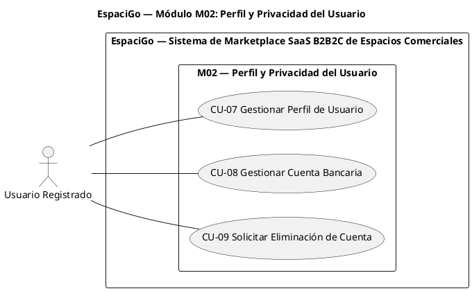

**Justificación de las relaciones**

| Relación | Tipo | Justificación |
|---|---|---|
| CU-07, CU-08, CU-09 | Sin relaciones | No existe comportamiento obligatorio compartido ni extensión condicional entre ellos: son objetivos independientes respaldados por RF distintos. Los bloqueos de CU-09 (RQF-035 a RQF-037) son validaciones de su propio flujo, no un caso de uso aparte. |

### CU-07: Gestionar Perfil de Usuario

| Atributo | Detalle |
| :--- | :--- |
| **ID** | CU-07 |
| **Caso de Uso** | Gestionar Perfil de Usuario |
| **Actor** | Usuario Registrado |
| **Descripción** | El usuario consulta y actualiza sus datos de perfil: nombre, teléfono y fotografía. |
| **Pre-condiciones** | Sesión activa en el sistema. |
| **Flujo Principal** | 1. El usuario accede a la configuración de su perfil. 2. El sistema muestra los datos actuales del perfil. 3. El usuario modifica su nombre, y el sistema valida que contenga únicamente caracteres alfabéticos y espacios. 4. El usuario modifica su teléfono, y el sistema valida que contenga exactamente 9 dígitos. 5. El usuario carga una fotografía de perfil, y el sistema valida que no supere los 2MB. 6. El sistema guarda los cambios y confirma la actualización. |
| **Flujos Alternativos** | **A1. Datos con formato inválido (Pasos 3 y 4):** 1. El sistema rechaza el valor ingresado y solicita corregirlo.  **A2. Fotografía superior al límite (Paso 5):** 1. El sistema rechaza la carga por superar los 2MB.  **A3. Eliminación de fotografía:** 1. El usuario solicita eliminar su fotografía y el sistema la elimina del perfil. |
| **Post-condiciones** | Datos de perfil actualizados en la plataforma. |
| **Referencias Cruzadas** | RQF-024 al RQF-031 · HU31 |

### CU-08: Gestionar Cuenta Bancaria

| Atributo | Detalle |
| :--- | :--- |
| **ID** | CU-08 |
| **Caso de Uso** | Gestionar Cuenta Bancaria |
| **Actor** | Usuario Registrado |
| **Descripción** | El usuario mantiene la cuenta bancaria en la que recibirá los pagos de los arriendos: la registra, consulta, modifica o elimina. |
| **Pre-condiciones** | Sesión activa y RUT validado en el perfil. |
| **Flujo Principal** | 1. El usuario accede a los datos de cobro de su perfil. 2. El sistema despliega la cuenta bancaria registrada, si existe. 3. El usuario registra una nueva cuenta bancaria o modifica la vigente. 4. El sistema valida que el RUT de la cuenta coincida con el RUT del usuario. 5. El sistema asocia la cuenta bancaria al perfil y confirma la operación. 6. El usuario puede eliminar la cuenta bancaria registrada. |
| **Flujos Alternativos** | **A1. RUT no coincidente (Paso 4):** 1. El sistema rechaza la operación e indica que el titular debe coincidir con el usuario verificado.  **A2. Eliminación con liquidaciones en proceso (Paso 6):** 1. El sistema advierte que existen pagos en proceso y mantiene la cuenta hasta completar su liquidación. |
| **Post-condiciones** | Cuenta bancaria registrada, actualizada o eliminada según la operación ejecutada. |
| **Referencias Cruzadas** | RQF-032, RQF-033 · RQF-189 al RQF-191 · CU-42 (uso de la cuenta en la liquidación) · HU31 |

### CU-09: Solicitar Eliminación de Cuenta

| Atributo | Detalle |
| :--- | :--- |
| **ID** | CU-09 |
| **Caso de Uso** | Solicitar Eliminación de Cuenta |
| **Actor** | Usuario Registrado |
| **Descripción** | El usuario solicita la eliminación de su cuenta y de sus datos personales, conforme al derecho de supresión de datos. |
| **Pre-condiciones** | Sesión activa en el sistema. |
| **Flujo Principal** | 1. El usuario solicita la eliminación de su cuenta desde la configuración. 2. El sistema verifica que no existan reservas activas. 3. El sistema verifica que no existan pagos pendientes. 4. El sistema verifica que no existan disputas abiertas. 5. El sistema ejecuta la eliminación de la cuenta y la anonimización de la información transaccional histórica. 6. El sistema cierra la sesión activa. |
| **Flujos Alternativos** | **A1. Procesos activos (Pasos 2 a 4):** 1. El sistema detecta reservas, pagos o disputas vigentes. 2. El sistema rechaza la eliminación e informa el motivo y las condiciones para reintentar. |
| **Post-condiciones** | Datos personales eliminados y data transaccional anonimizada (plazo administrativo conforme a RNF-026). |
| **Referencias Cruzadas** | RQF-034 al RQF-037 · RNF-018, RNF-026, RNF-029 · HU32 |

## Módulo M03 — Verificación de Identidad (KYC / KYB)

**RF cubiertos:** RQF-038 a RQF-059 + RQF-192 a RQF-194 + RQF-219, RQF-220 (27 RF)
**Actores participantes:** Usuario Registrado, Administrador; Registro Civil y SII (servicios externos)
**Casos de uso:** CU-10 (abstracto), CU-11, CU-12, CU-13, CU-14

### Diagrama de Casos de Uso

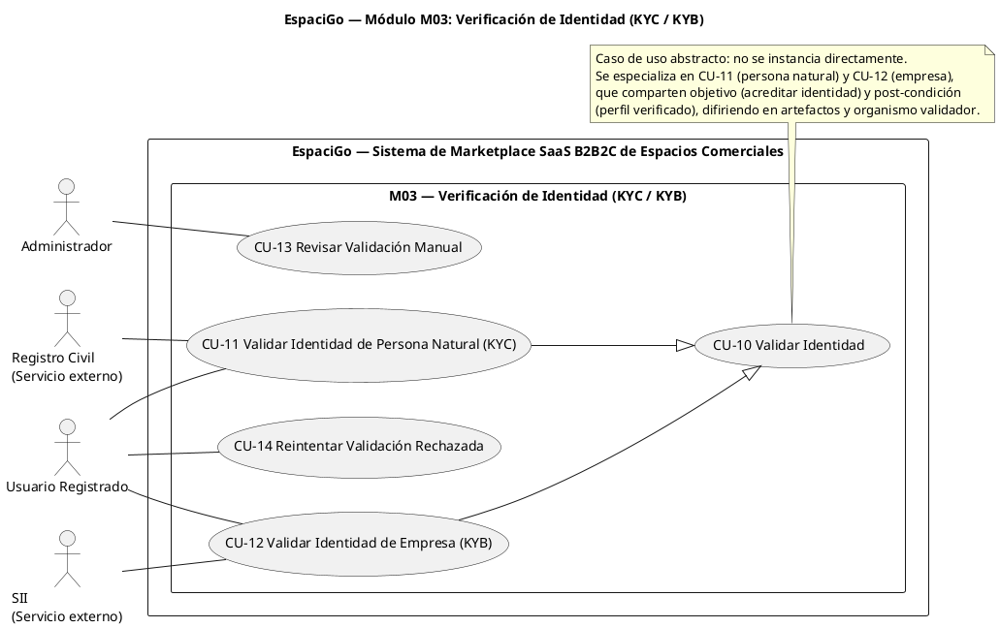

**Justificación de las relaciones**

| Relación | Tipo | Justificación |
|---|---|---|
| CU-11 → CU-10 | Generalización | Especialización real: mismo objetivo (acreditar identidad) y misma post-condición (perfil verificado), con reglas, artefactos y organismo validador distintos (Registro Civil vs SII). CU-10 es abstracto y no se ejecuta por sí solo. |
| CU-12 → CU-10 | Generalización | Ídem anterior para personas jurídicas. |
| CU-13 | Sin relación | El arbitraje manual es un objetivo propio del Administrador (RQF-054 a RQF-057); no es comportamiento obligatorio ni opcional de CU-11/CU-12, sino el tratamiento de sus resultados fallidos (se documenta como flujo alternativo derivado). |
| CU-14 | Sin relación | Reintentar la validación es una acción autónoma del usuario (RQF-058, RQF-059) iniciada desde su perfil, no una extensión de la validación en curso. |

### CU-10: Validar Identidad (caso de uso abstracto)

| Atributo | Detalle |
| :--- | :--- |
| **ID** | CU-10 |
| **Caso de Uso** | Validar Identidad (abstracto) |
| **Actor** | Usuario Registrado (actor general) |
| **Descripción** | Caso de uso abstracto que representa el objetivo común de acreditar la identidad del usuario ante un organismo externo, habilitándolo para operar en el marketplace. |
| **Pre-condiciones** | Sesión activa y datos básicos del perfil completos. |
| **Flujo Principal** | 1. El caso de uso no se instancia directamente. 2. Se ejecuta a través de sus especializaciones CU-11 (persona natural) y CU-12 (empresa). |
| **Flujos Alternativos** | No aplica (caso de uso abstracto). |
| **Post-condiciones** | Perfil del usuario en estado verificado y habilitado para transaccionar. |
| **Referencias Cruzadas** | RQF-038 al RQF-053 (a través de CU-11 y CU-12) |

### CU-11: Validar Identidad de Persona Natural (KYC)

| Atributo | Detalle |
| :--- | :--- |
| **ID** | CU-11 |
| **Caso de Uso** | Validar Identidad de Persona Natural (KYC) |
| **Actor** | Usuario Registrado · Registro Civil (servicio externo) |
| **Descripción** | El usuario acredita su identidad como persona natural mediante los documentos oficiales y la consulta de vigencia ante el Registro Civil. |
| **Pre-condiciones** | Sesión activa y datos básicos completos del perfil. |
| **Flujo Principal** | 1. El usuario solicita la validación de identidad KYC. 2. El usuario carga la fotografía del anverso de la cédula de identidad. 3. El usuario carga la fotografía del reverso de la cédula de identidad. 4. El usuario captura una fotografía tipo selfie para la validación facial. 5. El sistema valida que las imágenes tengan un formato compatible y no superen los 10MB por archivo. 6. El sistema extrae el RUT y el número de serie desde las fotografías. 7. El sistema cambia el estado del perfil a "Pendiente de Verificación" mientras se procesa la validación. 8. El sistema valida la vigencia de la cédula ante el Registro Civil. 9. El sistema cambia el estado del perfil a "Verificado _KYC" y notifica el resultado al usuario. |
| **Flujos Alternativos** | **A1. Documento vencido (Paso 8):** 1. El sistema rechaza la validación por documento vencido. 2. El sistema deriva el caso a la revisión manual del administrador (CU-13).  **A2. Formato o peso no permitido (Paso 5):** 1. El sistema rechaza la carga e indica el límite incumplido (formato compatible o máximo 10MB). |
| **Post-condiciones** | Perfil verificado como persona natural, habilitado para publicar y reservar. |
| **Referencias Cruzadas** | RQF-038 al RQF-047 · RQF-192 · RQF-219, RQF-220 · especializa CU-10 · CU-13 (derivación) · HU04 |

### CU-12: Validar Identidad de Empresa (KYB)

| Atributo | Detalle |
| :--- | :--- |
| **ID** | CU-12 |
| **Caso de Uso** | Validar Identidad de Empresa (KYB) |
| **Actor** | Usuario Registrado · SII (servicio externo) |
| **Descripción** | El usuario acredita la identidad legal y operativa de su empresa mediante el RUT y la consulta de inicio de actividades ante el SII. |
| **Pre-condiciones** | Sesión activa y datos básicos completos del perfil. |
| **Flujo Principal** | 1. El usuario solicita la validación de identidad KYB. 2. El usuario ingresa el RUT de la empresa. 3. El sistema valida el dígito verificador del RUT ingresado. 4. El sistema consulta el inicio de actividades ante el SII. 5. El sistema cambia el estado del perfil a "Verificado_KYB" y notifica el resultado al usuario. |
| **Flujos Alternativos** | **A1. Empresa sin inicio de actividades (Paso 4):** 1. El sistema rechaza la validación. 2. El sistema deriva el caso a la revisión manual del administrador (CU-13).  **A2. Dígito verificador inválido (Paso 3):** 1. El sistema rechaza el RUT ingresado y solicita corregirlo. |
| **Post-condiciones** | Perfil verificado como empresa, habilitado para publicar y reservar. |
| **Referencias Cruzadas** | RQF-048 al RQF-053 · RQF-194 · especializa CU-10 · CU-13 (derivación) |

### CU-13: Revisar Validación Manual

| Atributo | Detalle |
| :--- | :--- |
| **ID** | CU-13 |
| **Caso de Uso** | Revisar Validación Manual |
| **Actor** | Administrador |
| **Descripción** | El administrador revisa las validaciones de identidad que fallaron automáticamente y resuelve aprobando o rechazando con motivo obligatorio. |
| **Pre-condiciones** | Sesión activa con rol de Administrador y existencia de validaciones fallidas. |
| **Flujo Principal** | 1. El administrador consulta el listado de validaciones fallidas. 2. El sistema despliega los antecedentes aportados por el usuario. 3. El administrador selecciona aprobar o rechazar la validación. 4. Al rechazar, el administrador ingresa el motivo obligatorio. 5. El sistema actualiza el estado del perfil y notifica al usuario. |
| **Flujos Alternativos** | **A1. Rechazo sin motivo (Paso 4):** 1. El sistema exige completar el motivo antes de procesar el rechazo. |
| **Post-condiciones** | Validación de identidad resuelta manualmente. |
| **Referencias Cruzadas** | RQF-054 al RQF-057 · CU-11/CU-12 (origen del caso) · CU-14 (reintento) |

### CU-14: Reintentar Validación Rechazada

| Atributo | Detalle |
| :--- | :--- |
| **ID** | CU-14 |
| **Caso de Uso** | Reintentar Validación Rechazada |
| **Actor** | Usuario Registrado |
| **Descripción** | El usuario corrige los antecedentes rechazados y solicita un nuevo intento de validación de identidad. |
| **Pre-condiciones** | Contar con una validación de identidad previamente rechazada. |
| **Flujo Principal** | 1. El usuario consulta el estado de su validación de identidad. 2. El sistema despliega el estado de la validación y, si corresponde, el motivo del rechazo. 3. El usuario modifica los antecedentes rechazados. 4. El usuario solicita un nuevo intento de validación. 5. El sistema reingresa la solicitud al flujo de validación (CU-11 o CU-12). |
| **Flujos Alternativos** | **A1. Antecedentes sin modificar:** 1. El sistema no habilita el nuevo intento y solicita corregir los datos observados. |
| **Post-condiciones** | Solicitud de validación reingresada para evaluación. |
| **Referencias Cruzadas** | RQF-058, RQF-059 · RQF-193 · CU-13 (origen del rechazo) |

## Módulo M04 — Gestión de Publicaciones

**RF cubiertos:** RQF-060 a RQF-093 + RQF-195 a RQF-198 + RQF-221 a RQF-226 (44 RF)
**Actores participantes:** Arrendador
**Casos de uso:** CU-15, CU-16, CU-17, CU-18

### Diagrama de Casos de Uso

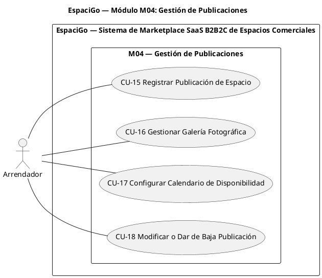

**Justificación de las relaciones**

| Relación | Tipo | Justificación |
|---|---|---|
| CU-15 ↔ CU-16 | Sin relación | Se evaluó un `<<include>>`, pero la galería **no es obligatoria** para registrar la publicación (la publicación existe en estado "Borrador" sin fotografías, RQF-081). Al no existir obligatoriedad, no corresponde `<<include>>`. |
| CU-17, CU-18 | Sin relación | Objetivos independientes: calendarizar (RQF-083 a RQF-085) y mantener vigente la publicación (RQF-086 a RQF-093) no son obligatorios ni condicionales entre sí. |

### CU-15: Registrar Publicación de Espacio

| Atributo | Detalle |
| :--- | :--- |
| **ID** | CU-15 |
| **Caso de Uso** | Registrar Publicación de Espacio |
| **Actor** | Arrendador |
| **Descripción** | El arrendador verificado registra un espacio comercial con sus características, tarifas y ubicación, y lo publica en el catálogo. |
| **Pre-condiciones** | Identidad verificada (KYC o KYB aprobado) y sesión activa. |
| **Flujo Principal** | 1. El arrendador accede al panel de creación de publicaciones. 2. Ingresa el título, validándose que no exceda los 70 caracteres. 3. Ingresa la descripción, validándose que contenga al menos 100 caracteres. 4. Ingresa la superficie en metros cuadrados, validándose que sea mayor a cero. 5. Selecciona el tipo de inmueble y establece la capacidad máxima de personas. 6. Agrega las reglas de uso, configura la modalidad tarifaria e ingresa el precio base, validándose que sea superior a \$5.000 CLP. 7. Ingresa la dirección física, y el sistema registra la ubicación geográfica correspondiente. 8. El sistema guarda la publicación en estado "Borrador". 9. Al confirmar el formulario, el sistema cambia el estado a "Activa". |
| **Flujos Alternativos** | **A1. Usuario sin verificación (Paso 1):** 1. El sistema bloquea el acceso al panel de creación de publicaciones. 2. El sistema indica que debe completar la validación de identidad.  **A2. Datos fuera de rango (Pasos 2, 3, 4 y 6):** 1. El sistema rechaza el registro y detalla los campos que incumplen las validaciones. |
| **Post-condiciones** | Publicación en estado "Activa" y visible en el catálogo público. |
| **Referencias Cruzadas** | RQF-060 al RQF-073 · RQF-079 al RQF-082 · CU-16 y CU-17 (complementarios) · HU05 |

### CU-16: Gestionar Galería Fotográfica

| Atributo | Detalle |
| :--- | :--- |
| **ID** | CU-16 |
| **Caso de Uso** | Gestionar Galería Fotográfica |
| **Actor** | Arrendador |
| **Descripción** | El arrendador mantiene la galería de imágenes de su publicación: carga, define portada y elimina fotografías. |
| **Pre-condiciones** | Poseer una publicación creada (en estado "Borrador" o "Activa"). |
| **Flujo Principal** | 1. El arrendador selecciona las imágenes a incorporar desde su dispositivo. 2. El sistema valida que la galería no exceda las 10 fotografías. 3. El sistema rechaza los archivos que superen los 5MB. 4. El arrendador selecciona la fotografía de portada. 5. El arrendador elimina las fotografías que ya no desea publicar. 6. El sistema almacena la galería vinculada a la publicación. |
| **Flujos Alternativos** | **A1. Exceso de fotografías o de peso (Pasos 2 y 3):** 1. El sistema rechaza la carga e indica la restricción incumplida (máximo 10 fotografías, 5MB por archivo). |
| **Post-condiciones** | Galería de la publicación actualizada. |
| **Referencias Cruzadas** | RQF-074 al RQF-078 · HU05 |

### CU-17: Configurar Calendario de Disponibilidad

| Atributo | Detalle |
| :--- | :--- |
| **ID** | CU-17 |
| **Caso de Uso** | Configurar Calendario de Disponibilidad |
| **Actor** | Arrendador |
| **Descripción** | El arrendador administra la disponibilidad de su espacio bloqueando y desbloqueando fechas en el calendario de la publicación. |
| **Pre-condiciones** | Publicación de espacio existente. |
| **Flujo Principal** | 1. El arrendador accede al calendario de disponibilidad generado para su publicación. 2. Selecciona un rango de fechas u horas para bloquear e ingresa el motivo del bloqueo. 3. El sistema valida que la fecha de término sea posterior a la de inicio y que el motivo esté ingresado. 4. El sistema verifica que el rango no se superponga con reservas existentes y aplica el bloqueo. 5. El sistema actualiza la disponibilidad consultada por el motor de búsqueda. 6. El arrendador desbloquea fechas previamente bloqueadas cuando corresponde. |
| **Flujos Alternativos** | **A1. Superposición con reservas existentes (Paso 4):** 1. El sistema impide el bloqueo para no interferir con una reserva vigente (deriva de RQF-112).  **A2. Motivo no ingresado (Paso 3):** 1. El sistema exige el motivo del bloqueo antes de aplicarlo.  **A3. Fecha de término inválida (Paso 3):** 1. El sistema rechaza el bloqueo e indica que la fecha de término debe ser posterior a la de inicio. |
| **Post-condiciones** | Calendario de la publicación actualizado y consistente con las reservas vigentes. |
| **Referencias Cruzadas** | RQF-083 al RQF-085 · RQF-225, RQF-226 · CU-19 (consumo de la disponibilidad) · CU-23 (validación de disponibilidad) · HU20, HU21 |

### CU-18: Modificar o Dar de Baja Publicación

| Atributo | Detalle |
| :--- | :--- |
| **ID** | CU-18 |
| **Caso de Uso** | Modificar o Dar de Baja Publicación |
| **Actor** | Arrendador |
| **Descripción** | El arrendador consulta su listado de publicaciones y modifica, oculta, reactiva o elimina una publicación. |
| **Pre-condiciones** | Ser propietario de la publicación y tener sesión activa. |
| **Flujo Principal** | 1. El arrendador consulta su listado de publicaciones. 2. Selecciona la publicación que desea gestionar. 3. Modifica el título, la descripción, el precio base, las reglas de uso, la capacidad máxima, la modalidad tarifaria o la política de cancelación de la publicación. 4. El sistema valida el precio base modificado (mayor a \$5.000 CLP) y las reglas personalizadas (máximo 250 caracteres). 5. El sistema publica las reglas de uso y la política de cancelación en el detalle de la publicación. 6. Cambia el estado a "Oculta", quedando excluida de los resultados públicos. 7. Cambia el estado de "Oculta" a "Activa" cuando corresponde. 8. Solicita la eliminación permanente de la publicación. |
| **Flujos Alternativos** | **A1. Eliminación con reservas futuras (Paso 8):** 1. El sistema detecta reservas futuras pendientes asociadas a la publicación. 2. El sistema rechaza la eliminación permanente y emite una advertencia.  **A2. Datos modificados fuera de rango (Paso 4):** 1. El sistema rechaza el valor ingresado y detalla las validaciones incumplidas (precio base o largo de la regla personalizada). |
| **Post-condiciones** | Publicación modificada, con reglas y política de cancelación publicadas, o bien oculta, reactivada o eliminada según la acción ejecutada. |
| **Referencias Cruzadas** | RQF-086 al RQF-093 · RQF-195 al RQF-198 · RQF-221 al RQF-224 · HU06, HU07, HU08 |

## Módulo M05 — Búsqueda y Cotización de Espacios

**RF cubiertos:** RQF-094 a RQF-107 (14 RF)
**Actores participantes:** Visitante, Arrendatario (Usuario Registrado hereda la capacidad de búsqueda)
**Casos de uso:** CU-19, CU-20, CU-21

### Diagrama de Casos de Uso

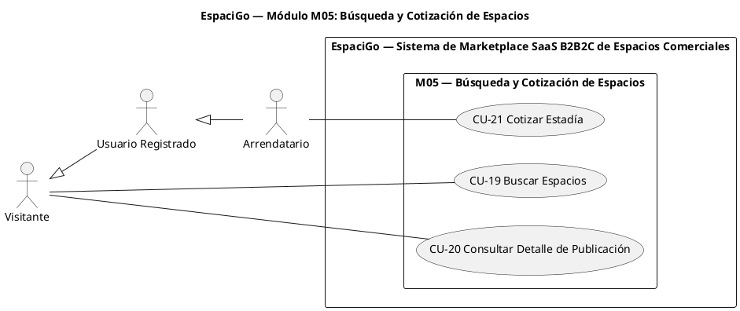

**Justificación de las relaciones**

| Relación | Tipo | Justificación |
|---|---|---|
| `VIS <\|-- USR <\|-- ARREN` | Generalización de actores | El usuario registrado y el arrendatario heredan la capacidad de buscar y consultar el catálogo; el arrendatario agrega la cotización como paso previo a la reserva. |
| CU-19, CU-20, CU-21 | Sin relaciones entre CU | La cotización no es un `<<include>>` de la búsqueda (el usuario puede cotizar sin buscar, accediendo al detalle directo) y el detalle no es obligatorio para buscar. Al no existir obligatoriedad, se mantienen independientes. |

### CU-19: Buscar Espacios

| Atributo | Detalle |
| :--- | :--- |
| **ID** | CU-19 |
| **Caso de Uso** | Buscar Espacios |
| **Actor** | Visitante (el Usuario Registrado y el Arrendatario heredan esta capacidad) |
| **Descripción** | El visitante busca espacios combinando texto libre, mapa interactivo y filtros, y el sistema excluye las publicaciones sin disponibilidad en el rango consultado. |
| **Pre-condiciones** | Existencia de publicaciones en estado "Activa". |
| **Flujo Principal** | 1. El visitante ingresa términos de búsqueda en la barra de texto. 2. El sistema renderiza el mapa interactivo con las ubicaciones de los espacios. 3. El sistema despliega la cuadrícula de tarjetas con el resumen de las publicaciones. 4. El visitante aplica filtros de precio mínimo y máximo, tipo de inmueble, metros cuadrados mínimos y rango de fechas. 5. El sistema excluye las publicaciones sin disponibilidad en las fechas consultadas. 6. El visitante limpia todos los filtros aplicados para reiniciar la búsqueda. |
| **Flujos Alternativos** | **A1. Sin resultados coincidentes (Paso 5):** 1. El sistema informa que no se encontraron espacios disponibles. 2. El sistema sugiere ampliar o relajar los criterios de búsqueda. |
| **Post-condiciones** | Listado geolocalizado de espacios disponibles según los criterios aplicados. |
| **Referencias Cruzadas** | RQF-094 al RQF-102 · CU-20 (siguiente paso) · HU10 |

### CU-20: Consultar Detalle de Publicación

| Atributo | Detalle |
| :--- | :--- |
| **ID** | CU-20 |
| **Caso de Uso** | Consultar Detalle de Publicación |
| **Actor** | Visitante |
| **Descripción** | El visitante consulta la información completa de un espacio publicado, incluyendo sus fotografías, reglas y reseñas. |
| **Pre-condiciones** | Publicación en estado "Activa". |
| **Flujo Principal** | 1. El visitante selecciona una tarjeta de resultado. 2. El sistema despliega los detalles completos de la publicación. 3. El sistema muestra las reseñas y calificaciones del espacio (ver CU-36). |
| **Flujos Alternativos** | **A1. Publicación no disponible (Paso 1):** 1. El sistema informa que la publicación ya no está disponible y vuelve a los resultados (deriva de RQF-089). |
| **Post-condiciones** | Información completa del espacio desplegada para el visitante. |
| **Referencias Cruzadas** | RQF-103 · CU-36 (reseñas) · CU-21 (cotización) |

### CU-21: Cotizar Estadía

| Atributo | Detalle |
| :--- | :--- |
| **ID** | CU-21 |
| **Caso de Uso** | Cotizar Estadía |
| **Actor** | Arrendatario |
| **Descripción** | Calcula y muestra el desglose económico del uso del espacio considerando precio base, comisión de servicio y garantía. |
| **Pre-condiciones** | Publicación activa y rango de tiempo de uso seleccionado. |
| **Flujo Principal** | 1. El arrendatario selecciona el tiempo de uso del espacio. 2. El sistema calcula el costo total multiplicando el precio base por el tiempo seleccionado. 3. El sistema calcula el monto de la comisión de servicio. 4. El sistema calcula el monto de la garantía exigida. 5. El sistema muestra el desglose de cobro (Estadía + Comisión + Garantía). |
| **Flujos Alternativos** | **A1. Cambio del rango de tiempo (Paso 2):** 1. El arrendatario modifica el rango y el sistema recalcula el desglose antes de continuar. |
| **Post-condiciones** | Desglose de cobro disponible para iniciar el proceso de reserva. |
| **Referencias Cruzadas** | RQF-104 al RQF-107 · CU-22 (reserva) · HU15 |

## Módulo M06 — Reservas y Pagos (Escrow)

**RF cubiertos:** RQF-108 a RQF-129 + RQF-199 a RQF-201 + RQF-227 a RQF-231 (30 RF)
**Actores participantes:** Arrendatario, Arrendador; Mercado Pago (pasarela externa)
**Casos de uso:** CU-22, CU-23, CU-24, CU-25, CU-26, CU-27, CU-28, CU-47, CU-51

### Diagrama de Casos de Uso

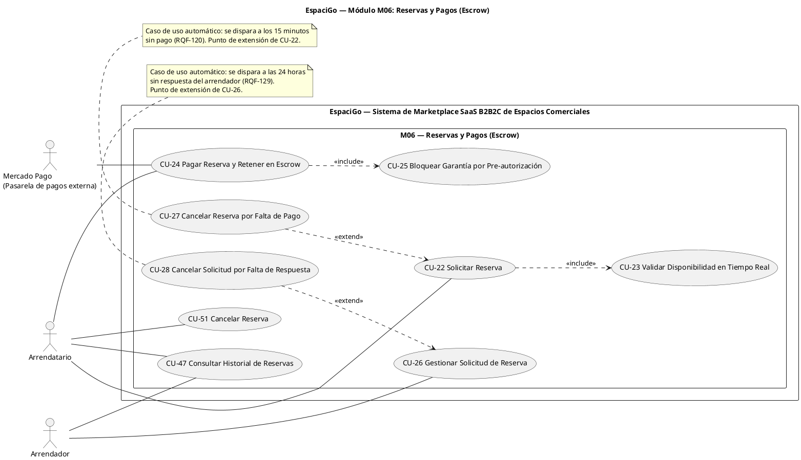

**Justificación de las relaciones**

| Relación | Tipo | Justificación |
|---|---|---|
| CU-22 → CU-23 | `<<include>>` | **Obligatorio:** ninguna reserva puede registrarse sin validar la disponibilidad del intervalo contra reservas y bloqueos existentes (RQF-111). La validación siempre se ejecuta como parte de CU-22. |
| CU-24 → CU-25 | `<<include>>` | **Obligatorio:** el flujo de pago exige ejecutar la pre-autorización por el monto de la garantía (RQF-118); no es opcional ni alternativo. |
| CU-27 → CU-22 | `<<extend>>` | **Condicional:** la cancelación por falta de pago solo ocurre si transcurren 15 minutos sin completarse el pago (RQF-120). CU-22 puede finalizar con el pago exitoso sin ejecutar la extensión. |
| CU-28 → CU-26 | `<<extend>>` | **Condicional:** la cancelación por falta de respuesta solo ocurre si el arrendador no responde en 24 horas (RQF-129). CU-26 puede finalizar con aprobación o rechazo sin ejecutar la extensión. |
| CU-47 | Sin relación | La consulta del historial de reservas es un objetivo de consulta independiente: no es obligatoria para ningún otro caso de uso del módulo ni agrega comportamiento a ellos. |
| CU-51 | Sin relación (con `<<extend>>` evaluado) | Se evaluó que CU-51 extendiera a CU-26 (solicitud de reserva), pero la cancelación la ejecuta un **actor distinto** (Arrendatario) sobre una reserva ya pagada o en curso, y no modifica el comportamiento del caso base. Se modela como caso de uso independiente con la reserva vigente como pre-condición. |

### CU-22: Solicitar Reserva

| Atributo | Detalle |
| :--- | :--- |
| **ID** | CU-22 |
| **Caso de Uso** | Solicitar Reserva |
| **Actor** | Arrendatario |
| **Descripción** | El arrendatario solicita formalmente la reserva del espacio para un intervalo determinado, registrándose la solicitud en estado pendiente de pago. |
| **Pre-condiciones** | Usuario autenticado con identidad verificada y cotización de estadía generada. |
| **Flujo Principal** | 1. El arrendatario selecciona las fechas u horas de uso dentro de la publicación. 2. El sistema valida que la fecha de inicio sea posterior a la fecha actual. 3. El sistema valida que la fecha de fin sea posterior a la fecha de inicio. 4. El sistema ejecuta la validación de disponibilidad en tiempo real (incluye CU-23). 5. El sistema registra la reserva en estado "Pendiente de Pago" y deriva al flujo de pago (CU-24). |
| **Flujos Alternativos** | **A1. Colisión de fechas detectada (Paso 4):** 1. El sistema rechaza la reserva por superposición temporal con otra reserva o bloqueo. 2. El sistema solicita seleccionar un nuevo rango de fechas.  **A2. Usuario sin identidad verificada:** 1. El sistema rechaza la reserva y dirige al usuario a la validación de identidad (CU-11 o CU-12).  **A3. Pago no completado en 15 minutos:** 1. Se ejecuta la extensión CU-27 (cancelación automática). |
| **Post-condiciones** | Reserva registrada en estado "Pendiente de Pago" a la espera de confirmación de pago. |
| **Referencias Cruzadas** | RQF-108 al RQF-110 · RQF-113 · RQF-227 · incluye CU-23 · extendido por CU-27 · HU15, HU17 |

### CU-23: Validar Disponibilidad en Tiempo Real

| Atributo | Detalle |
| :--- | :--- |
| **ID** | CU-23 |
| **Caso de Uso** | Validar Disponibilidad en Tiempo Real |
| **Actor** | Sin actor propio: caso de uso incluido obligatoriamente por CU-22 |
| **Descripción** | Verifica contra la base de datos operativa que el intervalo solicitado no se superponga con reservas confirmadas ni con bloqueos de calendario, evitando la doble reserva. |
| **Pre-condiciones** | Intervalo de fechas u horas definido por el arrendatario (CU-22, paso 1). |
| **Flujo Principal** | 1. El sistema consulta la disponibilidad del intervalo solicitado. 2. El sistema confirma que no existen superposiciones y retorna el resultado a CU-22. |
| **Flujos Alternativos** | **A1. Superposición detectada (Paso 1):** 1. El sistema rechaza la reserva cuando existe superposición temporal con otra reserva o bloqueo. 2. El sistema retorna el rechazo a CU-22. |
| **Post-condiciones** | Disponibilidad del intervalo confirmada o rechazada. |
| **Referencias Cruzadas** | RQF-111, RQF-112 · incluido por CU-22 · HU15 |

### CU-24: Pagar Reserva y Retener en Escrow

| Atributo | Detalle |
| :--- | :--- |
| **ID** | CU-24 |
| **Caso de Uso** | Pagar Reserva y Retener en Escrow |
| **Actor** | Arrendatario · Mercado Pago (pasarela externa) |
| **Descripción** | El arrendatario paga la reserva a través de la pasarela integrada y el sistema mantiene los fondos retenidos en custodia (Escrow) hasta que se cumplan las condiciones de liberación. |
| **Pre-condiciones** | Reserva registrada en estado "Pendiente de Pago". |
| **Flujo Principal** | 1. El arrendatario selecciona el método de pago en la pasarela integrada. 2. El sistema inicia el flujo de cobro comunicándose con la pasarela. 3. La pasarela aprueba la transacción y el sistema cambia el estado de la reserva a "Pagada". 4. El sistema mantiene retenidos los fondos hasta que se cumplan las condiciones de liberación. 5. El sistema ejecuta el bloqueo de la garantía por pre-autorización (incluye CU-25). 6. El sistema notifica al arrendatario que el pago fue procesado. 7. El sistema notifica al arrendador la recepción de una nueva solicitud pagada. |
| **Flujos Alternativos** | **A1. Rechazo de la pasarela (Paso 3):** 1. El sistema cambia el estado de la reserva a "Cancelada_Por_Pago". 2. El sistema notifica al arrendatario que el pago fue rechazado y permite reintentar con otro método de pago.  **A2. Garantía sin cupo disponible (Paso 5):** 1. La pre-autorización es rechazada por la pasarela. 2. El sistema cancela la reserva y gestiona la devolución conforme a RQF-119 y RQF-128. |
| **Post-condiciones** | Fondos de la estadía retenidos en custodia y garantía bloqueada en la tarjeta del arrendatario. |
| **Referencias Cruzadas** | RQF-114 al RQF-117 · RQF-119 · RQF-121, RQF-122 · RQF-201 · incluye CU-25 · HU17 |

### CU-25: Bloquear Garantía por Pre-autorización

| Atributo | Detalle |
| :--- | :--- |
| **ID** | CU-25 |
| **Caso de Uso** | Bloquear Garantía por Pre-autorización |
| **Actor** | Sin actor propio: caso de uso incluido obligatoriamente por CU-24 |
| **Descripción** | Solicita a la pasarela el bloqueo de cupo por el monto de la garantía, sin ejecutar un cargo efectivo en ese momento. |
| **Pre-condiciones** | Pago de la estadía procesado exitosamente (CU-24, paso 3). |
| **Flujo Principal** | 1. El sistema solicita a la pasarela la pre-autorización por el monto exacto de la garantía. 2. La pasarela aplica el bloqueo temporal de cupo. 3. El sistema registra el resultado del bloqueo y retorna a CU-24. |
| **Flujos Alternativos** | **A1. Rechazo por límite excedido (Paso 2):** 1. La pasarela rechaza la pre-autorización. 2. El sistema informa el rechazo a CU-24 para la cancelación y devolución correspondiente. |
| **Post-condiciones** | Cupo de garantía retenido temporalmente en la tarjeta del arrendatario. |
| **Referencias Cruzadas** | RQF-118 · incluido por CU-24 · CU-41/CU-42 (liberación o cobro de la garantía) |

### CU-26: Gestionar Solicitud de Reserva

| Atributo | Detalle |
| :--- | :--- |
| **ID** | CU-26 |
| **Caso de Uso** | Gestionar Solicitud de Reserva |
| **Actor** | Arrendador |
| **Descripción** | El arrendador revisa las solicitudes de reserva pagadas y decide aprobarlas, habilitando el contrato, o rechazarlas con reembolso total. |
| **Pre-condiciones** | Existencia de solicitudes de reserva con pago retenido pendientes de revisión. |
| **Flujo Principal** | 1. El arrendador consulta las solicitudes de reserva entrantes. 2. El arrendador aprueba la solicitud y el sistema cambia el estado a "Aprobada_Host". 3. El sistema habilita la generación del contrato (CU-29). 4. Alternativamente, el arrendador rechaza la solicitud seleccionando un motivo obligatorio. 5. El sistema ejecuta el reembolso total al arrendatario y actualiza el estado de la reserva. |
| **Flujos Alternativos** | **A1. Rechazo sin motivo (Paso 4):** 1. El sistema exige seleccionar el motivo antes de procesar el rechazo y el reembolso.  **A2. Sin respuesta en 24 horas:** 1. Se ejecuta la extensión CU-28 (cancelación automática de la solicitud). |
| **Post-condiciones** | Reserva aprobada para contratación o rechazada con reembolso ejecutado. |
| **Referencias Cruzadas** | RQF-123 al RQF-128 · extendido por CU-28 · CU-29 (contrato) · CU-18 (informe) |

### CU-27: Cancelar Reserva por Falta de Pago

| Atributo | Detalle |
| :--- | :--- |
| **ID** | CU-27 |
| **Caso de Uso** | Cancelar Reserva por Falta de Pago |
| **Actor** | Caso automático desencadenado por el sistema (afecta al Arrendatario) |
| **Descripción** | Extensión de CU-22 que cancela automáticamente la reserva cuando el pago no se completa dentro de los 15 minutos siguientes al registro. |
| **Pre-condiciones** | Reserva en estado "Pendiente de Pago" (punto de extensión de CU-22). |
| **Flujo Principal** | 1. El sistema monitorea el tiempo de vigencia del estado "Pendiente de Pago". 2. Al cumplirse 15 minutos sin pago, el sistema cancela la reserva. 3. El sistema libera el bloqueo temporal de las fechas. |
| **Flujos Alternativos** | **A1. Pago recibido dentro del plazo:** 1. La condición de extensión no se cumple y la extensión no se ejecuta. |
| **Post-condiciones** | Reserva cancelada y fechas liberadas para nuevas solicitudes. |
| **Referencias Cruzadas** | RQF-120 · RQF-200 · extiende CU-22 |

### CU-28: Cancelar Solicitud por Falta de Respuesta

| Atributo | Detalle |
| :--- | :--- |
| **ID** | CU-28 |
| **Caso de Uso** | Cancelar Solicitud por Falta de Respuesta |
| **Actor** | Caso automático desencadenado por el sistema (afecta a Arrendador y Arrendatario) |
| **Descripción** | Extensión de CU-26 que cancela automáticamente la solicitud de reserva cuando el arrendador no responde en el plazo de 24 horas. |
| **Pre-condiciones** | Solicitud de reserva pagada sin respuesta del arrendador (punto de extensión de CU-26). |
| **Flujo Principal** | 1. El sistema monitorea el plazo de respuesta de la solicitud. 2. Al cumplirse 24 horas sin respuesta, el sistema cancela la solicitud. 3. El sistema libera las fechas y gestiona los fondos retenidos según la política de liberación. |
| **Flujos Alternativos** | **A1. Respuesta registrada dentro del plazo:** 1. La condición de extensión no se cumple y la extensión no se ejecuta. |
| **Post-condiciones** | Solicitud cancelada y disponibilidad liberada. |
| **Referencias Cruzadas** | RQF-129 · extiende CU-26 · CU-24 (fondos retenidos) · CU-27 (liberación de fechas) |

> **Caso de uso complementario:** CU-47 se incorpora al módulo M06 sin alterar la numeración de los casos de uso existentes.

### CU-47: Consultar Historial de Reservas

| Atributo | Detalle |
| :--- | :--- |
| **ID** | CU-47 |
| **Caso de Uso** | Consultar Historial de Reservas |
| **Actor** | Arrendatario · Arrendador |
| **Descripción** | El usuario consulta las reservas asociadas a su cuenta y el estado vigente de cada una (pendiente de pago, pagada, aprobada, en firma, lista para check-in, en curso, finalizada, en disputa o cerrada). |
| **Pre-condiciones** | Sesión activa con identidad verificada (KYC o KYB aprobado). |
| **Flujo Principal** | 1. El usuario accede a su panel de reservas. 2. El sistema despliega el historial de reservas asociadas a su cuenta. 3. El usuario selecciona una reserva y el sistema muestra su detalle y estado. 4. El sistema habilita las acciones disponibles según el estado de la reserva (pagar, aprobar, firmar, descargar el contrato, realizar check-in o check-out, reseñar). |
| **Flujos Alternativos** | **A1. Cuenta sin reservas (Paso 2):** 1. El sistema muestra el estado vacío del historial.  **A2. Reserva finalizada seleccionada (Paso 3):** 1. El sistema despliega el detalle en modo de solo lectura y no habilita acciones operativas. |
| **Post-condiciones** | Historial y estado de las reservas consultado por el usuario según su rol. |
| **Referencias Cruzadas** | RQF-199 · CU-24 (pago), CU-26 (aprobación), CU-31 (contrato), CU-33/CU-34 (check-in y check-out), CU-42 (cierre) |

> **Caso de uso complementario (2.ª revisión, derivada de las Historias de Usuario):** CU-51 se incorpora al módulo M06 sin alterar la numeración de los casos existentes.

### CU-51: Cancelar Reserva

| Atributo | Detalle |
| :--- | :--- |
| **ID** | CU-51 |
| **Caso de Uso** | Cancelar Reserva |
| **Actor** | Arrendatario |
| **Descripción** | El arrendatario cancela una reserva vigente conforme a la política de cancelación del espacio, gestionando la devolución de los fondos según corresponda. |
| **Pre-condiciones** | Reserva en estado "Pagada", "Aprobada_Host", "Lista_Para_Checkin" o "En_Curso", con sesión activa del arrendatario titular. |
| **Flujo Principal** | 1. El arrendatario selecciona la reserva desde su historial de reservas. 2. El sistema muestra la política de cancelación aplicable y el monto estimado a devolver. 3. El arrendatario confirma la cancelación e ingresa un motivo opcional. 4. El sistema cambia el estado de la reserva a "Cancelada" y libera las fechas bloqueadas. 5. El sistema calcula el monto a reembolsar según la política de cancelación configurada. 6. El sistema ejecuta el reembolso a través de la pasarela de pago y registra el resultado de la operación. 7. El sistema notifica a ambas partes la cancelación y el estado de la devolución de los fondos. |
| **Flujos Alternativos** | **A1. Cancelación fuera del plazo permitido:** 1. El sistema rechaza la cancelación e informa que se encuentra fuera del plazo de la política de cancelación.  **A2. Rechazo del reembolso por la pasarela:** 1. El sistema registra el fallo, reintenta conforme a las políticas de conciliación (RNF-028) y mantiene la reserva cancelada con la devolución pendiente.  **A3. Reserva con disputa abierta:** 1. El sistema no habilita la cancelación y deriva el caso al flujo de resolución de disputas (CU-41). |
| **Post-condiciones** | Reserva cancelada, fechas liberadas, reembolso ejecutado o en proceso y partes notificadas del estado de devolución. |
| **Referencias Cruzadas** | RQF-228 al RQF-231 · CU-18 (política de cancelación) · CU-27 (liberación de fechas) · CU-24 (fondos retenidos en custodia) · CU-47 (acceso a la reserva) · HU19 |

## Módulo M07 — Contratos y Firma Electrónica

**RF cubiertos:** RQF-130 a RQF-142 + RQF-202 (14 RF)
**Actores participantes:** Arrendador, Arrendatario; FirmaVirtual (servicio externo)
**Casos de uso:** CU-29, CU-30, CU-31, CU-32

### Diagrama de Casos de Uso

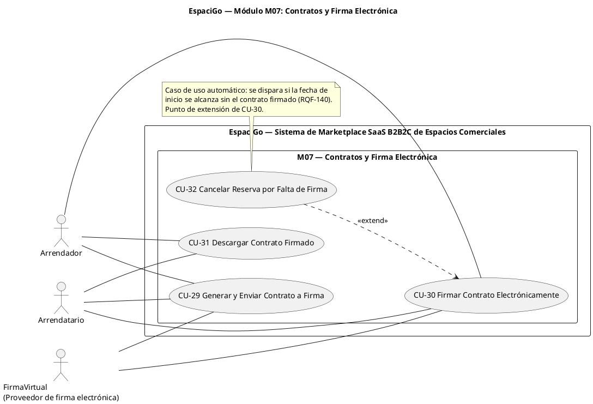

**Justificación de las relaciones**

| Relación | Tipo | Justificación |
|---|---|---|
| CU-32 → CU-30 | `<<extend>>` | **Condicional:** la cancelación solo ocurre si se alcanza la fecha de inicio sin la totalidad de las firmas (RQF-140). El caso base puede completar las firmas normalmente sin ejecutar la extensión. |
| CU-29 ↔ CU-30 | Sin relación | Se evaluó `<<include>>` desde CU-29, pero la firma es un acto de las partes (con enlaces enviados por correo y ejecutados fuera de la plataforma con el proveedor externo), no una ejecución obligatoria sincrónica de CU-29. Se documenta como secuencia mediante la pre-condición de CU-30. |
| CU-31 | Sin relación | Descargar el contrato firmado es un objetivo autónomo de cada parte, disponible después de completadas las firmas. |
| Dependencia con CU-26 | — | Se evaluó `<<include>>` desde CU-26 (aprobar solicitud) hacia CU-29. Se descartó para no acoplar dos módulos distintos en un mismo diagrama; la dependencia obligatoria (RQF-130) se documenta como pre-condición de CU-29. |

### CU-29: Generar y Enviar Contrato a Firma

| Atributo | Detalle |
| :--- | :--- |
| **ID** | CU-29 |
| **Caso de Uso** | Generar y Enviar Contrato a Firma |
| **Actor** | Arrendador · Arrendatario · FirmaVirtual (servicio externo) |
| **Descripción** | El sistema genera automáticamente el contrato con los datos legales de las partes y del inmueble, y lo envía al proveedor de firma electrónica para su suscripción. |
| **Pre-condiciones** | Reserva aprobada por el arrendador (CU-26). |
| **Flujo Principal** | 1. El sistema inicia la generación del contrato tras la aprobación de la reserva. 2. El sistema consulta los datos legales de las partes involucradas y del inmueble. 3. El sistema genera el documento de contrato incorporando los datos extraídos. 4. El sistema envía el documento al proveedor de firma electrónica externa. 5. El sistema envía el enlace de firma correspondiente al arrendatario. 6. El sistema envía el enlace de firma correspondiente al arrendador. |
| **Flujos Alternativos** | **A1. Proveedor de firma no disponible (Paso 4):** 1. El sistema registra el error, reintenta la comunicación y mantiene la reserva a la espera sin avanzar de estado.  **A2. Datos legales incompletos (Paso 2):** 1. El sistema detiene la generación e informa la inconsistencia para su corrección. |
| **Post-condiciones** | Contrato generado y enlaces de firma distribuidos a ambas partes. |
| **Referencias Cruzadas** | RQF-130 al RQF-135 · CU-26 (pre-condición) · CU-30 (continuación) · HU33 |

### CU-30: Firmar Contrato Electrónicamente

| Atributo | Detalle |
| :--- | :--- |
| **ID** | CU-30 |
| **Caso de Uso** | Firmar Contrato Electrónicamente |
| **Actor** | Arrendador · Arrendatario · FirmaVirtual (servicio externo) |
| **Descripción** | Las partes suscriben el contrato mediante firma electrónica y el sistema resguarda el documento firmado, habilitando el check-in. |
| **Pre-condiciones** | Contrato generado y enlaces de firma enviados (CU-29). |
| **Flujo Principal** | 1. Las partes firman el contrato desde los enlaces recibidos. 2. Al confirmarse la primera firma, el sistema cambia el estado del contrato a "Firma_Parcial". 3. Al confirmarse todas las firmas, el sistema almacena el contrato final asociado a la reserva. 4. El sistema cambia el estado de la reserva a "Lista_Para_Checkin". 5. El sistema notifica a las partes que el contrato está completamente firmado. |
| **Flujos Alternativos** | **A1. Firma incompleta al llegar la fecha de inicio:** 1. Se ejecuta la extensión CU-32 (cancelación y reembolso).  **A2. Firma rechazada o abandonada por una de las partes (Paso 1):** 1. El sistema registra el rechazo de firma notificado por el proveedor de firma electrónica. 2. El sistema mantiene el estado "Firma_Parcial" hasta el cumplimiento del plazo, sin almacenar el documento como contrato final. |
| **Post-condiciones** | Contrato firmado y almacenado; reserva habilitada para check-in. |
| **Referencias Cruzadas** | RQF-136 al RQF-139 · RQF-202 · extendido por CU-32 · CU-31 (descarga) · RNF-014, RNF-042 · HU33 |

### CU-31: Descargar Contrato Firmado

| Atributo | Detalle |
| :--- | :--- |
| **ID** | CU-31 |
| **Caso de Uso** | Descargar Contrato Firmado |
| **Actor** | Arrendador · Arrendatario |
| **Descripción** | Cada parte descarga el contrato firmado asociado a su reserva. |
| **Pre-condiciones** | Contrato almacenado tras la confirmación de todas las firmas (CU-30). |
| **Flujo Principal** | 1. La parte accede al detalle de su reserva. 2. La parte solicita la descarga del contrato. 3. El sistema entrega el contrato firmado para el titular de la reserva. |
| **Flujos Alternativos** | **A1. Contrato no firmado por todas las partes:** 1. El sistema informa el estado del contrato y no expone el documento final. |
| **Post-condiciones** | Documento firmado entregado a la parte solicitante. |
| **Referencias Cruzadas** | RQF-142 · CU-30 (pre-condición) · HU33 |

### CU-32: Cancelar Reserva por Falta de Firma

| Atributo | Detalle |
| :--- | :--- |
| **ID** | CU-32 |
| **Caso de Uso** | Cancelar Reserva por Falta de Firma |
| **Actor** | Caso automático desencadenado por el sistema (afecta al Arrendatario) |
| **Descripción** | Extensión de CU-30 que cancela la reserva y devuelve el pago cuando se alcanza la fecha de inicio sin el contrato firmado por todas las partes. |
| **Pre-condiciones** | Contrato pendiente de firma y fecha de inicio de la reserva alcanzada (punto de extensión de CU-30). |
| **Flujo Principal** | 1. El sistema detecta las reservas cuya fecha de inicio es la fecha actual y que no poseen el contrato firmado. 2. El sistema cancela la reserva. 3. El sistema reembolsa el pago al arrendatario. |
| **Flujos Alternativos** | **A1. Contrato firmado antes de la fecha de inicio:** 1. La condición de extensión no se cumple y la extensión no se ejecuta. |
| **Post-condiciones** | Reserva cancelada y pago reembolsado al arrendatario. |
| **Referencias Cruzadas** | RQF-140, RQF-141 · extiende CU-30 · HU33 |

## Módulo M08 — Check-in y Check-out

**RF cubiertos:** RQF-143 a RQF-152 + RQF-203 a RQF-206 (14 RF)
**Actores participantes:** Arrendatario (inicia), Arrendador (recibe notificación y confirma la recepción)
**Casos de uso:** CU-33, CU-34, CU-48

### Diagrama de Casos de Uso

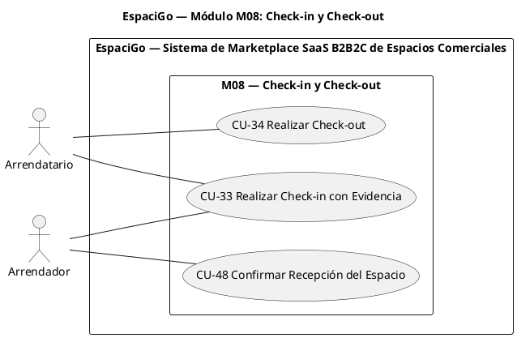

**Justificación de las relaciones**

| Relación | Tipo | Justificación |
|---|---|---|
| `ARR -- CU33` | Asociación | El arrendador participa en CU-33 al recibir la notificación del ingreso del arrendatario (RQF-149); no participa en CU-34, cuyos RF (RQF-150 a RQF-152) son ejecutados solo por el arrendatario. |
| CU-33 ↔ CU-34 | Sin relación | Son objetivos independientes y distantes en el tiempo (inicio y término del arriendo). Se evaluó `<<include>>`, pero el check-out no forma parte de la ejecución del check-in, ni el check-in es condición condicional del check-out. |
| CU-48 → CU-34 | Sin relación (evaluado) | Se evaluó `<<extend>>` desde CU-48 hacia CU-34. Se descartó: la confirmación de recepción la ejecuta un **actor distinto** (Arrendador), ocurre **después** de que el caso base finaliza y no modifica el comportamiento del check-out (RQF-205). Se modela como caso de uso independiente con la reserva finalizada como pre-condición. |

### CU-33: Realizar Check-in con Evidencia

| Atributo | Detalle |
| :--- | :--- |
| **ID** | CU-33 |
| **Caso de Uso** | Realizar Check-in con Evidencia |
| **Actor** | Arrendatario (inicia) · Arrendador (recibe notificación) |
| **Descripción** | El arrendatario documenta la recepción del espacio mediante fotografías y comentarios, registrándose la fecha y ubicación del ingreso. |
| **Pre-condiciones** | Contrato firmado y fecha actual coincidente con el día de inicio de la reserva. |
| **Flujo Principal** | 1. El sistema habilita la opción de check-in únicamente el día de inicio de la reserva. 2. El arrendatario carga las fotografías del estado del espacio. 3. El arrendatario ingresa comentarios de texto asociados al ingreso. 4. El sistema registra la fecha y la ubicación al procesar el check-in. 5. El sistema cambia el estado de la reserva a "En_Curso". 6. El sistema notifica al arrendador que el arrendatario procesó el ingreso. |
| **Flujos Alternativos** | **A1. Check-in fuera de la fecha de inicio (Paso 1):** 1. El sistema bloquea la posibilidad de realizar check-in.  **A2. Envío sin fotografías (Paso 2):** 1. El sistema rechaza el formulario y exige al menos una evidencia fotográfica. |
| **Post-condiciones** | Evidencia de entrada registrada y reserva en estado "En_Curso". |
| **Referencias Cruzadas** | RQF-143 al RQF-149 · RQF-203 · CU-30 (pre-condición) · CU-41 y CU-48 (evidencia) · RNF-042 · HU35 |

### CU-34: Realizar Check-out

| Atributo | Detalle |
| :--- | :--- |
| **ID** | CU-34 |
| **Caso de Uso** | Realizar Check-out |
| **Actor** | Arrendatario |
| **Descripción** | El arrendatario registra el término del uso del espacio adjuntando fotografías del estado final, cerrando la estadía. |
| **Pre-condiciones** | Reserva en estado "En_Curso". |
| **Flujo Principal** | 1. El arrendatario registra el check-out de la reserva. 2. El arrendatario carga las fotografías del estado final del espacio. 3. El sistema cambia el estado de la reserva a "Finalizada". 4. El sistema habilita el período de 24 horas para el registro de reclamos (CU-39). |
| **Flujos Alternativos** | **A1. Check-out sin fotografías (Paso 2):** 1. El sistema solicita registrar al menos una evidencia fotográfica del estado final. |
| **Post-condiciones** | Reserva finalizada y período de gracia iniciado. |
| **Referencias Cruzadas** | RQF-150 al RQF-152 · RQF-204 · CU-39 (habilita el período de reclamos) · CU-48 (confirmación de recepción) · HU35 |

> **Caso de uso complementario:** CU-48 se incorpora al módulo M08 sin alterar la numeración de los casos de uso existentes.

### CU-48: Confirmar Recepción del Espacio

| Atributo | Detalle |
| :--- | :--- |
| **ID** | CU-48 |
| **Caso de Uso** | Confirmar Recepción del Espacio |
| **Actor** | Arrendador |
| **Descripción** | El arrendador confirma la recepción del espacio tras el Check-out, dejando registro de la fecha, la ubicación y la conformidad (o las observaciones) del estado en que fue devuelto. |
| **Pre-condiciones** | Reserva en estado "Finalizada" (Check-out registrado) y arrendador autenticado. |
| **Flujo Principal** | 1. El arrendador selecciona la reserva finalizada desde su panel de reservas (CU-47). 2. El sistema habilita la confirmación de recepción del espacio. 3. El arrendador confirma la recepción del espacio. 4. El sistema registra la fecha y la ubicación de la confirmación. 5. El sistema deja la confirmación disponible como evidencia de la reserva para la resolución de disputas. |
| **Flujos Alternativos** | **A1. Daños detectados al recibir el espacio (Paso 3):** 1. El arrendador no registra la conformidad y presenta el reclamo por daños dentro de las 24 horas posteriores al término (CU-39).  **A2. Reserva no finalizada (Paso 1):** 1. El sistema no habilita la confirmación mientras la reserva no esté finalizada. |
| **Post-condiciones** | Recepción del espacio confirmada y registrada como evidencia. La confirmación **no altera** el período de gracia de 24 horas que rige la liquidación (CU-42). |
| **Referencias Cruzadas** | RQF-205, RQF-206 · CU-34 (pre-condición) · CU-39 (reclamo), CU-41 (evidencia en el arbitraje), CU-42 (cierre), CU-47 (acceso a la reserva) |

## Módulo M09 — Comunicación y Reputación

**RF cubiertos:** RQF-153 a RQF-158 + RQF-207 + RQF-232 a RQF-235 (11 RF)
**Actores participantes:** Arrendatario, Arrendador, Visitante
**Casos de uso:** CU-35, CU-36, CU-37, CU-38, CU-49

### Diagrama de Casos de Uso

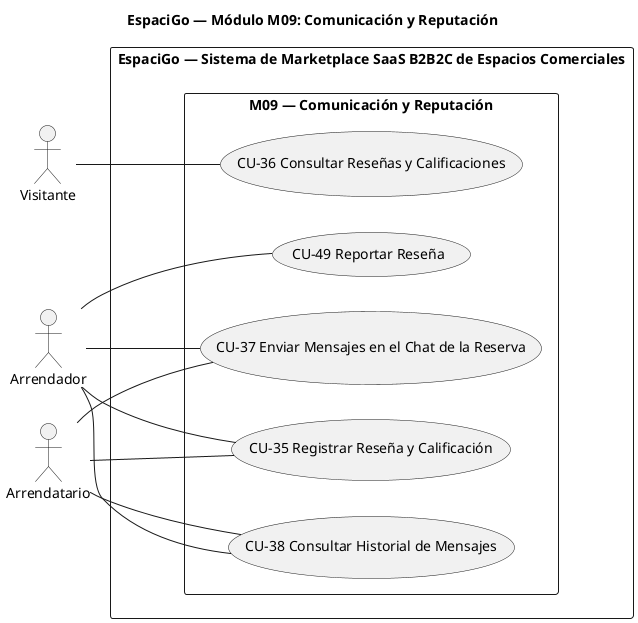

**Justificación de las relaciones**

| Relación | Tipo | Justificación |
|---|---|---|
| CU-35 ↔ CU-36 | Sin relación | Se evaluó `<<extend>>` de la consulta hacia la vista de detalle, pero son objetivos con actores distintos (arrendatario que reseña y visitante que consulta) sin obligatoriedad entre sí. Se mantienen independientes. |
| CU-37 ↔ CU-38 | Sin relación | Consultar el historial no es obligatorio para enviar mensajes ni viceversa; no corresponde `<<include>>` ni `<<extend>>`. |
| Cuatro casos, sin relaciones | — | No existe comportamiento obligatorio compartido ni extensión condicional justificable con los RF 153 a 158. |
| CU-49 | Sin relación | Reportar una reseña es un objetivo autónomo del arrendador (RQF-207); no es obligatorio ni condicional respecto de CU-35, CU-36 o CU-44. |

### CU-35: Registrar Reseña y Calificación

| Atributo | Detalle |
| :--- | :--- |
| **ID** | CU-35 |
| **Caso de Uso** | Registrar Reseña y Calificación |
| **Actor** | Arrendatario · Arrendador |
| **Descripción** | El arrendatario califica y reseña el espacio, y el arrendador califica y reseña al arrendatario, una vez finalizada la reserva. |
| **Pre-condiciones** | Reserva finalizada y usuario participante de la reserva. |
| **Flujo Principal** | 1. El usuario accede al formulario de reseña de una reserva finalizada. 2. El arrendatario registra la calificación numérica y la reseña del espacio. 3. El arrendador registra la calificación numérica y la reseña del arrendatario. 4. El sistema registra las evaluaciones y recalcula el promedio de calificaciones del espacio. 5. El sistema publica la reseña del espacio en la vista de detalle de la publicación. |
| **Flujos Alternativos** | **A1. Reserva no finalizada:** 1. El sistema no habilita el formulario de reseña mientras la reserva no esté finalizada.  **A2. Segunda reseña de la misma reserva (Paso 4):** 1. El sistema rechaza el registro e informa que ya se emitió una calificación para esa reserva.  **A3. Envío sin calificación numérica (Paso 2):** 1. El sistema exige seleccionar la puntuación y no registra la reseña. |
| **Post-condiciones** | Calificaciones y reseñas registradas, con el promedio de calificaciones del espacio actualizado. |
| **Referencias Cruzadas** | RQF-153, RQF-154 · RQF-232 al RQF-235 · CU-36 (visualización de reseñas), CU-47 (historial de reservas), CU-49 (reporte de reseña) · HU25 |

### CU-36: Consultar Reseñas y Calificaciones

| Atributo | Detalle |
| :--- | :--- |
| **ID** | CU-36 |
| **Caso de Uso** | Consultar Reseñas y Calificaciones |
| **Actor** | Visitante |
| **Descripción** | El visitante consulta las reseñas y calificaciones publicadas de un espacio desde su vista de detalle. |
| **Pre-condiciones** | Publicación en estado "Activa". |
| **Flujo Principal** | 1. El visitante accede al detalle del espacio. 2. El sistema despliega las reseñas y calificaciones registradas. |
| **Flujos Alternativos** | **A1. Espacio sin reseñas:** 1. El sistema muestra el estado vacío indicando que aún no existen evaluaciones. |
| **Post-condiciones** | Evaluaciones del espacio consultadas por el visitante. |
| **Referencias Cruzadas** | RQF-155 · CU-20 (vista de detalle) · CU-44 (moderación por el administrador) |

### CU-37: Enviar Mensajes en el Chat de la Reserva

| Atributo | Detalle |
| :--- | :--- |
| **ID** | CU-37 |
| **Caso de Uso** | Enviar Mensajes en el Chat de la Reserva |
| **Actor** | Arrendador · Arrendatario |
| **Descripción** | Las partes intercambian mensajes asociados a la reserva mediante el chat interno de la plataforma. |
| **Pre-condiciones** | Existencia de una reserva entre las partes. |
| **Flujo Principal** | 1. El arrendatario envía mensajes en el chat de la reserva. 2. El arrendador envía mensajes en el chat de la reserva. 3. El sistema asocia cada mensaje al hilo de la reserva correspondiente. |
| **Flujos Alternativos** | **A1. Intento de envío sin reserva asociada:** 1. El sistema no habilita el chat y no registra el mensaje. |
| **Post-condiciones** | Mensajes registrados en el hilo de la reserva. |
| **Referencias Cruzadas** | RQF-156, RQF-157 · CU-38 (historial) · HU34 |

### CU-38: Consultar Historial de Mensajes

| Atributo | Detalle |
| :--- | :--- |
| **ID** | CU-38 |
| **Caso de Uso** | Consultar Historial de Mensajes |
| **Actor** | Arrendador · Arrendatario |
| **Descripción** | Las partes consultan el historial completo de mensajes asociado a la reserva. |
| **Pre-condiciones** | Existencia de una reserva con mensajes registrados. |
| **Flujo Principal** | 1. La parte abre el hilo de la reserva. 2. El sistema despliega el historial de mensajes de la reserva. |
| **Flujos Alternativos** | **A1. Hilo sin mensajes:** 1. El sistema muestra el estado vacío del chat. |
| **Post-condiciones** | Historial de mensajes consultado por la parte solicitante. |
| **Referencias Cruzadas** | RQF-158 · CU-37 (origen de los mensajes) · HU34 |

> **Caso de uso complementario:** CU-49 se incorpora al módulo M09 sin alterar la numeración de los casos de uso existentes.

### CU-49: Reportar Reseña

| Atributo | Detalle |
| :--- | :--- |
| **ID** | CU-49 |
| **Caso de Uso** | Reportar Reseña |
| **Actor** | Arrendador |
| **Descripción** | El arrendador reporta una reseña publicada sobre su espacio cuando considera que incumple las reglas de publicación, habilitando su revisión por parte del administrador. |
| **Pre-condiciones** | Sesión activa y existencia de una reseña publicada sobre un espacio del arrendador. |
| **Flujo Principal** | 1. El arrendador accede a las reseñas de su espacio (CU-36). 2. Selecciona la reseña que desea reportar. 3. El sistema registra el reporte y cambia la reseña al estado "Reportada". 4. El sistema notifica la reseña reportada al administrador para su moderación (CU-44). |
| **Flujos Alternativos** | **A1. Reseña ya reportada (Paso 3):** 1. El sistema informa que la reseña se encuentra en revisión y no duplica el reporte. |
| **Post-condiciones** | Reseña reportada y disponible para la moderación del administrador. |
| **Referencias Cruzadas** | RQF-207 · CU-36 (visualización), CU-44 (moderación) |

## Módulo M10 — Disputas, Payout y Facturación

**RF cubiertos:** RQF-159 a RQF-177 + RQF-208 a RQF-211 (23 RF)
**Actores participantes:** Arrendador, Arrendatario, Administrador; Mercado Pago (pasarela externa)
**Casos de uso:** CU-39, CU-40, CU-41, CU-42

### Diagrama de Casos de Uso

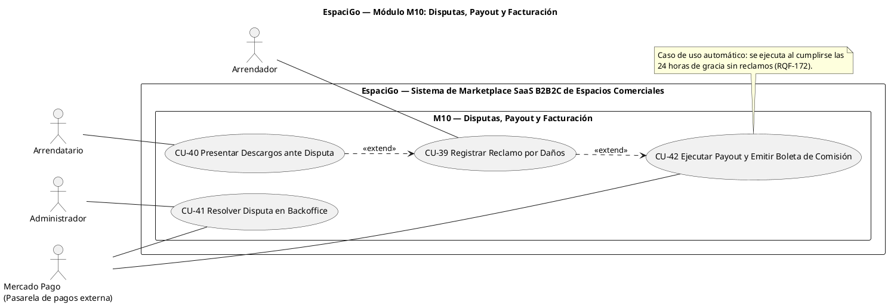

**Justificación de las relaciones**

| Relación | Tipo | Justificación |
|---|---|---|
| CU-39 → CU-42 | `<<extend>>` | **Condicional:** el reclamo por daños solo se produce si el arrendador detecta daños dentro de las 24 horas posteriores al término (RQF-159) y, al registrarse, bloquea la liberación de fondos (RQF-162). CU-42 (liquidación) puede ejecutarse íntegramente sin la extensión. |
| CU-40 → CU-39 | `<<extend>>` | **Condicional:** los descargos del arrendatario se agregan al reclamo solo si este decide presentarlos (RQF-165). CU-39 puede cerrar su registro sin la extensión, y el administrador puede resolver con la evidencia disponible. |
| CU-41 | Sin relación con CU-39/CU-40 | La resolución administrativa es un objetivo propio del Administrador; la disputa es su pre-condición, no comportamiento obligatorio u opcional del reclamo. |
| `MP -- CU41`, `MP -- CU42` | Asociaciones | La pasarela participa en la ejecución del fallo (cobro de la pre-autorización, RQF-174) y en la liquidación y liberación de la garantía (RQF-173, RQF-175). |

### CU-39: Registrar Reclamo por Daños

| Atributo | Detalle |
| :--- | :--- |
| **ID** | CU-39 |
| **Caso de Uso** | Registrar Reclamo por Daños |
| **Actor** | Arrendador |
| **Descripción** | El arrendador reporta daños detectados tras el término del arriendo, bloqueando la liberación de fondos y abriendo una disputa. |
| **Pre-condiciones** | Reserva finalizada y dentro de las 24 horas posteriores al término (punto de extensión de CU-42). |
| **Flujo Principal** | 1. El sistema habilita la ventana de 24 horas posteriores al término de la reserva para registrar reclamos. 2. El arrendador ingresa el reclamo con texto descriptivo. 3. El arrendador carga las fotografías de evidencia. 4. El sistema bloquea la liberación de fondos de la reserva. 5. El sistema cambia el estado de la reserva a "En_Disputa". 6. El sistema notifica al arrendatario la apertura de la disputa. |
| **Flujos Alternativos** | **A1. Registro fuera del plazo de 24 horas:** 1. El sistema no habilita el registro del reclamo.  **A2. Reclamo sin fotografías de evidencia (Paso 3):** 1. El sistema exige cargar evidencia fotográfica para validar el reclamo. |
| **Post-condiciones** | Fondos bloqueados y disputa abierta para revisión administrativa. |
| **Referencias Cruzadas** | RQF-159 al RQF-164 · extiende CU-42 · extendido por CU-40 · CU-41 · HU28 |

### CU-40: Presentar Descargos ante Disputa

| Atributo | Detalle |
| :--- | :--- |
| **ID** | CU-40 |
| **Caso de Uso** | Presentar Descargos ante Disputa |
| **Actor** | Arrendatario |
| **Descripción** | El arrendatario presenta su defensa con texto y fotografías frente a un reclamo por daños (extensión de CU-39). |
| **Pre-condiciones** | Existencia de una disputa abierta y notificada al arrendatario (punto de extensión de CU-39). |
| **Flujo Principal** | 1. El arrendatario revisa el reclamo registrado. 2. Ingresa el texto de defensa. 3. Adjunta las fotografías de respaldo. 4. El sistema incorpora los antecedentes a la disputa para la revisión del administrador. |
| **Flujos Alternativos** | **A1. El arrendatario no presenta descargos:** 1. La extensión no se ejecuta y el administrador resuelve con la evidencia disponible (CU-41). |
| **Post-condiciones** | Antecedentes de defensa incorporados a la disputa. |
| **Referencias Cruzadas** | RQF-165 · extiende CU-39 · CU-41 · HU28 |

### CU-41: Resolver Disputa en Backoffice

| Atributo | Detalle |
| :--- | :--- |
| **ID** | CU-41 |
| **Caso de Uso** | Resolver Disputa en Backoffice |
| **Actor** | Administrador · Mercado Pago (pasarela externa) |
| **Descripción** | El administrador evalúa las evidencias de ambas partes y emite un fallo que define la aplicación de la garantía. |
| **Pre-condiciones** | Existencia de una disputa en estado abierto. |
| **Flujo Principal** | 1. El administrador consulta el listado de disputas abiertas. 2. El administrador revisa las fotografías de check-in y check-out y la confirmación de recepción del espacio vinculadas a la disputa. 3. El administrador registra el fallo a favor del arrendatario o a favor del arrendador. 4. Al fallar a favor del arrendador, el administrador ingresa el monto a deducir de la garantía. 5. El sistema cambia el estado de la disputa a "Resuelta". 6. El sistema ejecuta el cobro de la pre-autorización de garantía cuando el fallo exija compensación. 7. El sistema notifica el resultado de la disputa a las partes. |
| **Flujos Alternativos** | **A1. Fallo a favor del arrendador sin monto (Paso 4):** 1. El sistema exige ingresar la cifra a deducir antes de cerrar el caso.  **A2. Fallo a favor del arrendatario (Paso 3):** 1. El sistema libera la garantía al arrendatario conforme al fallo y al saldo restante. |
| **Post-condiciones** | Disputa resuelta, garantía aplicada según el fallo emitido y resultado notificado a las partes. |
| **Referencias Cruzadas** | RQF-166 al RQF-171 · RQF-174 · RQF-209, RQF-210 · CU-39/CU-40 (antecedentes) · CU-48 (evidencia de recepción) · CU-42 (cierre financiero) |

### CU-42: Ejecutar Payout y Emitir Boleta de Comisión

| Atributo | Detalle |
| :--- | :--- |
| **ID** | CU-42 |
| **Caso de Uso** | Ejecutar Payout y Emitir Boleta de Comisión |
| **Actor** | Caso automático desencadenado por el sistema · Mercado Pago (pasarela externa) |
| **Descripción** | Liquidación automática del arriendo: transfiere los fondos al arrendador, libera la garantía del arrendatario, emite la boleta de la comisión y cierra la reserva. |
| **Pre-condiciones** | Reserva finalizada y 24 horas de gracia cumplidas sin reclamos registrados. |
| **Flujo Principal** | 1. El sistema inicia la liquidación al transcurrir las 24 horas de gracia sin reclamos registrados. 2. El sistema transfiere el monto de la estadía, menos las comisiones, a la cuenta bancaria del arrendador. 3. El sistema libera la totalidad de la garantía al arrendatario cuando la reserva finaliza sin reclamos. 4. El sistema genera la boleta electrónica por la comisión cobrada y la envía al correo del arrendador. 5. El sistema cambia el estado de la reserva a "Cerrada". |
| **Flujos Alternativos** | **A1. Reclamo registrado dentro del plazo (Paso 1):** 1. Se ejecuta la extensión CU-39: la liquidación no se ejecuta y los fondos quedan bloqueados.  **A2. Rechazo de la transferencia por la pasarela (Paso 2):** 1. El sistema registra el fallo de la operación y reintenta conforme a las políticas de conciliación (RNF-012). |
| **Post-condiciones** | Fondos liquidados al arrendador, garantía liberada y reserva cerrada. |
| **Referencias Cruzadas** | RQF-172, RQF-173 · RQF-175 al RQF-177 · RQF-208, RQF-211 · RNF-027, RNF-028 · extendido por CU-39 · CU-41 (post-fallo) |

## Módulo M11 — Administración y Auditoría

**RF cubiertos:** RQF-178 a RQF-185 + RQF-212 + RQF-236 (10 RF)
**Actores participantes:** Administrador
**Casos de uso:** CU-43, CU-44, CU-45, CU-46, CU-52

### Diagrama de Casos de Uso

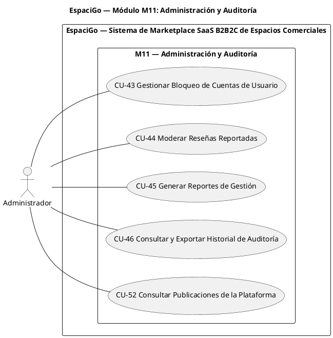

**Justificación de las relaciones**

| Relación | Tipo | Justificación |
|---|---|---|
| CU-43 a CU-46, CU-52 | Sin relaciones | Son objetivos administrativos independientes. No existen RF que establezcan obligatoriedad o extensión condicional entre ellos. La inmutabilidad del repositorio de auditoría que respalda CU-46 es un RNF (RNF-017) y no genera caso de uso. |

### CU-43: Gestionar Bloqueo de Cuentas de Usuario

| Atributo | Detalle |
| :--- | :--- |
| **ID** | CU-43 |
| **Caso de Uso** | Gestionar Bloqueo de Cuentas de Usuario |
| **Actor** | Administrador |
| **Descripción** | El administrador bloquea, consulta el motivo y desbloquea el acceso de una cuenta de usuario. |
| **Pre-condiciones** | Sesión activa con rol de Administrador. |
| **Flujo Principal** | 1. El administrador busca la cuenta del usuario. 2. El administrador bloquea el acceso a la cuenta de usuario. 3. El sistema registra la acción con su motivo. 4. El administrador consulta el motivo de bloqueo registrado. 5. El administrador desbloquea la cuenta dejándola habilitada nuevamente. |
| **Flujos Alternativos** | **A1. Cuenta ya bloqueada:** 1. El sistema informa el estado actual y el motivo registrado, sin duplicar la acción. |
| **Post-condiciones** | Estado de acceso de la cuenta actualizado y trazable. |
| **Referencias Cruzadas** | RQF-178 al RQF-180 · RQF-212 · CU-46 (trazabilidad) |

### CU-44: Moderar Reseñas Reportadas

| Atributo | Detalle |
| :--- | :--- |
| **ID** | CU-44 |
| **Caso de Uso** | Moderar Reseñas Reportadas |
| **Actor** | Administrador |
| **Descripción** | El administrador oculta una reseña reportada que incumple las reglas de publicación, registrando el motivo de la acción. |
| **Pre-condiciones** | Existencia de una reseña reportada. |
| **Flujo Principal** | 1. El administrador accede a la reseña reportada. 2. El administrador oculta la reseña. 3. El administrador registra el motivo obligatorio de la moderación. 4. El sistema deja la reseña fuera de la vista pública. |
| **Flujos Alternativos** | **A1. Moderación sin motivo (Paso 3):** 1. El sistema exige registrar el motivo antes de aplicar la acción. |
| **Post-condiciones** | Reseña moderada y oculta de la vista pública. |
| **Referencias Cruzadas** | RQF-181, RQF-182 · CU-36 (visualización de reseñas) · CU-49 (origen del reporte) |

### CU-45: Generar Reportes de Gestión

| Atributo | Detalle |
| :--- | :--- |
| **ID** | CU-45 |
| **Caso de Uso** | Generar Reportes de Gestión |
| **Actor** | Administrador |
| **Descripción** | El administrador genera reportes de reservas, pagos y disputas para el control de la operación. |
| **Pre-condiciones** | Sesión activa con rol de Administrador. |
| **Flujo Principal** | 1. El administrador selecciona el tipo de reporte requerido. 2. El sistema genera el reporte de reservas, pagos y disputas. 3. El administrador consulta el reporte generado. |
| **Flujos Alternativos** | **A1. Período sin datos:** 1. El sistema informa que no existen registros para los criterios seleccionados. |
| **Post-condiciones** | Reporte de gestión disponible para el administrador. |
| **Referencias Cruzadas** | RQF-183 |

### CU-46: Consultar y Exportar Historial de Auditoría

| Atributo | Detalle |
| :--- | :--- |
| **ID** | CU-46 |
| **Caso de Uso** | Consultar y Exportar Historial de Auditoría |
| **Actor** | Administrador |
| **Descripción** | El administrador consulta el historial de auditoría de un usuario filtrando por RUT y exporta los registros obtenidos para respaldo o reporte legal. |
| **Pre-condiciones** | Sesión activa con rol de Administrador. |
| **Flujo Principal** | 1. El administrador ingresa el RUT del usuario a auditar. 2. El sistema consulta y despliega el historial de auditoría asociado. 3. El administrador exporta los registros de auditoría consultados. |
| **Flujos Alternativos** | **A1. RUT sin registros (Paso 2):** 1. El sistema informa que no existen trazas de auditoría para el identificador ingresado.  **A2. Sin consulta previa (Paso 3):** 1. El sistema no habilita la exportación hasta ejecutar una consulta. |
| **Post-condiciones** | Historial de auditoría consultado y, si corresponde, exportado. |
| **Referencias Cruzadas** | RQF-184, RQF-185 · RNF-017 (inmutabilidad del repositorio) |

> **Caso de uso complementario (2.ª revisión, derivada de las Historias de Usuario):** CU-52 se incorpora al módulo M11 sin alterar la numeración de los casos existentes.

### CU-52: Consultar Publicaciones de la Plataforma

| Atributo | Detalle |
| :--- | :--- |
| **ID** | CU-52 |
| **Caso de Uso** | Consultar Publicaciones de la Plataforma |
| **Actor** | Administrador |
| **Descripción** | El administrador consulta el listado de espacios publicados en la plataforma para su supervisión. |
| **Pre-condiciones** | Sesión activa con rol de Administrador. |
| **Flujo Principal** | 1. El administrador accede al listado de espacios publicados. 2. El sistema despliega las publicaciones con sus datos principales (título, arrendador, tipo de inmueble, estado y precio base). 3. El administrador selecciona una publicación y el sistema muestra su detalle. |
| **Flujos Alternativos** | **A1. Plataforma sin publicaciones:** 1. El sistema muestra el estado vacío del listado. |
| **Post-condiciones** | Publicaciones de la plataforma consultadas por el administrador. |
| **Referencias Cruzadas** | RQF-236 · CU-44 (moderación), CU-45 (reportes), CU-46 (auditoría) · HU26 |

## 4. Trazabilidad y Cobertura

### 4.1 Resumen de módulos, casos de uso y requerimientos funcionales

| Módulo | Casos de uso | RF base | RF complementarios | Total RF |
|---|---|---|---|---|
| M01 — Autenticación y Gestión de Cuenta | CU-01 … CU-06, CU-50 | RQF-001 – RQF-023 | RQF-186 – RQF-188, RQF-213 – RQF-218 | 32 |
| M02 — Perfil y Privacidad del Usuario | CU-07 … CU-09 | RQF-024 – RQF-037 | RQF-189 – RQF-191 | 17 |
| M03 — Verificación de Identidad (KYC/KYB) | CU-10 … CU-14 | RQF-038 – RQF-059 | RQF-192 – RQF-194, RQF-219 – RQF-220 | 27 |
| M04 — Gestión de Publicaciones | CU-15 … CU-18 | RQF-060 – RQF-093 | RQF-195 – RQF-198, RQF-221 – RQF-226 | 44 |
| M05 — Búsqueda y Cotización de Espacios | CU-19 … CU-21 | RQF-094 – RQF-107 | — | 14 |
| M06 — Reservas y Pagos (Escrow) | CU-22 … CU-28, CU-47, CU-51 | RQF-108 – RQF-129 | RQF-199 – RQF-201, RQF-227 – RQF-231 | 30 |
| M07 — Contratos y Firma Electrónica | CU-29 … CU-32 | RQF-130 – RQF-142 | RQF-202 | 14 |
| M08 — Check-in y Check-out | CU-33, CU-34, CU-48 | RQF-143 – RQF-152 | RQF-203 – RQF-206 | 14 |
| M09 — Comunicación y Reputación | CU-35 … CU-38, CU-49 | RQF-153 – RQF-158 | RQF-207, RQF-232 – RQF-235 | 11 |
| M10 — Disputas, Payout y Facturación | CU-39 … CU-42 | RQF-159 – RQF-177 | RQF-208 – RQF-211 | 23 |
| M11 — Administración y Auditoría | CU-43 … CU-46, CU-52 | RQF-178 – RQF-185 | RQF-212, RQF-236 | 10 |
| **Total** | **52 CU** | **185 RF** | **51 RF** | **236 RF** |

**Verificación de cobertura:** cada uno de los **236 requerimientos funcionales** queda asignado a exactamente un caso de uso —**185** del catálogo base y **51** complementarios—, sin duplicación ni omisión. El detalle RF ↔ CU está declarado en la fila **Referencias Cruzadas** de cada ficha.

> **Excepción documentada:** CU-10 (caso de uso abstracto) declara el rango RQF-038 a RQF-053 porque sus dos especializaciones, CU-11 (KYC) y CU-12 (KYB), cubren ese rango. No es duplicación: CU-10 no se instancia de forma directa.

**Verificación de los requerimientos complementarios**

| RF | Caso de uso que lo implementa | Módulo |
|---|---|---|
| RQF-186, RQF-187 | CU-01 | M01 |
| RQF-188 | CU-02 | M01 |
| RQF-189, RQF-190, RQF-191 | CU-08 | M02 |
| RQF-192 | CU-11 | M03 |
| RQF-193 | CU-14 | M03 |
| RQF-194 | CU-12 | M03 |
| RQF-195, RQF-196, RQF-197, RQF-198 | CU-18 | M04 |
| RQF-199 | CU-47 | M06 |
| RQF-200 | CU-27 | M06 |
| RQF-201 | CU-24 | M06 |
| RQF-202 | CU-30 | M07 |
| RQF-203 | CU-33 | M08 |
| RQF-204 | CU-34 | M08 |
| RQF-205, RQF-206 | CU-48 | M08 |
| RQF-207 | CU-49 | M09 |
| RQF-208 | CU-42 | M10 |
| RQF-209, RQF-210 | CU-41 | M10 |
| RQF-211 | CU-42 | M10 |
| RQF-212 | CU-43 | M11 |
| RQF-213 | CU-01 | M01 |
| RQF-214, RQF-215, RQF-216, RQF-217, RQF-218 | CU-50 | M01 |
| RQF-219, RQF-220 | CU-11 | M03 |
| RQF-221, RQF-222, RQF-223, RQF-224 | CU-18 | M04 |
| RQF-225, RQF-226 | CU-17 | M04 |
| RQF-227 | CU-22 | M06 |
| RQF-228, RQF-229, RQF-230, RQF-231 | CU-51 | M06 |
| RQF-232, RQF-233, RQF-234, RQF-235 | CU-35 | M09 |
| RQF-236 | CU-52 | M11 |

### 4.2 Relaciones UML modeladas (resumen global)

| Relación | Origen → Destino | Tipo | Base funcional |
|---|---|---|---|
| R-01 | CU-02 → CU-01 | `<<extend>>` | RQF-009 (verificación condicional posterior al registro) |
| R-02 | CU-04 → CU-03 | `<<extend>>` | RQF-015 a RQF-017 (bloqueo por 5 intentos fallidos) |
| R-03 | CU-11 → CU-10 | Generalización | Especialización KYC (RQF-038 a RQF-047) |
| R-04 | CU-12 → CU-10 | Generalización | Especialización KYB (RQF-048 a RQF-053) |
| R-05 | CU-22 → CU-23 | `<<include>>` | RQF-111 (validación de disponibilidad obligatoria) |
| R-06 | CU-24 → CU-25 | `<<include>>` | RQF-118 (pre-autorización obligatoria de garantía) |
| R-07 | CU-27 → CU-22 | `<<extend>>` | RQF-120 (cancelación condicional por falta de pago) |
| R-08 | CU-28 → CU-26 | `<<extend>>` | RQF-129 (cancelación condicional por falta de respuesta) |
| R-09 | CU-32 → CU-30 | `<<extend>>` | RQF-140 (cancelación condicional por falta de firma) |
| R-10 | CU-39 → CU-42 | `<<extend>>` | RQF-159, RQF-162 (reclamo condicional que bloquea la liquidación) |
| R-11 | CU-40 → CU-39 | `<<extend>>` | RQF-165 (descargos condicionales del arrendatario) |
| R-12 | Visitante ◁— Usuario Registrado ◁— Arrendador / Arrendatario | Generalización de actores | Herencia de capacidades (ver sección 2.3) |

### 4.3 Relaciones evaluadas y descartadas (justificación)

| Relación evaluada | Se descartó porque |
|---|---|
| `<<include>>` CU-15 → CU-16 (galería dentro de la publicación) | La galería no es obligatoria para registrar la publicación; el `<<include>>` exige obligatoriedad. |
| `<<include>>` CU-26 → CU-29 (contrato al aprobar la solicitud) | La dependencia es real (RQF-130) pero se documenta como pre-condición para no acoplar dos módulos diferentes en un mismo diagrama. |
| `<<include>>` CU-29 → CU-30 (firma tras el envío) | La firma la ejecutan las partes con un proveedor externo, de forma asíncrona; no es una ejecución obligatoria sincrónica del envío. |
| `<<include>>` CU-19 → CU-21 / CU-20 → CU-36 (detalle y reseñas) | No existe obligatoriedad: se puede buscar sin cotizar, y consultar el detalle no exige ver reseñas. |
| `<<extend>>` CU-13 → CU-11/CU-12 (revisión manual) | La revisión manual es un objetivo autónomo del Administrador, no un comportamiento opcional del caso base. Se documenta como flujo alternativo derivado. |
| Caso de uso "Cifrar contraseña" | Es `RNF-013`, no un requerimiento funcional: es una condición de calidad y no una funcionalidad solicitada por una entidad externa. |
| Caso de uso "Transmitir logs a BigQuery" | Es `RNF-017`; no existe RF observable por un actor. |
| Caso de uso "Consultar Mis Publicaciones" | El RQF-093 se integra como primer paso de CU-18 y no requiere ficha independiente. |
| Generalización Administrador → Usuario Registrado | No hay especialización real: el administrador no ejecuta los flujos comerciales del marketplace. |
| Relación entre los casos complementarios CU-47, CU-48 y CU-49 y los casos existentes | Se evaluó `<<extend>>` / `<<include>>` hacia casos del mismo módulo y se descartó: son objetivos autónomos (consultar, confirmar evidencia, reportar), no obligatorios para otro caso de uso; además CU-48 y CU-49 son iniciados por actores distintos a los del caso base. |
