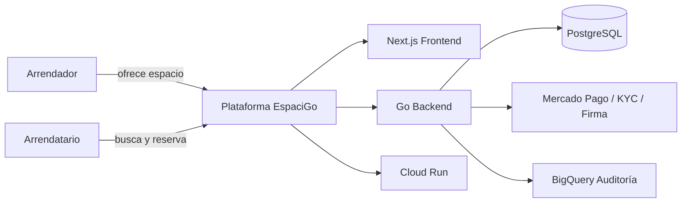

# 1. SaaS, modelos de negocio y justificación para EspaciGo

## 1.1 Concepto teórico: ¿qué es SaaS y por qué importa aquí?

Un modelo SaaS (Software as a Service) consiste en entregar software como servicio en la nube, de modo que el usuario accede a la aplicación mediante un navegador o una interfaz web, sin instalar software local ni mantener infraestructura física propia. La capacidad operativa se centraliza en un proveedor que mantiene el sistema, actualiza la plataforma y administra la disponibilidad y la escalabilidad.

Desde la perspectiva de la ingeniería de software, el SaaS es una forma de entregar valor digital de manera continua. No se trata solo de “usar internet para acceder a una app”, sino de diseñar un servicio con capacidad de operación permanente, mantenimiento remoto, integración con servicios externos y escenarios de alta concurrencia.

En el caso de EspaciGo, esta decisión es estratégica y no opcional. El sistema conecta a dos grupos de actores —arrendadores y arrendatarios— en tiempo real, debe soportar reservas, pagos, validaciones legales y contratos, y opera en un entorno donde la disponibilidad debe mantenerse 24/7. Una solución local o instalada por cada cliente no sería compatible con un marketplace de este tipo porque exigiría configuración técnica, mantenimiento distribuido y una coordinación compleja entre usuarios, datos y reglas de negocio.

> Decisión de diseño: EspaciGo se plantea como una plataforma SaaS cloud-native, no como un software de uso interno o una solución monolítica instalada en infraestructura local.

## 1.2 SaaS vs. On-Premise: comparación aplicada al problema de negocio

La elección entre SaaS y On-Premise no es neutral: afecta costo, velocidad de despliegue, mantenibilidad, seguridad, disponibilidad y capacidad de crecimiento.

| Aspecto | SaaS | On-Premise | Relevancia para EspaciGo |
|---|---|---|---|
| Infraestructura | Provista por un proveedor cloud | Instalación local por la empresa | La plataforma necesita operar sin depender de cada cliente |
| Mantenimiento | Centralizado y automatizado | Requiere personal técnico y recursos locales | Reduce carga operativa y acelera evolución del producto |
| Costos iniciales | Menores y escalables | Altos por hardware, licencias y soporte | Facilita una etapa inicial lean y de validación de mercado |
| Escalabilidad | Alta y elástica | Limitada por infraestructura fija | Necesaria para picos de demanda por fechas o temporadas |
| Actualizaciones | Centralizadas y frecuentes | Dependientes del equipo interno | Importante para pagos, legalidad y seguridad |
| Disponibilidad | Gestionada a nivel de servicio | Control directo, pero más frágil ante fallas | Crucial para reservas y pagos en tiempo real |
| Acceso | Web, móvil y multiusuario | Más restringido y dependiente del entorno local | El marketplace necesita acceso permanente y simultáneo |

### 1.2.1 Alternativas y criterio de decisión

Las alternativas relevantes para una plataforma tipo EspaciGo son principalmente: SaaS cloud-native, On-Premise y software licenciado tradicional. Una solución cloud-native ofrece elasticidad, mantenimiento centralizado y despliegue rápido; la opción On-Premise ofrece control total pero exige infraestructura, soporte técnico y complejidad operativa; el software tradicional se adapta peor a un entorno con transacciones dinámicas y múltiples roles.

### 1.2.2 Aplicación a EspaciGo

En un modelo de intermediación digital como EspaciGo, el SaaS es superior porque elimina la necesidad de que cada arrendador o arrendatario configure software, realice backups, gestione servidores o implemente actualizaciones. La solución debe actuar como un servicio central para todo el ecosistema, y no como un producto difuso instalado en múltiples entornos.

### 1.2.3 Decisión de diseño

> Decisión de diseño: EspaciGo se plantea como una plataforma SaaS cloud-native, no como un software de uso interno ni como una solución monolítica instalada en infraestructura local.

### 1.2.4 Implicación técnica

Esta elección exige:

- despliegue en cloud
- servidores y servicios centralizados
- actualización continua sin intervención del usuario final
- acceso web multusuario y soporte mobile
- coordinación de reserva, pago, identidad y auditoría en un backend centralizado

## 1.3 Modelos de negocio digital y su relación con la plataforma

Los modelos de negocio digital más comunes son:

- suscripción mensual o anual
- suscripción con niveles de servicio
- freemium
- cobro por uso
- comisión por transacción
- tarifa fija + valor agregado

Cada modelo responde a una lógica distinta. El modelo de suscripción funciona bien cuando el valor está en el uso continuo de una herramienta, mientras que el cobro por uso se aplica a servicios consumidos por unidad. En cambio, una plataforma como EspaciGo no vende software como herramienta interna, sino que conecta oferta y demanda para generar transacciones reales entre propietarios y usuarios de espacios.

Por ello, el modelo más adecuado es el de comisión por transacción, posiblemente combinado con una tarifa por servicios complementarios o por validaciones premium. Este enfoque se alinea con la lógica del marketplace B2B2C: la plataforma gana valor cuando una operación se concreta, no simplemente cuando un usuario se registra.

## 1.4 Marketplace B2B2C: la estructura de valor de EspaciGo

Un marketplace es una plataforma digital que facilita la interacción, negociación y transacción entre dos o más grupos de actores. La actividad central no es poseer el bien o servicio, sino permitir que la oferta y la demanda se conecten de manera segura, eficiente y estandarizada.

En el caso de EspaciGo, la empresa no es propietaria de los espacios que se ofertan, sino que funciona como intermediario tecnológico entre:

- arrendadores, que ofrecen inmuebles o locales
- arrendatarios, que necesitan alquilar o usar esos espacios
- la plataforma, que administra la visibilidad, la reserva, el pago, la legalización y la confianza

Este es un modelo de tipo B2B2C: la plataforma conecta a un proveedor de activos (arrendador, empresa o dueño del inmueble) con un cliente final o usuario que necesita ese servicio (arrendatario). La propuesta de valor no está solo en “mostrar espacios”, sino en reducir fricción operativa, legal y financiera.

El modelo B2B2C justifica varias decisiones de diseño:

- una interfaz web flexible y accesible para múltiples tipos de usuarios
- separación de roles y permisos por actor
- procesos de validación, reserva y pago integrados
- trazabilidad de operaciones para resolver disputas
- gestión centralizada de documentación y contratos legales

## 1.5 Por qué EspaciGo exige un SaaS cloud-native

La lógica del negocio exige que la plataforma esté siempre disponible, pueda escalar en momentos de alta demanda, soporte múltiples usuarios simultáneos y ejecute procesos transaccionales complejos sin depender de cada cliente. Es decir, el sistema debe operar como un servicio central y no como una herramienta aislada.

Esto tiene implicancias concretas:

- la interfaz debe estar disponible desde navegador web y dispositivos móviles
- la gestión de disponibilidad debe ser consistente en tiempo real
- el flujo de pago debe considerar tiempos de respuesta, rechazos y reintentos
- el contrato debe generarse de forma automática y verificarse legalmente
- la auditoría debe mantenerse inmutable para apoyar disputas y responsabilidades

Por eso, el modelo SaaS no es una elección estética: es una decisión funcional y técnica que responde a la naturaleza del product.

## 1.6 Justificación del stack actual: por qué este diseño es coherente con el modelo de negocio

La arquitectura seleccionada para EspaciGo se corresponde directamente con los requerimientos del sistema. No es un conjunto de tecnologías arbitrarias, sino una decisión técnica orientada a la disponibilidad, la concurrencia, la seguridad y la trazabilidad.

| Tecnología | Función en EspaciGo | Justificación teórica y técnica |
|---|---|---|
| Next.js | Frontend principal y capa de experiencia de usuario | Permite renderizado eficiente, SEO, navegación rápida y experiencia web moderna para catálogo, reservas y procesos transaccionales |
| Golang | Backend y lógica de negocio | Ofrece alto rendimiento, concurrencia natural mediante goroutines y buena capacidad para servicios de negocio críticos |
| PostgreSQL | Base de datos transaccional principal | Asegura consistencia, integridad y transacciones ACID para reservas, pagos, contratos y estados de operación |
| Cloud Run | Despliegue de servicios backend y aplicaciones en contenedores | Permite escalado automático, despliegue por contenedores y operación serverless para servicios de negocios y APIs |
| BigQuery | Auditoría analítica y almacenamiento de eventos | Soporta trazabilidad, análisis legal, reportes y evidencia inmutable para disputas y control interno |

Esta combinación refleja una arquitectura cloud-native basada en capas:

1. Frontend: experiencia de usuario, catálogo, reservas y formularios.
2. Backend: lógica de negocio, validaciones, transacciones y coordinación de APIs externas.
3. Base de datos transaccional: persistencia fiable de reservas, usuarios, pagos y contratos.
4. Servicios externos: pasarela de pagos, firma electrónica y validación de identidad.
5. Data warehouse: registro analítico e histórico para auditoría y análisis.

Es decir, el sistema no se organiza alrededor de un monolito de escritorio ni de infraestructura local; se diseña como un servicio web distribuido, escalable y seguro.

## 1.7 Diagrama conceptual del modelo SaaS para EspaciGo

Este diagrama resume la lógica propuesta: la experiencia del usuario ocurre en la capa web, la lógica de negocio se ejecuta en servicios backend, la información transaccional se guarda de forma segura en PostgreSQL y la evidencia analítica se almacena en BigQuery para fines de auditoría y cumplimiento.

## 1.8 Comparación de alternativas y criterios de decisión

La elección del modelo SaaS no debe entenderse como una decisión genérica, sino como una decisión técnica y económica vinculada a la naturaleza del negocio.

| Opción | Ventajas | Limitaciones | ¿Es adecuada para EspaciGo? |
|---|---|---|---|
| SaaS cloud-native | Escalabilidad, mantenimiento centralizado, acceso web, despliegue rápido, disponibilidad continua | Depende de la calidad de la infraestructura y de la integración con servicios externos | Sí, es la opción más adecuada |
| On-Premise | Control total de infraestructura y datos | Alto costo, mantenimiento interno, menor agilidad, más complejidad operativa | No, es poco viable para una plataforma de marketplace |
| Software licenciado tradicional | Establecido en mercados corporativos | Mala adaptación a cambios frecuentes, baja escalabilidad, difícil soporte multiusuario | No, no encaja con un modelo digital dinámico |
| Plataforma de código abierto sin servicio gestionado | Bajo costo y alta flexibilidad | Requiere infraestructura, DevOps y soporte permanente | Solo parcialmente; no resuelve la necesidad de operación continua |

En EspaciGo, los criterios decisivos son:

1. disponibilidad permanente para reservas y pagos
2. crecimiento de inventario y de usuarios sin levantar infraestructura manualmente
3. capacidad de integrar pasarelas de pago, validación de identidad y contratos digitales
4. necesidad de mantener trazabilidad para auditoría y disputas
5. reducción de fricción operativa para arrendadores y arrendatarios

Estos criterios desaconsejan un modelo On-Premise y favorecen un servicio web escalable y gestionado.

## 1.9 Criterios de decisión de arquitectura para EspaciGo

La decisión de usar un stack como Next.js + Go + PostgreSQL + Cloud Run + BigQuery responde a una lógica clara:

- Frontend con Next.js: la plataforma requiere una experiencia web moderna, buena usabilidad y soporte para catálogo, reservas y procesos complejos.
- Backend con Go: el sistema necesita manejar concurrencia, lógica de negocio y servicios de pagos y validaciones con buen rendimiento.
- PostgreSQL: la base transaccional debe mantener consistencia en reservas, pagos y estados de operación mediante transacciones ACID.
- Cloud Run: la aplicación debe desplegarse como servicio cloud, con escalado automático y menor carga operativa.
- BigQuery: la auditoría y la trazabilidad legal requieren un repositorio analítico e inmutable para eventos de negocio.

La coherencia entre negocio y tecnología es la clave del modelo SaaS adoptado. No se trata de elegir tecnologías por moda, sino por sus capacidades para satisfacer requerimientos funcionales, de seguridad, disponibilidad y operación en tiempo real.

## 1.10 Conclusión

El modelo SaaS es la opción más coherente para EspaciGo porque la plataforma no es un sistema aislado de escritorio ni una herramienta interna; es un marketplace digital de alta transaccionalidad, con usuarios concurrentes, validaciones legales y necesidad de disponibilidad permanente.

La elección de SaaS no responde a una moda tecnológica, sino a una necesidad funcional: la plataforma debe operar como un servicio central, útil para cualquier usuario con acceso a internet, sin depender de instalaciones locales ni de procesos manuales costosos.

La arquitectura propuesta con Next.js, Go, PostgreSQL, Cloud Run y BigQuery es coherente con este modelo de negocio y con la lógica operativa del sistema. En conjunto, estos componentes soportan la creación de una plataforma de intermediación digital segura, escalable y adecuada para mercados inmobiliarios de uso flexible.

## 1.11 Fuentes consultadas

- IBM. (s.f.). What is SaaS? Software as a Service. Recuperado de https://www.ibm.com/think/topics/saas
- NIST. (s.f.). Cloud computing. Recuperado de https://www.nist.gov/itl/applied-cybersecurity/cloud-computing
- Gartner. (2024). Cloud and SaaS fundamentals. Recuperado de https://www.gartner.com/en/information-technology
- Hagiu, A., & Wright, J. (2015). Multi-sided platforms. International Journal of Industrial Organization, 43, 162-174.
- Valacich, J., & Schneider, C. (2021). Information Systems Today.
- Microsoft Azure. (s.f.). What is cloud-native? Recuperado de https://azure.microsoft.com/en-us/resources/cloud-native/
