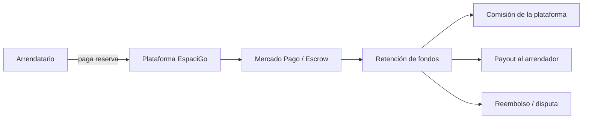

# 3. Modelos de monetización y su selección para EspaciGo

## 3.1 Concepto teórico: ¿qué es la monetización digital?

La monetización digital define la forma en que una plataforma transforma valor generado para sus usuarios en ingresos sostenibles para la empresa. En un ambiente digital, esto no se limita a cobrar por acceso o por licencias; también incluye comisiones, servicios premium, cobranzas por transacción, publicidad, retención de fondos y modelos híbridos.

En plataformas de intermediación, la monetización no es solo un tema financiero: también influye en la experiencia del usuario, la adopción del producto y la estrategia de crecimiento. Si la tarifa es demasiado alta, se frena la demanda; si es demasiado baja, la empresa no logra sostener la operación. Por eso, la elección del modelo debe alinearse con la lógica del negocio.

## 3.2 Modelos de monetización más comunes

Los modelos más habituales son:

- suscripción mensual o anual
- freemium con funciones premium
- pago por uso o por consumo
- comisión por transacción
- tarifa fija por publicación o gestión
- combinación híbrida

| Modelo | Descripción | Ventaja principal | Riesgo principal |
|---|---|---|---|
| Suscripción | Cobro periódico por acceso al servicio | Ingreso estable y predecible | Puede desalentar adopción inicial |
| Freemium | Servicio base gratis y funciones premium pagadas | Incrementa volumen de usuarios | Conversión incierta |
| Pago por uso | Cobro por cada operación o unidad consumida | Flexibilidad para distintos perfiles | Costos difíciles de proyectar |
| Comisión transaccional | Cobro por porcentaje de la operación | Alinea ingreso con actividad real | Depende del volumen operativo |
| Tarifa fija | Cobro por publicación o gestión | Simple de explicar | Puede desalentar operaciones pequeñas |

### 3.2.1 Alternativas y criterio de decisión

Para una plataforma como EspaciGo, las alternativas más relevantes son suscripción, freemium, tarifa por uso, comisión por operación y modelo híbrido. La suscripción funciona mejor cuando el principal valor es acceso regular a una herramienta; el freemium puede atraer usuarios, pero no encaja bien con operaciones puntuales de arriendo; la tarifa por uso presenta flexibilidad, pero no refleja el valor central de la intermediación; la comisión por transacción alinea mejor el beneficio de la empresa con la actividad real del marketplace.

### 3.2.2 Aplicación a EspaciGo

EspaciGo no es una aplicación de software tradicional que se vende a una empresa interna; es una plataforma de intermediación digital. Su valor se genera cuando ocurre una operación real: un arrendatario busca un espacio, confirma la reserva, paga de forma segura, recibe o usa el espacio y finaliza la operación sin conflictos.

### 3.2.3 Decisión de diseño

> Decisión de diseño: EspaciGo adopta un modelo basado en comisión transaccional, con servicios complementarios pagos adicionales (validación reforzada, gestión documental, soporte premium), en lugar de un modelo de suscripción o freemium como eje principal.

### 3.2.4 Implicación técnica

Esto exige:

- cálculo de comisión real en tiempo real
- separación entre valor bruto, comisión y payout neto
- retención o escrow de fondos
- trazabilidad de cada operación financiera
- registros para auditoría y disputa

## 3.3 ¿Por qué un marketplace no puede depender de un solo modelo?

Un marketplace multisided suele requerir una mezcla de incentivos. El comprador busca barato y simple; el vendedor quiere visibilidad y protección; la plataforma necesita sostener operación, infraestructura y confianza. Por eso, en muchos casos la mejor estrategia es una combinación de dos elementos: una comisión por transacción y un costo extra por servicios complementarios.

Este enfoque es especialmente útil cuando la plataforma ofrece valor no solo mediante la conexión, sino también mediante validación, seguridad, pago, contratos y resolución de disputas. En un sistema como EspaciGo, la operación no es una venta aislada: es la gestión completa de una reserva y su cumplimiento.

## 3.4 Aplicación a EspaciGo

EspaciGo no es una aplicación de software tradicional que se vende a una empresa interna; es una plataforma de intermediación digital. Su valor se genera cuando ocurre una operación real: un arrendatario busca un espacio, confirma la reserva, paga de forma segura, recibe o usa el espacio y finaliza la operación sin conflictos.

Por ello, el modelo más coherente es la comisión por transacción, idealmente bajo un esquema de take rate. La plataforma toma un porcentaje del valor total de la operación, y ese porcentaje puede variar según:

- tipo de espacio
- duración del arriendo o uso
- servicios adicionales
- riesgo asociado o nivel de validación
- tipo de disputa o resolución

Este modelo es compatible con el negocio porque alinea el ingreso de la empresa con la actividad real del marketplace. La plataforma gana cuando la operación se concreta y cuando la confianza del sistema funciona.

## 3.5 Comparación de alternativas para EspaciGo

| Modelo | ¿Cuándo funciona bien? | ¿Por qué no es ideal para EspaciGo? |
|---|---|---|
| Suscripción | Cuando el valor principal es acceso continuo a una herramienta | Puede frenar la adopción inicial del mercado y no refleja el valor de cada operación real |
| Freemium | Cuando la base del valor es el uso masivo y luego la conversión a pago | No encaja bien con una operación inmobiliaria de transacción puntual |
| Pago por uso | Cuando el servicio se consumo por unidad o por evento | Requiere más control operativo y no refleja la lógica central de una reserva formal |
| Comisión por transacción | Cuando la plataforma intermedia entre oferta y demanda real | Es la opción más alineada con la operación del marketplace |
| Tarifa fija | Cuando la plataforma centraliza servicios predefinidos | Puede desincentivar operaciones pequeñas y baja densidad |

## 3.6 Decisión de implementación para EspaciGo

Se adopta un modelo basado en comisión transaccional, con posibilidad de integrar servicios adicionales pagados. Este enfoque responde a la naturaleza del negocio:

- la operación se concreta en una reserva o arriendo real
- la plataforma genera valor al organizar la disponibilidad, pago y formalización
- el riesgo de fraude y la complejidad legal justifican un cobro asociado al éxito de la operación

En términos prácticos, la empresa puede operar con un take rate sobre el valor de la reserva o del alquiler temporal, y además cobrar por servicios complementarios tales como:

- validación reforzada de identidad
- gestión documental avanzada
- soporte legal o arbitraje
- servicios premium de publicación o gestión de inventario

## 3.7 Relación con el flujo financiero y la retención de fondos

La monetización no puede separarse del flujo financiero. En EspaciGo, la operación de pago no es solo “cobrar al arrendatario”; implica retener fondos, calcular comisiones, asignar pagos, prever reembolsos y mantener trazabilidad.

Esto exige una lógica financiera clara:

- el arrendatario paga por la reserva o uso del espacio
- los fondos quedan retenidos en una bóveda virtual o escrow
- la plataforma calcula la comisión
- se realiza el payout al arrendador
- si ocurre una disputa, el sistema reevalúa el flujo y puede producir reembolso o compensación

> La monetización del sistema está íntimamente ligada a la lógica de seguridad y cumplimiento del negocio.

## 3.8 Implicación técnica

El modelo de comisión por transacción exige componentes técnicos específicos:

- cálculo de comisión en tiempo real
- separación entre monto bruto, comisión y neto a pagar
- control de fondos retenidos durante validaciones o revisión
- lógica de payout hacia el arrendador
- estado de disputa y posibilidades de reembolso
- registro financiero para auditoría y trazabilidad

En el stack actual de EspaciGo, estas decisiones se materializan en el backend en Go y en la base de datos relacional en PostgreSQL. La lógica de negocio calcula la comisión y coordina con la pasarela de pago, mientras la base de datos mantiene el estado exacto de cada operación. Los eventos relevantes se registran en BigQuery para auditoría y análisis histórico.

## 3.9 Diagrama de flujo financiero

Este flujo evidencia que la monetización de EspaciGo no es un cobro aislado: es parte del mismo proceso de confianza, validación y cierre operativo de la transacción.

## 3.10 Conclusión

El modelo de monetización más adecuado para EspaciGo es la comisión transaccional, complementada con servicios adicionales cuando la operación lo requiere. Esta decisión se alinea con la naturaleza del negocio y con el diseño del marketplace B2B2C: la plataforma genera valor al facilitar una operación real, segura y documentada entre arrendadores y arrendatarios.

La monetización no debe entenderse solo como un mecanismo de ingresos, sino como una herramienta de gobernanza del negocio. Define cómo se reparte valor, cómo se protege la operación, cómo se maneja el riesgo financiero y cómo se sostiene la plataforma a largo plazo.

## 3.11 Fuentes consultadas

- Osterwalder, A., & Pigneur, Y. (2010). *Business Model Generation*. Wiley.
- Chaffey, D. (2022). *Digital Business and E-Commerce Management*. Pearson.
- Timmers, P. (1998). Business models for electronic markets. *Electronic Markets, 8*(2), 3-8.
- Parker, G. G., Van Alstyne, M. W., & Choudary, S. P. (2016). *Platform Revolution*. W. W. Norton.
- Mercado Pago Developers. (2024). Documentación oficial de pagos, cashback, settlement y flujos de negocio digital. Recuperado de https://www.mercadopago.cl/developers/
