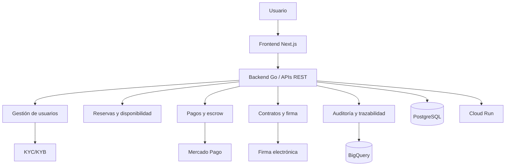

# 4. Cloud Computing, arquitectura web y APIs

## 4.1 Concepto teórico: ¿qué es cloud computing y por qué es clave aquí?

El cloud computing consiste en ofrecer recursos informáticos bajo demanda, como almacenamiento, capacidad de cómputo, bases de datos, redes y servicios de software, sin requerir que la organización mantenga infraestructura física propia. En términos prácticos, un sistema basado en la nube es capaz de escalar, desplegarse y operar con menor dependencia de la administración local de hardware.

Las características clave del cloud computing son:

- elasticidad para responder a picos de demanda
- accesibilidad por internet
- automatización de infraestructura
- pago por uso o consumo
- separación entre la operación técnica y la lógica de negocio

En un sistema como EspaciGo, esto es central porque la plataforma debe operar de manera continua, manejar crecimiento de usuarios y transacciones, y ofrecer servicios críticos como reserva, pago y auditoría sin depender de una infraestructura local rígida.

## 4.2 Arquitectura de software y su relación con la solución

Una arquitectura de software define cómo se organizan los componentes del sistema para cumplir requisitos de funcionalidad, seguridad, escalabilidad y mantenibilidad. En aplicaciones modernas, la arquitectura suele dividirse en capas:

- capa de presentación o frontend
- capa de negocio o backend
- capa de persistencia
- servicios externos
- almacenamiento analítico y de auditoría

Esta separación permite que cada parte del sistema tenga una responsabilidad definida, reduciendo el acoplamiento y permitiendo cambios más seguros. En EspaciGo, por ejemplo, la lógica de reserva, pago, contrato y auditoría no pueden mezclarse sin generar complejidad y riesgo.

## 4.3 Arquitectura monolítica vs. arquitectura distribuida

| Enfoque | Ventaja principal | Limitación principal | ¿Es adecuado para EspaciGo? |
|---|---|---|---|
| Monolítica | Simplicidad de desarrollo inicial | Acoplamiento fuerte y dificultad de evolución | No, porque hay procesos distintos y críticos |
| Arquitectura modular | Separación de dominios y mejor mantenibilidad | Mayor complejidad de integración | Sí, es la base del diseño |
| Microservicios | Escalado independiente y especialización | Mayor coordinación y operación | Sí, en una forma razonable y orientada a servicios |

### 4.3.1 Alternativas y criterio de decisión

La arquitectura de un marketplace no puede ser monolítica si combina pagos, disponibilidad temporal, contratos, identidad y trazabilidad. Una solución monolítica puede funcionar en etapas iniciales, pero termina mezclando dominios diferentes y arriesgando la consistencia del negocio. La modularidad permite aislar procesos críticos sin perder flexibilidad y escalabilidad.

### 4.3.2 Aplicación a EspaciGo

Una solución de marketplace con pagos, validación de identidad, contratos y auditoría exige una arquitectura modular, porque cada flujo tiene requisitos distintos de seguridad, latencia y consistencia. Por ejemplo, el flujo de pago requiere confiabilidad y transaccionalidad, mientras que el flujo de auditoría requiere registro inmutable y análisis histórico.

### 4.3.3 Decisión de diseño

> Decisión de diseño: EspaciGo se implementa con una arquitectura modular cloud-native, con servicios encapsulados para frontend, negocio, persistencia, pagos, firma, identidad y auditoría.

### 4.3.4 Implicación técnica

Esto implica:

- separación de capas
- APIs REST bien definidas
- integración con servicios externos mediante webhooks y eventos
- desacople de la lógica operativa y analítica
- facilidades de escalado por servicio según demanda

## 4.4 Aplicación a EspaciGo

EspaciGo requiere simultáneamente:

- gestionar reservas y disponibilidad temporal
- procesar pagos y retenciones de fondos
- verificar identidad y antecedentes legales
- generar y registrar contratos digitales
- producir auditoría y trazabilidad para disputas
- ofrecer una experiencia web rápida para usuarios finales

Estas necesidades no pueden resolverse con una sola capa de lógica acoplada. La solución moderna exige una arquitectura que separe el frontend, el backend, la base de datos y los servicios de terceros. Además, es esencial usar cloud computing para escalar cada servicio según el patrón de demanda.

## 4.5 APIs y su papel en la integración de sistemas

Una API (Application Programming Interface) permite que dos sistemas o módulos se comuniquen entre sí de manera estandarizada. En el contexto de EspaciGo, las APIs son esenciales para conectar:

- el frontend con el backend
- el backend con PostgreSQL
- el backend con Mercado Pago
- el backend con servicios de firma electrónica
- el backend con servicios de KYC/KYB
- el sistema con BigQuery para auditoría

Las APIs REST son especialmente adecuadas porque ofrecen una interfaz simple basada en HTTP, consumo fácil para aplicaciones web y una integración clara con servicios de terceros.

## 4.6 Arquitectura elegida para EspaciGo

La arquitectura del proyecto se alinea con una solución cloud-native basada en capas y servicios web:

- frontend en Next.js
- backend en Go
- base de datos transaccional en PostgreSQL
- despliegue en Cloud Run
- trazabilidad analítica en BigQuery

Esta configuración responde a la necesidad de dividir la complejidad del sistema sin perder consistencia ni seguridad. La capa de presentación atiende la experiencia del usuario; la capa de negocio ejecuta la lógica de reservas, pagos, validaciones y documentos; la capa de persistencia conserva la información crítica; y los servicios externos aportan capacidades complementarias como pagos y firma legal.

## 4.7 Decisión de implementación: cloud-native, modular y con APIs

La decisión de usar una arquitectura cloud-native no es accidental. El problema de negocio exige:

- disponibilidad continua
- escalado automático ante picos de demanda
- velocidad de despliegue y actualización
- separación entre negocio y tecnología
- integración con servicios críticos externos

Por eso, EspaciGo se diseña con un enfoque basado en servicios y procedimientos asincrónicos en ciertos flujos. Por ejemplo, la auditoría, la generación de contrato o la respuesta de un proveedor externo no necesariamente deben bloquear la operación completa del usuario; en muchos casos, se convierten en eventos secundarios o trabajos de integración.

## 4.8 Implicación técnica

La decisión anterior implica requisitos concretos:

- contenedores y despliegue automatizado en Cloud Run
- capas bien definidas entre frontend, backend y datos
- autenticación y autorización centralizadas
- servicios de integración con pasarelas y proveedores legales
- manejo de webhooks, reintentos y estados de operación
- registros analíticos para auditoría y disputas

Además, la plataforma necesita seguridad en la capa de API: validación de tokens, límites de acceso, manejo de errores y protección frente a abuso. Esto es particularmente importante porque los servicios externos reciben información sensible y el sistema debe evitar fallas de integridad o fraude.

## 4.9 Diagrama de arquitectura conceptual

El diagrama refleja la lógica del sistema: el usuario interactúa con una capa de interfaz moderna; la lógica del negocio se ejecuta en servicios backend; los datos transaccionales se guardan en PostgreSQL; y la evidencia y auditoría se gestionan en BigQuery.

## 4.10 Comparación técnica: arquitectura recomendada para EspaciGo

| Ámbito | Opción tradicional | Opción recomendada | Justificación |
|---|---|---|---|
| Integración | Lógica acoplada en una misma app | APIs REST y módulos separados | Facilita mantenimiento, testing y evolución |
| Despliegue | Infraestructura local y manual | Cloud Run con contenedores | Mejora disponibilidad y escalabilidad |
| Persistencia | Un único repositorio para todo | PostgreSQL + BigQuery | Separación entre OLTP y OLAP |
| Procesamiento | Todo sincrónico | Híbrido sincrónico y asincrónico | Permite mejor manejo de pagos, firma y auditoría |
| Seguridad | Acceso directo a servicios | Tokens, validaciones y webhooks | Reduce riesgo de abuso y fraude |

## 4.11 Conclusión

El cloud computing y la arquitectura basada en APIs son fundamentales para EspaciGo porque permiten operar una plataforma de intermediación compleja sin depender de infraestructura local ni de una lógica monolítica frágil. La separación entre frontend, backend, persistencia y servicios externos responde a necesidades reales del negocio: reserva, pago, legalidad, seguridad y trazabilidad.

La arquitectura elegida con Next.js, Go, PostgreSQL, Cloud Run y BigQuery es coherente con una solución moderna de marketplace financiero y legal. No se trata de una elección tecnológica aleatoria; es una respuesta directa a los requisitos funcionales y no funcionales del sistema.

## 4.12 Fuentes consultadas

- IBM. (s.f.). What is cloud computing? Recuperado de https://www.ibm.com/think/topics/cloud-computing
- NIST. (s.f.). Cloud computing. Recuperado de https://www.nist.gov/itl/applied-cybersecurity/cloud-computing
- Fielding, R. T. (2000). *Architectural Styles and the Design of Network-based Software Architectures*. University of California, Irvine.
- Bass, L., Clements, P., & Kazman, R. (2021). *Software Architecture in Practice* (4th ed.). Addison-Wesley.
- OWASP. (2024). API Security. Recuperado de https://owasp.org/www-project-api-security/
- Google Cloud. (s.f.). What is Cloud Run? Recuperado de https://cloud.google.com/run
