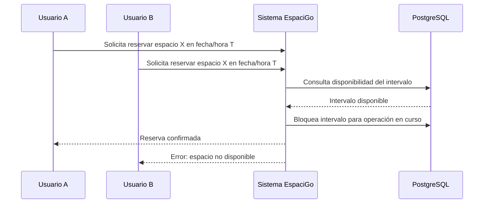

# 5. Gestión de espacios, disponibilidad y riesgo de doble reserva

## 5.1 Concepto teórico: el recurso principal no es un producto, sino un intervalo de uso

En plataformas de alquiler, coworking o uso de espacios comerciales, el recurso principal no es un producto estático que se vende por cantidad, sino un activo temporal. La disponibilidad del espacio depende del tiempo, la ubicación, la capacidad del lugar, las restricciones de uso y las condiciones impuestas por el arrendador.

Por esta razón, la gestión del inventario no se puede comparar con la logística tradicional de comercio electrónico. En un sistema de reserva, no basta con saber cuántas unidades existen; es necesario saber si un espacio está disponible en un rango específico, con horarios concretos y para una capacidad determinada.

En la práctica, el sistema debe modelar:

- fechas y horas de disponibilidad
- restricciones legales o operativas
- capacidad máxima de uso
- días bloqueados o no disponibles
- estados de la reserva y su confirmación

## 5.2 Scheduling y doble reserva: el problema crítico

El problema central en estos sistemas es la reserva concurrente, también conocida como *double booking*. Si dos usuarios intentan reservar el mismo espacio para el mismo intervalo de tiempo casi simultáneamente, el sistema puede confirmar ambas operaciones y generar inconsistencias graves.

Este riesgo afecta directamente a:

- la integridad del calendario del arrendador
- la consistencia del pago
- la legalidad del contrato
- la experiencia del cliente
- la reputación de la plataforma

En un marketplace como EspaciGo, la doble reserva puede convertirse en un problema financiero y reputacional, porque no solo se pierde disponibilidad, sino que también puede haber cobros duplicados o conflictos contractuales.

## 5.3 Conceptos asociados al problema de disponibilidad

Los conceptos clave del problema son:

- inventario temporal
- disponibilidad por intervalos
- bloqueo o reserva preventiva
- solapamiento de fechas y horarios
- estados transaccionales de la reserva
- validación de disponibilidad antes del pago

Estos conceptos son esenciales para la operación del sistema, porque el recurso a vender no es “un espacio en general”, sino “disponibilidad de ese espacio en ese momento específico”.

## 5.4 Aplicación a EspaciGo

EspaciGo debe permitir que un usuario busque espacios según:

- ubicación
- tipo de espacio
- rango de fechas
- horario de uso
- restricciones de capacidad o condiciones

La plataforma debe mostrar disponibilidad real y no solo un inventario estático. Cuando un usuario elige una opción, el sistema debe validar que ese intervalo no esté ya ocupado o bloqueado. La reserva no puede confirmarse si existe solapamiento con otra operación activa.

Además, la disponibilidad no se entiende solo como una condición visual; debe estar conectada con la lógica de pago, porque una reserva confirmada sin validación financiera puede generar inconsistencias entre el calendario y la transacción.

## 5.5 Diagrama del conflicto de reserva

Este flujo refleja la necesidad de controlar concurrencia y validar la disponibilidad antes de confirmar la operación. La idea no es evitar que dos usuarios intenten reservar al mismo tiempo, sino evitar que el sistema permita dos confirmaciones para el mismo recurso en el mismo slot.

## 5.6 Decisión de implementación

La solución del problema pasa por dos decisiones clave:

1. validar disponibilidad antes de confirmar la reserva
2. aplicar control de concurrencia transaccional para que dos operaciones no creen estados contradictorios

Esto implica que la plataforma debe mantener estados de reserva claros, como:

- disponible
- reservada pendiente de pago
- pagada y confirmada
- bloqueada por revisión
- cancelada o disputada

La reserva debe asociarse a un intervalo específico y a un espacio concreto. Una vez que ese intervalo se confirma, el sistema debe evitar que otro usuario lo tome sin pasar por el mismo mecanismo de validación.

## 5.7 Implicación técnica

El manejo de disponibilidad exige componentes técnicos específicos:

- validación de solapamiento temporal
- bloqueo lógico o transaccional del intervalo
- control de concurrencia sobre un mismo recurso
- consistencia entre disponibilidad y pago
- trazabilidad de cambios de estado de la reserva
- actualizaciones rápidas del calendario de disponibilidad

La arquitectura moderna de EspaciGo responde a este problema utilizando un backend en Go para la lógica de negocio y PostgreSQL para la persistencia transaccional. La base de datos relacional permite asegurar la consistencia de los estados y manejar transacciones críticas. Las operaciones de disponibilidad se registran y pueden auditarse para resolver conflictos y disputas.

## 5.8 Comparación de tipos de inventario

| Tipo de activo | Modelo de inventario | Requisito principal |
|---|---|---|
| Producto físico | Stock fijo | Cantidad disponible |
| Espacio commercial | Inventario temporal | Intervalo de uso y calendario |
| Recurso de servicio | Slot o disponibilidad por horario | Prevención de solapamiento |

Esta comparación muestra que EspaciGo no puede operarse con una lógica de inventario propia de e-commerce clásico. En este negocio, el recurso se consume por tiempo, no por cantidad física de unidades disponibles.

## 5.9 Conclusión

La gestión de espacios y la disponibilidad temporal son un eje central del proyecto. La capacidad para validar reservas, controlar concurrencia y evitar dobles reservas define la confiabilidad del marketplace y la confianza de los usuarios.

Por eso, la solución no se reduce a un calendario visual; requiere un diseño transaccional serio, con validaciones de negocio, control de intervalos y trazabilidad de cambios. Este aspecto es una de las razones por las que la lógica del sistema debe apoyarse en una base de datos robusta y en un backend capaz de gestionar concurrencia.

## 5.10 Fuentes consultadas

- Date, C. J. (2003). *An Introduction to Database Systems*. Pearson.
- Elmasri, R., & Navathe, S. (2015). *Fundamentals of Database Systems*. Pearson.
- IBM. (s.f.). What is inventory management? Recuperado de https://www.ibm.com/topics/inventory-management
- Gray, J., & Reuter, A. (1993). *Transaction Processing: Concepts and Techniques*. Morgan Kaufmann.
- PostgreSQL Documentation. (2024). Concurrency control and transactions. Recuperado de https://www.postgresql.org/docs/
