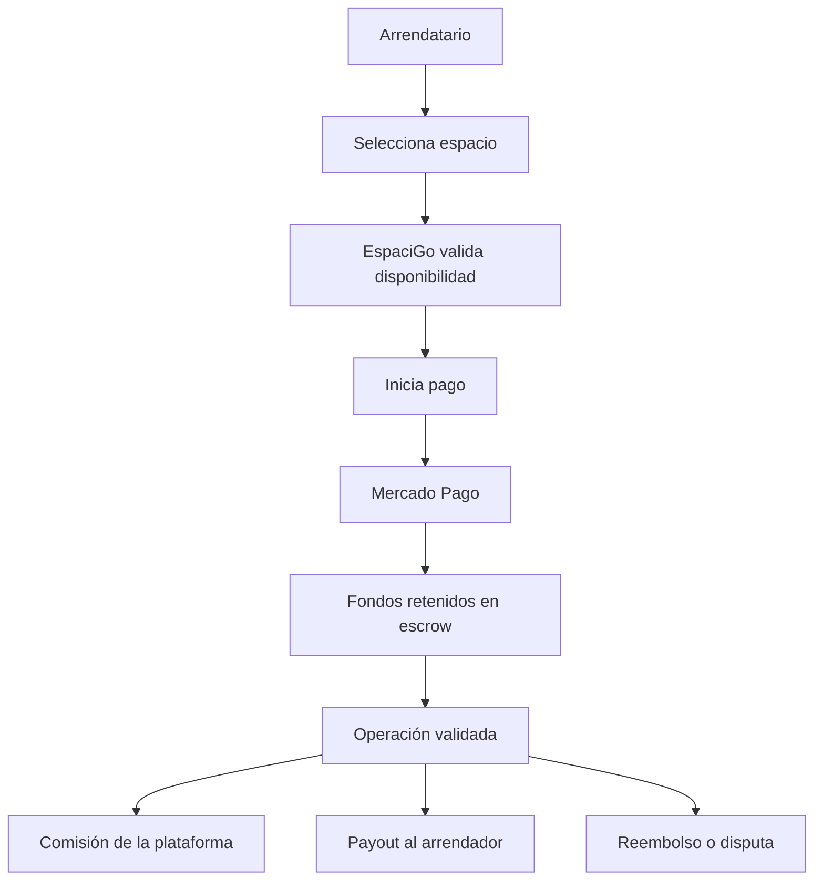

# 6. Sistemas de pago electrónico, retención de fondos y escrow

## 6.1 Concepto teórico: ¿qué es una pasarela de pago?

Una pasarela de pago es un servicio que permite recibir, validar y procesar pagos electrónicos entre el comprador, la entidad financiera y el comercio. Su función principal no es simplemente “aceptar tarjetas”, sino actuar como infraestructura de confianza para autorizar transacciones, confirmar pagos y coordinar con instituciones bancarias.

Los conceptos clave del flujo de pago son:

- autorización: validación de la tarjeta o método de pago
- captura: confirmación del cobro
- reembolso: devolución de fondos
- tokenización: sustitución de datos sensibles por identificadores seguros
- idempotencia: evitar cobros duplicados ante fallos de red
- webhook: notificación asíncrona desde la pasarela hacia el sistema
- split payment: división del pago entre distintas cuentas o partes

En un sistema digital de reservas, estos conceptos no son opcionales: una plataforma debe garantizar que el pago sea seguro, verificable y no pueda duplicarse por errores técnicos.

## 6.2 ¿Qué es escrow y por qué importa en un marketplace?

El escrow es un mecanismo de custodia de fondos en el que un tercero retiene el dinero hasta que se cumplen condiciones definidas, como la entrega del servicio, la firma del contrato o la resolución de una disputa. Es una forma de reducir el riesgo de fraude y aumentar la confianza entre las partes.

En plataformas de intermediación, donde participan un arrendador y un arrendatario que no se conocen necesariamente, el dinero debe protegerse de dos problemas principales:

1. el arrendatario paga y luego el servicio no ocurre
2. el arrendador entrega el espacio o servicio, pero no recibe el dinero

El escrow resuelve esta problemática al mantener el dinero bajo control de la plataforma o de la pasarela hasta que se cumplen condiciones de operación.

## 6.3 Comparación de mecanismos de pago para un marketplace

| Proveedor o mecanismo | Fortalezas | Limitaciones | Aplicación en EspaciGo |
|---|---|---|---|
| Webpay | Confianza institucional y uso generalizado | Menor flexibilidad para flujos complejos | Adecuado, pero menos flexible para marketplace dinámico |
| Flow | Integración simple para comercio digital | Menor soporte para flujos de retención y split | No es la mejor opción para EspaciGo |
| Mercado Pago | APIs modernas, webhooks, split, retención y comercio digital | Requiere integración técnica más cuidadosa | Es la opción más alineada con el negocio |
| Escrow | Reducción del riesgo de fraude y mayor confianza | Debe estar bien modelado en sistemas y estados | Es clave para la operación de EspaciGo |

En un marketplace con reserva, pago y contratación, la retención de fondos es más adecuada que un cobro directo sin respaldo. La transacción debe quedar protegida hasta que la operación se complete o se resuelva una disputa.

## 6.4 Aplicación a EspaciGo

EspaciGo conecta a dos actores con objetivos distintos: el arrendatario quiere obtener un espacio y el arrendador quiere garantizar que el pago sea confiable y que el servicio se entregue. En ese escenario, no basta con aceptar el pago; la plataforma debe asegurar que:

- el dinero quede retenido durante la validación operativa
- la operación se confirme solo cuando el espacio o servicio esté realmente disponible
- la plataforma pueda reembolsar o resolver disputas
- el arrendador reciba el payout solo cuando corresponda

Por ello, la solución requiere un flujo de pago con retención y liberación condicionada, esto es, un modelo de escrow digital.

## 6.5 Flujos financieros del negocio

El flujo financiero de EspaciGo se compone de varias etapas:

1. búsqueda y selección del espacio
2. validación de disponibilidad
3. inicio de la reserva y pago
4. retención del dinero
5. confirmación del uso o cumplimiento del servicio
6. payout al arrendador
7. resolución de disputas o reembolso si hay conflicto

Este modelo es coherente con una plataforma que actúa como intermediaria y que debe proteger tanto al consumidor como al proveedor del activo.

## 6.6 Decisión de implementación

Se adopta una solución de pagos basada en una pasarela con soporte a:

- retención de fondos
- separación de montos por comisiones
- webhooks para sincronización de estados
- idempotencia ante errores de red
- payout condicionado a la operación

El dinero no se libera de forma automática al arrendador; queda bajo una lógica de custodia digital hasta que se cumplen condiciones de servicio, resolución de disputas o cierre de la operación.

## 6.7 Implicación técnica

Este modelo exige una serie de decisiones de ingeniería:

- no almacenar datos sensibles de tarjetas en la base principal
- usar tokens y referencias seguras de la pasarela
- mantener estados de pago y reserva sincronizados
- manejar eventos asíncronos por webhook
- registrar acciones financieras con trazabilidad para auditoría
- diseñar reglas de reembolso y payout bajo condiciones específicas

En EspaciGo, esto se materializa en el backend y en la base de datos transaccional. El backend en Go coordina la operación, mientras PostgreSQL conserva el estado correcto de la reserva y del pago. Los datos financieros relevantes se registran en BigQuery para auditoría y análisis.

## 6.8 Diagrama del flujo de pagos con retención

Este flujo muestra que la plataforma no es solo un frontend para pagar, sino un mecanismo de coordinación financiera y operativa entre usuarios y servicios externos.

## 6.9 Comparación de proveedores y mecanismos

| Criterio | Webpay | Flow | Mercado Pago |
|---|---|---|---|
| Integración con marketplace | Media | Media | Alta |
| Soporte de webhooks | Sí | Sí | Sí |
| Retención de fondos | Limitada | Limitada | Más flexible |
| Gestión de split payments | Media | Baja | Alta |
| Cohesión con un modelo B2B2C | Media | Media | Alta |

La comparación pone de manifiesto que Mercado Pago es más apropiado para la lógica de EspaciGo, porque su modelo se adapta mejor a un flujo de plataforma intermediaria con retención, payout y soporte a operaciones complejas.

## 6.10 Conclusión

El manejo de pagos en EspaciGo no puede reducirse a aceptar una tarjeta o un método de pago. La operación implica confianza, retención de fondos, validación de disponibilidad y protección ante fallos o disputas. Por eso, el modelo de escrow es una decisión técnica y de negocio esencial para la viabilidad de la plataforma.

La arquitectura del sistema debe garantizar que el pago se procese de manera segura, los estados del pago y la reserva se mantengan consistentes y la evidencia financiera quede registrada adecuadamente. Esta lógica refuerza la elección del stack actual y muestra por qué la plataforma requiere un backend robusto, una base transaccional fiable y una trazabilidad analítica sólida.

## 6.11 Fuentes consultadas

- Mercado Pago Developers. (2024). *Documentación oficial de pagos y webhooks*. Recuperado de https://www.mercadopago.cl/developers/
- PCI Security Standards Council. (2023). *PCI DSS*. Recuperado de https://www.pcisecuritystandards.org/
- Goodrich, M., & Tamassia, R. (2014). *Introduction to Computer Security*. Pearson.
- IBM. (2024). *What is payment processing?* Recuperado de https://www.ibm.com/topics/payment-processing
- Gray, J., & Reuter, A. (1993). *Transaction Processing: Concepts and Techniques*. Morgan Kaufmann.
