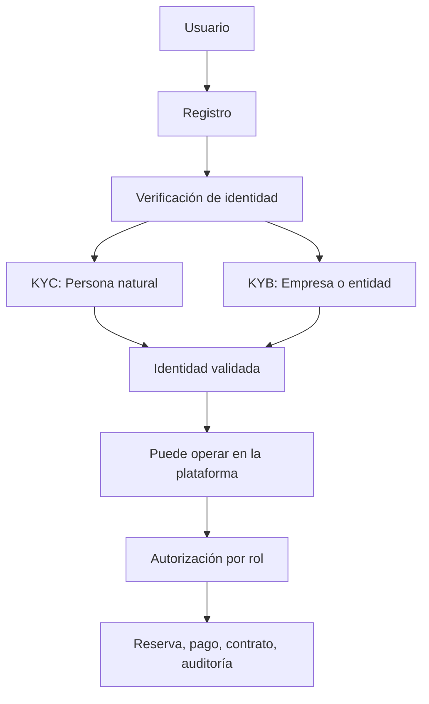

# 7. KYC, KYB, identidad digital y autenticación

## 7.1 Concepto teórico: por qué la identidad importa en un marketplace

KYC (Know Your Customer) y KYB (Know Your Business) son procesos de verificación de identidad utilizados para mitigar fraude, lavado de dinero, suplantación de identidad y uso indebido de plataformas. El objetivo principal es conocer a quién se está dando acceso a la operación y cuáles son los elementos que respaldan su identidad.

- KYC aplica a personas naturales
- KYB aplica a personas jurídicas o empresas

En un marketplace financiero y legal como EspaciGo, la identidad no es un requisito opcional; es una condición de confianza operativa. Si un usuario no es verificable, los procesos de reserva, pago y formalización contractual se vuelven inseguros.

## 7.2 Identidad digital y confianza en la plataforma

La identidad digital se refiere a la capacidad de verificar que una persona o empresa es quien dice ser, usando mecanismos como documentos, validación de datos, autenticación multifactor y evidencia de actividad. En plataformas de intermediación, la confianza no se sostiene solo por la reputación del usuario; debe existir un soporte técnico y documental que valide la identidad detrás de cada cuenta.

En EspaciGo, esto es esencial porque la operación incluye:

- reserva y uso de espacios físicos
- flujo de pagos con retención de fondos
- documentación legal y contratos
- interacción entre usuarios que no se conocen físicamente

Por ello, la validación de identidad se convierte en una pieza clave para reducir fraude y proteger a la comunidad.

## 7.3 Autenticación y autorización: dos conceptos distintos

Dentro de la seguridad digital es necesario distinguir entre:

- autenticación: verificar quién es el usuario
- autorización: definir qué puede hacer ese usuario dentro del sistema

La autenticación responde a la pregunta “¿quién eres?”; la autorización responde a la pregunta “¿qué puedes hacer?” En EspaciGo, esto es crucial porque no todos los usuarios tienen las mismas capacidades: un arrendador no puede operar como arrendatario ni viceversa, y un administrador debe tener permisos distintos a los usuarios normales.

### 7.3.1 Alternativas y criterio de decisión

La alternativa más común es una identidad abierta sin validación formal, o bien una identidad con verificación documental y control de roles. En un marketplace con dinero y contratos, la segunda opción es necesaria porque la confianza operativa depende de la capacidad de identificar a los participantes y definir límites claros de acción.

### 7.3.2 Aplicación a EspaciGo

EspaciGo debe validar que:

- la persona que publica un espacio es el titular o cuenta con autorización
- la persona que reserva un espacio es una entidad real y verificable
- las empresas o arrendadores con actividad comercial cumplen con la validación correspondiente
- los permisos de cada perfil estén bien diferenciados
- los eventos relevantes de identificación y operación queden registrados para auditoría

La plataforma no puede operar como un sistema abierto al fraude, sobre todo cuando se trata de transacciones con dinero y documentación legal.

## 7.5 Decisión de implementación

La solución incorpora mecanismos de:

- registro y verificación de identidad
- validación documental para personas naturales y jurídicas
- control de roles mediante RBAC
- autenticación segura con credenciales y mecanismos adicionales de seguridad
- trazabilidad de acciones relevantes del usuario

### 7.5.1 Decisión de diseño

> Decisión de diseño: EspaciGo adopta una política de identidad verificada con KYC/KYB, autenticación segura y autorización por roles, con el objetivo de reducir fraude y proteger la operación de pago, reserva y contrato.

### 7.5.2 Implicación técnica

Esto convierte la identidad en un componente funcional del sistema, no solo en un requisito de seguridad formal.

## 7.6 Implicación técnica

Esto requiere un conjunto de decisiones de diseño:

- almacenamiento seguro de datos identificatorios
- validación documental y de negocio antes de habilitar la operación
- login seguro con autenticación adecuada
- control de permisos por rol y por caso de uso
- bloqueo o rechazo ante actividad sospechosa
- trazabilidad en auditoría para cada evento relevante

La arquitectura actual de EspaciGo refleja esta necesidad: el backend en Go gestiona la autenticación, autorización, validaciones y coordinación con servicios externos; la base en PostgreSQL conserva la identidad y el estado del usuario; y BigQuery registra eventos para auditoría y evidencia.

## 7.7 Diagrama del flujo de identidad y confianza

Este esquema muestra que la identidad no es una etapa aislada, sino un sistema de confianza que habilita la operación completa dentro de la plataforma.

## 7.8 Comparación KYC vs. KYB

| Criterio | KYC | KYB |
|---|---|---|
| Usuario | Persona natural | Empresa o entidad |
| Objetivo | Verificar identidad personal | Verificar identidad legal y operativa de la empresa |
| Riesgo principal | Suplantación, fraude, identidad falsa | Lavado de dinero, operación con entidad no real |
| Relevancia en EspaciGo | Usuarios individuales | Propietarios o operadores empresariales |

La diferencia es importante porque en un marketplace de espacios comerciales pueden participar individuos y organizaciones distintas, con distintas necesidades de validación y responsabilidad legal.

## 7.9 Conclusión

KYC, KYB e identidad digital son fundamentales para EspaciGo porque la plataforma no se limita a mostrar espacios; también coordina pagos, contratos y operación entre actores que no necesariamente se conocen entre sí. Sin un proceso sólido de validación y control de acceso, la confianza del sistema se derrumba.

La autenticación y la autorización deben diseñarse como componentes del negocio, no como un requisito técnico aislado. La plataforma necesita saber quién es cada usuario, qué puede hacer, cómo se comporta y qué evidencia queda asociada a sus acciones para resolver conflictos o prevenir fraudes.

## 7.10 Fuentes consultadas

- FATF. (2023). *International Standards on Combating Money Laundering and the Financing of Terrorism*. Recuperado de https://www.fatf-gafi.org/
- NIST. (2020). *Digital Identity Guidelines*. Recuperado de https://www.nist.gov/
- OWASP. (2024). *Authentication Cheat Sheet*. Recuperado de https://cheatsheetseries.owasp.org/
- Sumsub. (2024). *KYC and identity verification overview*. Recuperado de https://sumsub.com/
- Microsoft. (2024). *Identity and access management concepts*. Recuperado de https://learn.microsoft.com/
