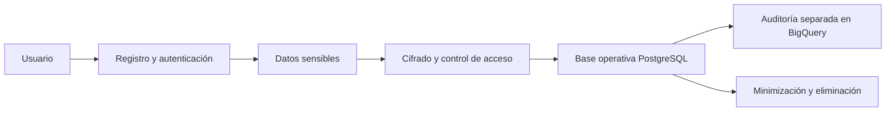

# 8. Seguridad, privacidad y protección de datos personales

## 8.1 Concepto teórico: seguridad y privacidad no son lo mismo

La seguridad de la información y la protección de datos personales son dimensiones relacionadas, pero no equivalentes. La seguridad busca proteger la información frente a amenazas, robo, manipulación o accesos indebidos; la privacidad busca garantizar que los datos se usen de manera justa, limitada y conforme a la normativa.

En un sistema digital con pagos, identidad y documentos legales, ambas son necesarias. Una plataforma puede ser segura desde el punto de vista técnico y aun así incumplir con la normativa si trata datos de manera excesiva o no justificada.

## 8.2 Seguridad informática y sus principios en EspaciGo

En EspaciGo, es necesario proteger:

- credenciales de acceso
- documentos de identificación
- información financiera y de pago
- datos asociados a contratos y reservas
- fotografías, documentos y archivos de usuarios
- registros de actividad y auditoría

Algunos conceptos clave son:

- autenticación
- autorización
- cifrado
- hash y sal para contraseñas
- TLS para comunicaciones
- control de acceso por roles
- prevención de vulnerabilidades OWASP Top 10

### 8.2.1 Alternativas y criterio de decisión

La alternativa es operar sin medidas de protección, o bien diseñar controles de seguridad desde la arquitectura. En un sistema con pagos y datos personales, la segunda opción no es opcional. Seguridad y privacidad deben incorporarse desde la concepción del sistema, no como capas posteriores.

La seguridad se encarga de que la plataforma no sea fácil de vulnerar, mientras que la privacidad asegura que los datos se traten solo para fines legítimos y con la menor intensidad posible.

## 8.3 Privacidad y protección de datos personales en Chile

La normativa chilena sobre protección de datos establece principios fundamentales, entre ellos:

- finalidad: los datos solo deben usarse para fines específicos
- minimización: solo se debe recopilar lo necesario
- transparencia: el usuario debe conocer cómo se usan sus datos
- seguridad: los datos deben protegerse adecuadamente
- acceso y rectificación: el titular puede consultar y corregir sus datos
- eliminación: algunos datos pueden ser eliminados cuando deje de ser necesario su tratamiento
- limitación del tratamiento: no se deben usar datos para fines ajenos a la finalidad del servicio

En ese contexto, una plataforma de intermediación como EspaciGo debe diseñarse bajo el principio de privacidad por diseño, es decir, anticipando la protección de datos desde la concepción del sistema, no como una capa final añadida.

## 8.4 Aplicación a EspaciGo

EspaciGo trata información altamente sensible: identidad de usuarios, documentos, montos financieros, registros de actividad, contratos y, en algunos casos, información legal o tributaria. Esto exige que la plataforma no solo proteja la información frente a ataques, sino además que limite su tratamiento y lo vuelva trazable bajo condiciones debidas.

Por ejemplo:

- las contraseñas deben almacenarse con hash y sal
- los documentos de identidad deben estar protegidos y accesibles solo por roles autorizados
- los registros financieros no deben mezclarse con el almacenamiento público del usuario
- la evidencia de auditoría debe separarse de los perfiles de usuario para evitar exposiciones excesivas

## 8.5 Decisión de implementación

La solución incorpora una estrategia de privacidad y seguridad desde el diseño, con:

- cifrado de datos sensibles
- control de acceso basado en roles
- almacenamiento mínimo de información personal
- separación entre datos operativos, analíticos y de auditoría
- retención y eliminación controlada de información cuando ya no sea necesaria

### 8.5.1 Decisión de diseño

> Decisión de diseño: EspaciGo adopta un enfoque de privacidad por diseño y seguridad aplicada por capas, diferenciando datos operativos, financieros, documentales y de auditoría para cumplir con la normativa y evitar exposición innecesaria.

### 8.5.2 Implicación técnica

Esto refleja la necesidad de cumplir con la normativa sin comprometer la operatividad del sistema.

## 8.6 Implicación técnica

La implementación exige:

- cifrado de contraseñas y datos sensibles
- políticas de acceso por perfil y permisos
- registro de eventos críticos para auditoría
- separación entre base transaccional y data warehouse
- políticas de retención de datos y eliminación segura
- validación de seguridad en cada flujo de API y servicio externo

En la arquitectura actual de EspaciGo, esta separación es especialmente importante: PostgreSQL se usa para la base operativa, mientras BigQuery se reserva para auditoría y trazabilidad analítica; así no se exponen más datos de lo necesario ni se mezcla la evidencia legal con el perfil del usuario activo.

## 8.7 Matriz de seguridad y privacidad

| Área | Seguridad | Privacidad |
|---|---|---|
| Objetivo | Proteger la información frente a amenazas | Garantizar tratamiento adecuado y justo de los datos |
| Ejemplo | Cifrado, MFA, TLS, control de acceso | Minimización, transparencia, eliminación y acceso |
| Riesgo principal | Robo, manipulación, explotación de vulnerabilidades | Uso indebido, tratamiento excesivo, falta de consentimiento |
| Relevancia en EspaciGo | Datos financieros, autenticación e identidad | Datos personales, documentos y auditoría |

## 8.8 Diagrama de manejo de información sensible

El flujo muestra que no basta con guardar la información; también debe gestionarse el acceso, la retención y la separación de evidencias para proteger tanto a los usuarios como a la empresa.

## 8.9 Conclusión

La seguridad y la privacidad son componentes centrales en EspaciGo porque la plataforma procesa datos sensibles y coordina dinero, identidad y documentación legal. La protección de la información no puede ser un requisito secundario ni una decisión técnica aislada; es parte del valor del sistema y de su legitimidad frente a los usuarios y la normativa.

La arquitectura del sistema debe seguir el principio de privacidad por diseño, separando datos operativos de evidencia analítica y asegurando que cada actor tenga acceso solo a lo necesario para cumplir su función. Esto convierte la seguridad y la privacidad en bases de confianza para la operación del marketplace.

## 8.10 Fuentes consultadas

- Biblioteca del Congreso Nacional de Chile. (2024). *Ley N° 21.719 sobre protección de la vida privada y datos personales*.
- NIST. (2023). *Security and Privacy Controls for Information Systems and Organizations*.
- OWASP. (2024). *OWASP Top 10 Web Application Security Risks*.
- Google Cloud. (2024). *Security and data protection guidance for cloud workloads*.
- ICO / UK Information Commissioner's Office. (2024). *Data protection and privacy guidance*.
