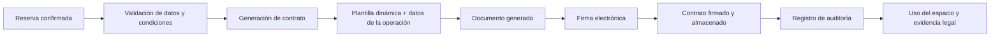

# 9. Contratos digitales, firma electrónica y gestión documental

## 9.1 Concepto teórico: el contrato como evidencia de la relación comercial

Un contrato digital es un acuerdo formalizado mediante medios electrónicos, con valor jurídico cuando cumple requisitos de identidad, intención de obligarse, trazabilidad y protección del documento. En mercados digitales y plataformas de servicios, el contrato deja de ser solo un documento administrativo y pasa a ser evidencia de la relación operativa entre proveedor, usuario y plataforma.

En la lógica de EspaciGo, este concepto es central porque el sistema no solo coordina disponibilidad y pago, sino que también debe validar la relación legal que permite el uso de un espacio. El contrato conecta la operación comercial con la protección legal de las partes.

## 9.2 Contratos en plataformas de intermediación

En un marketplace de alquiler o uso de espacios, el contrato debe responder a varias necesidades:

- identificar claramente a las partes
- describir el servicio o espacio alquilado
- fijar condiciones de uso, precio y duración
- registrar la aceptación y consentimiento
- dejar evidencia del proceso completo
- permitir la resolución de disputas o la auditoría posterior

Esto exige que el documento no sea un texto estático, sino un artefacto dinámico que se genera con datos reales de la operación. Un contrato genérico no sirve en un sistema con condiciones distintas para cada reserva, propietario, usuario y normativa aplicable.

## 9.3 Firma electrónica: identidad, autenticación y validez jurídica

La firma electrónica permite asociar la voluntad de una persona a un documento digital. Su nivel de seguridad varía según la tecnología utilizada y el grado de verificación de identidad.

Los tipos más relevantes son:

- firma simple: válida para aceptación de condiciones básicas o consentimientos simples
- firma avanzada: requiere mayor autenticación y control de la identidad del firmante
- firma cualificada: ofrece el máximo nivel de seguridad y reconocimiento jurídico, apropiado para casos con gran exigencia legal o financiera

En un sistema de alquiler de espacios, no basta con que el usuario acepte términos de uso. Debe existir una forma de verificar que el contrato fue firmado por la persona correcta y que el documento ha sido generado, entregado y conservado sin alteraciones.

## 9.4 Aplicación a EspaciGo

En EspaciGo, los contratos digitales son necesarios en varios momentos del ciclo de operación:

- antes de la reserva confirmada, cuando se aceptan condiciones de uso
- durante la validación del espacio y responsabilidades del arrendatario
- en el proceso de pago y depósito, cuando se vinculan obligaciones económicas
- al momento de uso del espacio, cuando se verifica que el usuario cuenta con una relación contractual válida
- ante eventuales disputas, reclamos o auditorías, cuando se requiere evidencia documental

Esto significa que la plataforma debe ser capaz de generar un documento contractual único para cada operación, asociarlo a los participantes, registrar el estado de aprobación y proteger el archivo final para que pueda usarse como evidencia frente a una revisión legal o interna.

## 9.5 Gestión documental y trazabilidad

La gestión documental no se limita a guardar un PDF. Implica controlar:

- versión del documento
- datos del contrato asociados a la reserva
- identidad del firmante
- fecha y hora de firma
- estado del proceso: pendiente, firmado, rechazado, archivado
- retención legal y acceso controlado

En un sistema de marketplace, la documentación debe estar conectada con el flujo operativo. Por ejemplo, si un contrato no ha sido firmado, la operación no debería avanzar como si ya existiera una relación legal plenamente constitutiva. Esta validación se vuelve especialmente importante cuando el servicio incluye pagos, uso de instalaciones o responsabilidad por daños.

## 9.6 Decisión de implementación

La solución para EspaciGo es adoptar un flujo de contratos digitales con los siguientes componentes:

- generación automática de plantillas configuradas según el tipo de reserva o espacio
- validación de datos antes de la firma
- integración con un servicio de firma electrónica o firma de confianza
- almacenamiento seguro del documento firmado
- registro de metadata para auditoría y evidencias legales
- restricción de acceso según el rol del usuario o del administrador

Esto no solo mejora la experiencia del usuario, sino que también fortalece la credibilidad del sistema como plataforma confiable y regulada.

## 9.7 Implicación técnica

Desde el punto de vista de arquitectura, el proceso exige la intervención de varios componentes:

- frontend en Next.js para presentar el documento y solicitar la aceptación
- backend en Go para preparar los datos del contrato y orquestar el flujo
- base de datos PostgreSQL para guardar metadatos, estados y referencias del documento
- almacenamiento seguro del archivo final, con acceso limitado
- BigQuery para análisis y trazabilidad en evidencia documental
- servicios externos de firma digital para garantizar autenticación y no repudio

La decisión de separar datos operativos y evidencias analíticas es particularmente relevante: el sistema debe conservar el documento y su historial sin mezclarlo con información de uso general o con perfiles no autorizados.

## 9.8 Comparación de mecanismos de firma

| Tipo de firma | Nivel de seguridad | Uso típico | Relevancia para EspaciGo |
|---|---|---|---|
| Firma simple | Baja | Aceptación de términos y condiciones | Útil para consentimientos básicos |
| Firma avanzada | Media-alta | Documentos comerciales y firma de acuerdos | Adecuada para la mayoría de contratos de uso |
| Firma cualificada | Máxima | Casos con alta exigencia legal y financiera | Recomendable para contratos críticos y disputas legales |

La elección de un nivel apropiado depende del riesgo de la operación, la sensibilidad de los datos y la exigencia jurídica del documento. En un marketplace con pagos, espacios físicos y posibles reclamos, la firma avanzada o cualificada es mucho más apropiada que la firma simple.

## 9.9 Diagrama del flujo contractual

Este flujo demuestra que el contrato no es un documento aislado, sino un elemento del sistema que conecta operación, seguridad, cumplimiento y evidencia.

## 9.10 Conclusión

Los contratos digitales y la firma electrónica son pilares de confianza en una plataforma de intermediación como EspaciGo. No se trata solo de formalizar una transacción, sino de asegurar que la relación entre usuarios, prestadores y plataforma quede documentada, validada y protegida.

En el contexto del proyecto, esta capacidad no es una funcionalidad secundaria: es un elemento de gobernanza, cumplimiento y reducción de riesgo. La firma electrónica aporta no repudio, la gestión documental aporta trazabilidad y el contrato digital genera una base legal para la operación del servicio.

## 9.11 Fuentes consultadas

- Comisión Europea. (2024). *eIDAS Regulation and electronic identification services*.
- OECD. (2023). *Digital trust and e-signatures: policy and governance considerations*.
- Ley N° 21.521. (2022). *Modificaciones a procedimientos civiles y otros asuntos legales*.
- International Organization for Standardization. (2024). *Electronic signatures and document trust frameworks*.
- W3C. (2024). *Digital signatures and verifiable credentials*.
- NIST. (2023). *Digital identity and electronic transactions guidance*.
