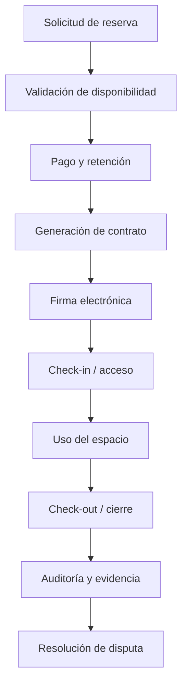

# 10. Auditoría, trazabilidad y resolución de disputas

## 10.1 Concepto teórico: la trazabilidad como prueba del funcionamiento del sistema

La auditoría es el registro de acciones relevantes con el propósito de verificar qué ocurrió, quién lo realizó y en qué momento. La trazabilidad, por su parte, permite reconstruir la secuencia de eventos de un proceso y analizar la relación entre decisiones, operaciones y resultados.

En una plataforma como EspaciGo, este tipo de mecanismo no es un detalle técnico secundario: es una pieza central para la confianza, la legalidad y la resolución de conflictos. El sistema no solo debe ejecutar transacciones, sino también demostrar qué se hizo, con qué evidencia y cómo se llegó a una decisión final.

## 10.2 Importancia de la trazabilidad en marketplaces y servicios digitales

La trazabilidad es esencial para procesos como:

- reservas y disponibilidad
- confirmación de pagos
- firma de contratos
- uso y check-in de espacios
- incidentes o daños reportados
- revisiones regulatorias o administrativas

Cuando hay una diferencia de interpretación entre propietario, arrendatario y plataforma, no basta con la memoria humana: hace falta evidencia objetiva. Esto puede incluir historiales de estado, cambios de reserva, pagos, accesos, notificaciones y documentos firmados.

## 10.3 Resolución de disputas y necesidad de evidencia objetiva

En un escenario de arrendamiento de espacios, las disputas suelen derivar de preguntas como:

- ¿la reserva fue confirmada en ese horario?
- ¿se pagó el monto correcto?
- ¿el contrato fue firmado antes del uso?
- ¿el espacio estaba en el estado indicado?
- ¿la denuncia se registró antes o después de la entrega?

La respuesta a estas preguntas depende de un historial fiable. Por eso, la plataforma debe contar con evidencia digital que permita reconstruir la operación de manera ordenada, verificable y defendible.

## 10.4 Aplicación a EspaciGo

EspaciGo debe permitir demostrar qué sucedió antes, durante y después del uso de un espacio. Esto incluye la evidencia de:

- disponibilidad y bloqueos
- mensajes de confirmación y rechazo
- pago, retención o reembolso
- firma de contrato
- confirmación de ingreso y salida del espacio
- revisión o reporte de daños o incumplimientos

El valor de esta práctica no es solo técnico; también es comercial y legal. Una plataforma que puede reconstruir un caso con evidencia sólida reduce fricciones, mejora la relación con los usuarios y disminuye la exposición a conflictos no resueltos.

## 10.5 Decisión de implementación

El sistema adopta un modelo de auditoría basado en eventos. Cada acción clave del negocio genera un registro estructurado que conserva información sobre:

- tipo de evento
- actor que lo ejecutó
- momento exacto
- entidad afectada
- estado previo y posterior
- resultado o evidencia asociada

Estas trazas se almacenan de forma separada del sistema transaccional para proteger la integridad, la auditabilidad y la capacidad de investigación posterior.

## 10.6 Implicación técnica

La arquitectura de EspaciGo debe contemplar los siguientes elementos:

- registro de eventos por acción crítica
- almacenamiento en repositorio de auditoría
- separación entre base de datos operativa y repositorio analítico/auditivo
- consulta histórica para soporte de decisiones o demandas
- conexión con documentos, pagos y estados de reserva
- soporte para cumplimiento legal y evidencia digital

En esta lógica, PostgreSQL almacena la información transaccional del negocio, mientras que BigQuery puede usarse para evidencia analítica, consolidación y trazabilidad a nivel histórico. Esto permite mantener la operación eficiente sin comprometer la capacidad de auditoría.

## 10.7 Diagrama del flujo de trazabilidad

El diagrama muestra que cada etapa del proceso puede ser rastreada y contrastada con evidencia, evitando que la solución dependa solo de la memoria o de mensajes no verificables.

## 10.8 Tabla de evidencia digital

| Evento | Evidencia relevante | Valor para EspaciGo |
|---|---|---|
| Reserva | usuario, horario, disponibilidad, estado | Permite validar la operación comercial |
| Pago | monto, token, estado, timestamp | Confirma la transacción financiera |
| Contrato | documento firmado y metadata | Soporta la relación legal entre partes |
| Check-in/out | registro fotográfico, ubicación, estado | Ayuda a resolver conflictos de acceso o daños |
| Reclamo | documentación, mensajes, historial | Facilita la investigación y respuesta ante un caso |

## 10.9 Tipos de auditoría en una plataforma digital

La auditoría puede clasificarse en varios niveles:

- auditoría operacional: revisión de acciones de usuario, administradores y procesos internos
- auditoría financiera: control de pagos, retenciones, reembolsos y estados de transacción
- auditoría de seguridad: revisión de accesos, intentos de login, cambios de permisos y registros críticos
- auditoría legal: evidencia del cumplimiento de contratos, condiciones y documentos firmados

En EspaciGo, estos ejes no son separables: el proceso de alquiler combina operación, pago, seguridad y documentación legal; por eso la auditoría debe estar integrada en la plataforma, no añadida como un sistema aislado.

## 10.10 Conclusión

La auditoría y la trazabilidad son requisitos estratégicos para una plataforma de intermediación como EspaciGo. La capacidad de demostrar qué ocurrió, quién lo accionó y cuál fue la evidencia asociada aumenta la confianza del usuario, reduce la ambigüedad en disputas y fortalece la gobernanza del negocio.

En otras palabras, no basta con que el sistema funcione: debe poder sostener su funcionamiento con evidencia. Esta cualidad convierte la trazabilidad en un componente esencial para la credibilidad, la defensa legal y la continuidad operativa del marketplace.

## 10.11 Fuentes consultadas

- ISO. (2024). *Information technology — Security techniques — Audit and traceability guidelines*.
- NIST. (2024). *Logging and monitoring guidance for systems and organizations*.
- OWASP. (2024). *Logging and security monitoring best practices*.
- ISACA. (2023). *Audit and assurance for digital platforms*.
- Google Cloud. (2024). *Observability, logging and audit trail design patterns*.
