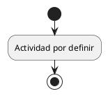

# Ejemplos de autoría

Ejemplos de sintaxis, no requisitos académicos ni evidencia del producto. Las rutas son relativas a la raíz de la entrega.

## Sección y cita

```markdown
# Título exigido por la rúbrica

[[PENDIENTE: redactar el argumento y comprobar su evidencia.]]

La afirmación debe estar sustentada [@clave_verificada].

## Subtema

Desarrollo del argumento; no repetir el título del informe en cada archivo.
```

Agregar la clave real al catálogo BibTeX con autor, título, año y metadatos verificados según el tipo de fuente. No usar la clave del ejemplo como fuente real.

## Tabla y referencia cruzada

```markdown
Como se resume en la {{Tabla:comparacion}}:

*Tabla. Comparación de alternativas* <!--#tab:comparacion--> <!--#fuente:elaboración propia.-->

| Criterio | Alternativa A | Alternativa B |
| --- | --- | --- |
| Evidencia | Por verificar | Por verificar |
```

La nota se coloca bajo la tabla y el rótulo sobre ella. Los identificadores deben ser únicos dentro del informe o de cada anexo. Sustituir «elaboración propia» cuando se adapte material ajeno y agregar su cita.

## Figura y diagrama

Guardar `diagramas/flujo.puml`:



Referenciar su PNG desde Markdown:

```markdown
{width=6in} <!--#fig:flujo--> <!--#fuente:elaboración propia.-->

La {{Figura:flujo}} muestra el flujo.
```

Para una imagen estática, guardarla en `imagenes/` y usar la misma sintaxis. Los diagramas se renderizan en `build/imagenes/`; no se modifican las fuentes.

## Anexo independiente

Crear `anexos/A_evidencias.md` con título `# Evidencias` y contenido. Incorporar este objeto a `anexos` en `informe.json`:

```json
{
  "letra": "A",
  "titulo": "Evidencias",
  "archivo": "anexos/A_evidencias.md",
  "salida": "Anexo_A_Evidencias.docx",
  "transformacion": "general"
}
```

El motor sustituye el primer título por el del anexo, mantiene su contenido y genera numeración propia de tablas y figuras (`A.1`, `A.2`). Las citas del anexo generan sus propias referencias. Su portada e índices usan el perfil de la entrega.
